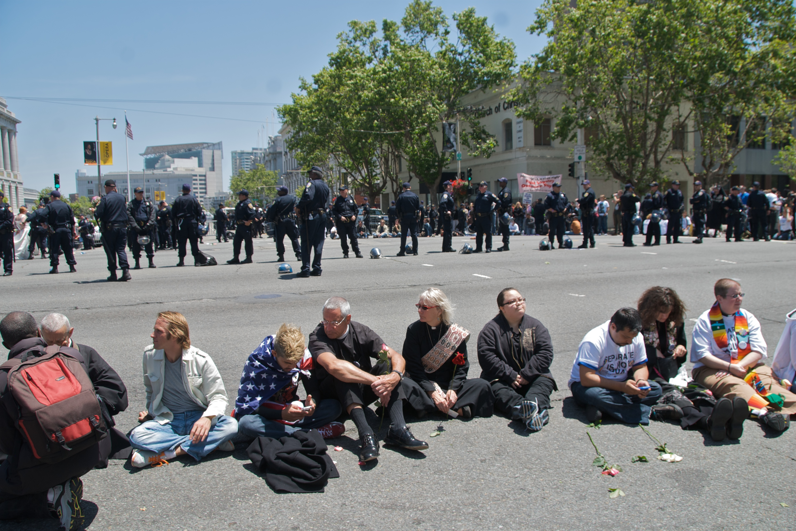

import { Aside } from '@astrojs/starlight/components';

The California State Supreme Court ruled in 2009 that California voters had been properly exercising their Constitutional prerogatives when they outlawed same-sex marriage by passing “Proposition 8.”
Hundreds of marriage equality supporters expressed their outrage against this decision by getting arrested for blocking a city street in San Francisco.

<figcaption>Some of the Van Ness Avenue blockaders</figcaption>

This is a peculiar and nowadays popular form of protest.
It bears some resemblance to civil disobedience, but is really its own, distinct phenomenon.

## What Is Civil Disobedience For?

In civil disobedience, one of the following two conditions hold:

1. The law you break is itself immoral in some way, and that is the reason you are breaking it, or
1. Although the law itself is unobjectionable, you are acting to prevent a wrong (or promote a good) in a way that requires you to incidentally break that law.

So, for instance, people who violated the Fugitive Slave Act by operating a station on the Underground Railroad were breaking a law that they believed was itself an immoral law.
On the other hand, people who are arrested at blockades usually are tyically not opposed to laws against trespassing or blocking traffic or whatever they end up being charged with—rather, they are violating those laws incidentally while trying to prevent some greater harm.

But in the case of the people who were arrested blocking the street in San Francisco—and the same is true of much other so-called “civil disobedience” actions I’ve seen in recent years—they were neither asserting that laws against blocking traffic were immoral, nor did they believe that blocking traffic would prevent some greater harm that would be caused by allowing that traffic to proceed as normal.

## What Is Getting Arrested For?

Instead, <em>getting arrested</em>—whatever the charge and whatever the action leading to it—is itself the point of the action, and seems to be mostly a way of publicizing and amplifying one’s sense of outrage, anguish, or commitment.
Less a civil disobedience action, it is more like the action of a mourner who wails and covers himself in ashes, or a penitent who whips himself with a lash.
Being arrested has become a sort of government-sponsored method of certifying the strength of one’s opinion.

Here are some excerpts from a newspaper article on the arrests:

> Earlier in the day, police arrested more than 100 protesters blocking Van Ness Avenue near the Civic Center after giving the chanting, sign-waving crowd more than an hour to vent its anger and sadness.
> Many of those arrested were released in time to return for the evening event.

> Shortly after noon, officers began arresting anti-Prop. 8 protesters, starting with clergy members.
> The arrests went so smoothly they seemed choreographed—which in a way they almost were, considering the police and protest organizers had been talking for days to make sure everything went smoothly and peacefully.
>
> “It’s the right thing to do,” Rabbi Sydney Mintz… said of her decision to protest Prop. 8, shortly before she was led off with wrists tied.

> Mintz received her citation and was back on the street by 6 p.m., this time with her 8-year-old son Gabe Newbrun-Mintz, who said his mother’s arrest was “sad.”
>
> But she stayed in the street “so that they would know she was serious about the civil rights,” he said.

None of this is necessarily bad, though it is a little <em>weird</em> when you pause to think about it.
(No weirder than sackcloth & ashes or self-flagellation, though, I suppose.)
Maybe I’m reading too much in to this, but I’m struck by the phrase “Mintz received her citation” in the above excerpt.
It’s a description that would apply equally well to a summons to appear in court and to an official commendation of praiseworthy action.

While this sort of thing may seem harmless, I worry that people confuse this theatrical arrest-as-protest sort of thing with genuine civil disobedience.
If so, they may forget the practical power that well-crafted civil disobedience campaigns and actions have.

## How Fetishizing Arrest Can Make You Neglect Worthy Goals

I’ve also seen activists lose sight of important goals and practical means of achieving them because they pursue opportunities to be arrested instead.

For example, I attended the strategy meetings of a group that planned an action to disrupt the San Francisco headquarters of the military contractor Bechtel in 2006.
When the group discussed what sort of action to do, the questions of “do we want to do an action where people risk arrest?” and “who here is planning to risk arrest?” came up before any discussion about what goals the activists hoped to accomplish with their action (unless, that is, being arrested <em>was</em> their goal).

Eventually I asked “what is the goal of the civil disobedience action—to get arrested, or to inconvenience Bechtel, or to get press coverage, or what?”
The consensus seemed to be that inconveniencing Bechtel—or “shutting down” Bechtel if you allow for hyperbole—was the goal.

But later, two women at the same meeting said that they once had tried on their own to deliver a message to Bechtel’s CEO.
Bechtel’s security, realizing that some sort of protest was happening, started their standard procedure for such things—which was to shut down the building and let nobody in or out (even employees).
Two people, not intending to be arrested, managed to shut down the Bechtel home office for 45 minutes one day just by showing up and asking to speak with the boss.

But because the activists at the meeting were more intent on getting arrested than on the ostensible purpose of their action (to “shut down Bechtel”), they did not attend to this information but instead they planned an action in which they would lock arms and conduct a sit-down blockade of the building’s doors until the police hauled them away.

As it turns out, this blockade would prove ineffective at either shutting down the building or preventing the people who worked there from coming and going (indeed, the police didn’t even find it necessary to arrest any of the door-blockers).
However, when one of the activists walked into the lobby, towards the tail-end of the action, and began protesting there (though this was not part of the previously-agreed-upon game plan), the building’s security <em>did</em> shut the building down—until they managed to have the protester hauled away.

I bring this up to encourage you to evaluate the techniques you read about in this book primarily on how <em>effective</em> they might be in meeting the true goals of your campaign—not on how hard-core they appear, how much disregard they show for the law, or how much risk they involve for their practitioners.
None of those things are dependable proxies for effectiveness.

The following chapters look back over many tax resistance campaigns that have been conducted through the centuries around the world, examining the tactics they employed.
I briefly introduce each tactic, and then usually let the examples do the talking.
But as your author slips into the past tense, I hope you will keep at least one eye on the future.
Look at these examples and decide which lessons from them you can apply to your campaign tomorrow.

<Aside type="tip" title="Links">
Wikipedia: [2008 California Proposition 8](https://en.wikipedia.org/wiki/2008_California_Proposition_8), [Fugitive Slave Act of 1850](https://en.wikipedia.org/wiki/Fugitive_Slave_Act_of_1850), [Underground Railroad](https://en.wikipedia.org/wiki/Underground_Railroad)
</Aside>

Notes and Citations

* Coté, J., May, M., Stannard, M.B., and Fagan, K. [“Same-sex marriage protestors stop traffic”](https://www.sfgate.com/bayarea/article/Same-sex-marriage-protestors-stop-traffic-3231579.php) <i>San Francisco Chronicle</i> 27 May 2009
* Gross, David [“Review of today’s civil disobedience at Bechtel”](https://www.indybay.org/newsitems/2006/08/09/18295821.php) <i>IndyBay</i> 9 August 2006

