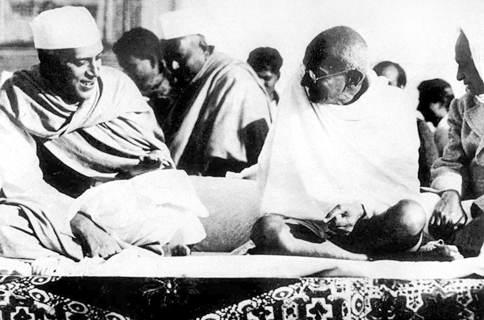

Tax resistance is a technique studied by scholars of nonviolent conflict.
This field of study has attracted a lot of attention in recent years, particularly because of the success of “people power” uprisings that used varieties of nonviolent resistance tactics and that explicitly disavowed violence.

But of the tax resistance campaigns I studied, only some made an effort to maintain nonviolence.
Many others were willing and able to augment their tax resistance with violent tactics.
Others were incidentally nonviolent without having made any special commitment to be so.
This book covers both violent and nonviolent tactics (as well as some tactics, like property destruction or sabotage, that some people consider to be violent and others do not).

Violence certainly can be an effective way to disrupt the tax collecting bureaucracy.
Most tax collectors are not particularly enthusiastic about their calling to begin with, and so a little violent intimidation can go a long way in discouraging them.
This makes tax collection more expensive for the government, decreasing its return-on-investment and compelling the government either to tighten its belt or to resort to higher taxes and thereby encourage more people to resist.

But violence also may backfire.
Some of the tax resistance campaigns I studied showed great success right up to the point where they started deploying violent tactics, whereupon they lost popular support, became subject to easier-to-justify draconian crack-downs, or reinvigorated their opponents.
Violence also harms the body politic (and so also the resisters who make up part of it) by increasing fear, divisiveness, and tension, by giving precedent to people who use violence to try to resolve their conflicts, by making it harder for opposing sides to come to a reconciliation, and so forth.
And of course, in many cases, it is just cruel and wrong.

But it’s also worth remembering that some injustice—particularly government-sanctioned injustice—masquerades as nonviolence while really having a violent nature.
So long as the veiled threat of violence is enough to subdue challenges, what looks like “peace” prevails and superficially nonviolent behavior contains hidden violence.

For the most part, in this book I present examples of violent tactics without passing judgement on whether or not I think they were justified.
Some examples of tax resistance campaigns, for example the Rebecca Riots in Wales, are hard to imagine without violence.
Others, like the Regulator movement in colonial North Carolina, seem to me to be cases where violent tactics were counterproductive to the point of being disastrous.
The Whiskey Tax Rebellion in the early United States is an interesting example of this:
In Pennsylvania, rebels turned to violent tactics, and were violently repressed by the federal army.
In Kentucky, on the other hand, the tax refusers stuck with a variety of nonviolent tactics and continued successfully evading the tax for eight years, until its repeal.

## Authority

Political authority is the pinnacle of government achievement, and almost all governments strive to be seen by their subjects as having such authority—as ruling “legitimately.”
Such authority evolves from an origin of mixed coercion and persuasion.
A political system of 100% persuasion is what takes place in non-governed settings:
for example, a group of friends deciding what sort of pizza to order will typically use persuasion, even if this results in setting up a democratic or monarchical decision-making process by temporary consensus.

But at the large-scale political level, even a 100% persuasive origin can perhaps evolve (or devolve) into an authority-based state.
This is the mythical origin of Hobbes’s Leviathan, of Robert Nozick’s minimal state, and various other such creatures of political philosophy.

Outside of philosophy, things are typically more mixed:
For example, the <i>Federalist Papers</i> were a measure of persuasion that prepared Americans to be ruled by their emerging federal government, and the military repression of various unpersuaded Americans (for instance in the Whiskey Rebellion) was a measure of coercion.
Mixed together with many other ingredients, of such a recipe was the American republic made, and it is the relatively high proportion of persuasion in that mix that gives its founding such a good reputation in some quarters.

One way of looking at political authority is as a mixture of coercion and persuasion that is held in reserve:
capability that is potential, rather than kinetic—like a battery.
Another physical metaphor is to consider authority as the momentum built up through the application of coercion and persuasion, such that the momentum itself has the same sort of power that the original coercion and persuasion did.

The momentum of authority allows the government to coast:
“We could persuade you, but you are already persuaded, remember?
We could compel you, but you are already compelled, remember?”
Meanwhile its subjects feel persuaded without knowing quite which arguments persuaded them, and feel compelled without ever feeling the grip on their shoulders or the bayonet at their backs.

If a government’s authority is challenged, it will temporarily retrench into a position from which it can unleash its potential political capability as kinetic political capability and thereby remove the challenge.
It will use the tools of coercion and persuasion that it has kept in reserve.

In this way, nonviolent resistance can make visible the hidden violence of authoritarian coercion.
By challenging the authority of the government, you call its bluff and force it to reveal its hand.
If it has a strong persuasive hand, well, there you go, and maybe you’re even persuaded.
If it has a strong coercive hand, suddenly people begin to feel its tight grip on their shoulders.
If neither hand is strong, suddenly this too is exposed, and the power-behind-the-throne is revealed to be not so powerful after all.

For this reason it may be important and useful for you to force the government to retrench from authority to its more concrete basis in coercion and persuasion, even if you do not have the power to overcome it once it has retrenched.

The danger is that if you challenge the government to drop its mask of authority and show you the fangs of coercion that lie behind it, you might very well get bit.
And the stronger and more effective your challenge to authority is, the more vicious will be the government’s reaction.

The more benign the government you challenge, the more it will try to retreat into a stance dominated by persuasion over coercion.
The more malign it is, the more eagerly it will bring out the hardware.
But the paradox is that the longer you wait and the more malevolent the government becomes, the more dangerous it is to challenge it, while at the same time such a challenge is more imperative.

The way out of this dilemma is to be quicker to challenge political authority (and this means saying “no” to its commands, not merely grumbling “I disapprove” to its heralds)—and to make this challenge at the first sign that authority is misused, rather than waiting until it has become so tyrannical that it knows no limits.

## Ineffectiveness Is Not a Nonviolent Tactic

Some people think nonviolence is perversely self-sabotaging—like fighting with one hand tied behind your back.
If you were really serious about winning, they believe, you wouldn’t surrender the violent tools in your toolkit before the struggle even begins.

I think this argument arises not because nonviolent action is inherently flawed, but because many activists have used “nonviolence” as their excuse for choosing ineffective tactics that don’t involve much risk (particularly the risk of success).

In reaction to this are violent, “black bloc”-style protesters and anti-nonviolence theoreticians like Derrick Jensen and Ward Churchill.
They see nonviolent protest as pathetic and timid pleading to an unresponsive and hostile government—symbolic rather than direct, predictable (and predictably ineffective), self-aggrandizing, hobbyish, and effectively collaborationist with political authority and therefore violent by proxy—ultimately, no better than the electoral process at generating real change.
And they’re not willing to go along with the well-worn techniques of losing.

For a movement dedicated to nonviolence to withstand such challenges, it must not mistake a non-confrontational action for a non-violent one, or confuse making an “incredibly powerful statement” with making progress.

People who are committed to nonviolence and who want to discourage violence in their campaigns should ask how Gandhi prevented the Indian National Congress from choosing the tactics of those in India who were advocating armed insurrection.
The answer: he was more hard-core than they were, and he demonstrated results.

## Satyagraha

Deliberate, principled, Gandhi-style nonviolence not only can be an effective technique of political force, but it includes safeguards that make it difficult to use in the service of injustice.
A Gandhian revolution seems better-protected from devolving, as so many other revolutions have, into one in which the revolutionaries become the oppressors.

<figcaption>Gandhi and Jawaharlal Nehru confer at the 1937 Indian National Congress</figcaption>

Gandhi initially used the English term “passive resistance” to describe his techniques.
But that phrase led to confusion.
Gandhi was once introduced to an English-speaking audience by a friend who inadvertently insulted Gandhi’s work in South Africa—saying that Gandhi’s forces “are weak and have no arms.
Therefore they have taken to passive resistance which is the weapon of the weak.”

Gandhi decided that “passive resistance” was an inappropriate description:
“it was supposed to be a weapon of the weak… could be characterized by hatred, and… could finally manifest itself as violence.”
He decided to use the term <i>satyagraha</i> (roughly-translated: “truth-force”) instead, and he took pains to emphasize that it was a powerful tool for the strong, not a second-best tactic of the weak.

Satyagraha includes a more radical limitation than the renunciation of violence.
In its purest forms it also includes the renunciation of <em>force</em>—except perhaps persuasive moral force.
And it sets much loftier political goals than run-of-the-mill nonviolent action.
It does not claim victory in the defeat or subjugation of its foes.
Instead, victory comes when those foes, under no threat aside from that of their own awakened consciences, willingly and gladly change their behavior and rejoin the satyagrahi in a cooperative community.

This restricts your choice of tactics much more than a commitment to “nonviolence” does.
Would Gandhi have signed off on [the lunch counter sit-ins](https://en.wikipedia.org/wiki/Sit-in_movement) of the American civil rights movement?
It is possible that he would have considered them to be too coercive.
Blockades and sit-ins designed to prevent people from doing business or moving about could be considered violations of satyagraha—only sit-ins like those caused when the authorities prevent people from legitimately continuing on their way are thoroughly non-forceful.
All lawbreaking under satyagraha is supposed to be done openly, and with the expectation and even invitation of state sanctions—would being a necessarily secret station on the [Underground Railroad](https://en.wikipedia.org/wiki/Underground_Railroad) have been an acceptable technique for a satyagrahi, I wonder?

In Gandhi’s view, the means so necessarily and thoroughly shape the nature of the ends that these scrupulous distinctions are important:
“Let us first take the argument that we [in India] are justified in gaining our end by using brute force because the English gained theirs by similar means…
[B]y using similar means we can get only the same thing that they got.
You will admit that we do not want that.”
He used this analogy:

> If I want to deprive you of your watch, I shall certainly have to fight for it; if I want to buy your watch, I shall have to pay for it; and if I want a gift, I shall have to plead for it; and, according to the means I employ, the watch is stolen property, my own property, or a donation.

Gandhi designed satyagraha not just to be a tactic that might be useful in a particular struggle, but to be a solvent that dissolves injustice generally.
“This force,” Gandhi wrote, “is to violence, and, therefore, to all tyranny, all injustice, what light is to darkness.”

He seemed at times to be promoting something like the “conservation of energy” principle in physics—as if there were a law of nature that if you add anger or violence to a situation, even in the service of justice, that anger and violence will reemerge as additional injustice somewhere down the line.
Only through satyagraha can you be certain you’re doing good, not harm.
The satyagrahi eagerly, even masochistically, absorbs the harm inflicted by others, without retaliation or even resentment, and thereby retires that injustice for good.

Violent, coercive, or humiliating resistance tactics have certain pitfalls.
For instance:

* They might be applied unwisely or against the wrong targets, thereby causing injustice rather than relieving it.
* They might cause such anguish or resentment in their victims as to provoke additional injustice from them.
* They might encourage habits of violence, coercion, or humiliation in those who use them that would lead to injustice later.
* If they fail to achieve their intended result, they just add to the world’s suffering without anything to show for it.

The genius of satyagraha is that it is less plagued by such “collateral damage,” and it is very difficult to use in the service of an unjust cause, even by the unscrupulous or unwise.

Understandably, Gandhi, though he considered satyagraha “so simple that it can be preached even to children,” was frequently troubled by campaigns that went awry due to his followers’ imprecise understanding of (or uncertain faith in) the technique.
He had to pay a lot of attention to education and discipline, especially as his mass campaigns in India developed.
The full satyagraha vows were almost monastic in tone.

But Gandhi was confident enough in his methods that he led campaigns of resisters whose understanding was weak and whose training was incomplete.
He did not feel the need to wait until his ideal was fully realized before acting, but hoped instead to realize his ideal in part through action and experimentation.
It would be a shame if the lesson people took from Gandhi was that they should become saints first, and do good afterwards.

Notes and Citations

* Mary K. Bonsteel Tachau “The Whiskey Rebellion in Kentucky: A Forgotten Episode of Civil Disobedience” <i>Journal of the Early Republic</i> (1982), pp. 239–259
* Hannah Arendt, in <i>Between Past and Future</i>, described political “authority” this way:
  > Since authority always demands obedience, it is commonly taken for some form of power or violence. Yet authority precludes the use of external means of coercion; where force is used, authority itself has failed. Authority, on the other hand, is incompatible with persuasion, which presupposes equality and works through a process of argumentation. Where arguments are used, authority is left in abeyance. Against the egalitarian order of persuasion stands the authoritarian order, which is always hierarchical. If authority is to be defined at all, then, it must be in contradistinction to both coercion by force and persuasion through arguments.
* I base my guesses about how Gandhi would apply his theories to the American civil rights campaign on how Gandhi advised the satyagrahis engaged in a campaign against the policy of excluding “untouchables” from the Vykom temple. One wrote to him asking whether they should consider blockading the temple and preventing orthodox Hindus from entering until they allowed “untouchables” to worship there. Gandhi responded, in part:
  > Such blocking the way will be sheer compulsion… [The word] Satyagraha is often most loosely used and is made to cover veiled violence. But as the author of the word I may be allowed to say that it excludes every form of violence, direct or indirect, veiled or unveiled, and whether in thought, word or deed… Satyagraha is gentle, it never wounds. It must not be the result of anger or malice. It is never fussy, never impatient, never vociferous. It is the direct opposite of compulsion. It was conceived as a complete substitute for violence.

  On the other hand, Gandhi endorsed sit-ins at the blockades where police were preventing “untouchables” and their supporters from approaching the temple—these sit-ins were not coercive, but were reactions to the illegitimate coercion of the police. It is guesswork to try to draw analogies to the U.S. civil rights movement, but I can imagine Gandhi using similar logic to endorse the bus boycott or the Selma to Montgomery marches, for instance, but not the lunch counter sit-ins.
* Gandhi, M.K. “Satyagraha vs. Passive Resistance” <i>Satyagraha in South Africa</i> (1928), quoting William Hoskens
* Gandhi, M.K. “The Birth of Satyagraha” <i>An Autobiography: Or, My Experiments with the Truth</i> (1940)
* Gandhi, M.K. “Means and Ends” in <i>Non-Violent Resistance (Satyagraha)</i> (1961), pp. 4–15
* Gandhi, M.K. “The Theory and Practice of Satyagraha” in <i>Non-Violent Resistance (Satyagraha)</i> (1961), pp. 34–36

