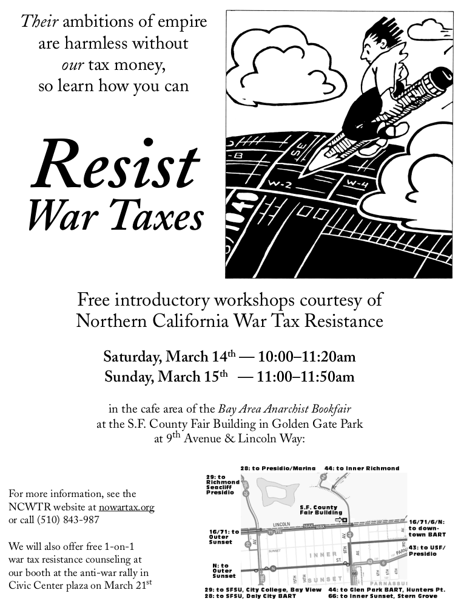

Communicating well can be crucial to the success of your campaign.
Evaluate your tactics with an eye not only to their primary effects, but also to the message they send.
In some cases, the message <em>is</em> the primary effect of the tactic (even when this is not what you had in mind).

Good communication helps you recruit resisters and blunts the effects of the government’s countermeasures.
It can also help your campaign develop the support and sympathy of non-participants, and even of former antagonists.

This chapter discusses several tactics tax resistance campaigns have used in the service of education and public relations.

<figcaption>Flyer advertising an educational workshop on the techniques of war tax resistance</figcaption>
