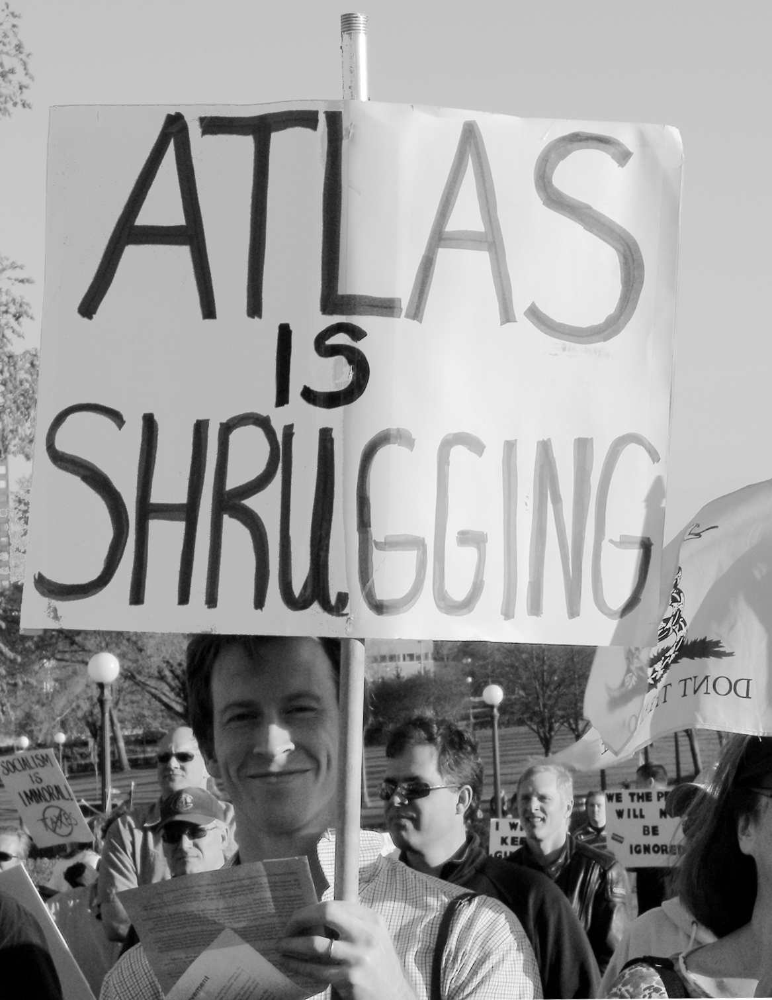

Tax resistance movements have often found it useful to identify and highlight resonances between their campaigns and popular myths, esteemed tax rebellions of yore, and historical heroes.

<figcaption>a TEA Party demonstrator dressed up in the garb of an American colonial</figcaption>

### Resonances with Prior Rebellions

Just about every tax revolt in the U.S. appropriates the Boston Tea Party as an evocative example of a righteous grassroots uprising.
The “Taxed Enough Already” TEA Party phenomenon is just one of many, many examples.

In Spain, the <i>Tancament de Caixes</i> (“shutting the cashboxes”) campaign in 1899 plays a similar role: modern Spanish tax resisters take inspiration from and compare their campaigns with that legendary struggle.

In Brittany, during the tax riots there in late 2013, “protesters wore red caps as a symbol of the Bretons’ historical resistance to taxes imposed by the ‘Sun King,’ Louis XIV.”

In England (and the British empire), the 1635 refusal by John Hampden to pay the King’s “ship money” has long been the example of choice—he has been trotted out from South Africa to Ireland to India to prove that celebrated patriots can refuse to hand over their tribute to the crown.

The phrase “no taxation without representation” has rhetorical power, especially in the nations descended from the British Empire.
It was especially potent in the American revolution and in the women’s suffrage movements.
It is sometimes used today even in support of tax resistance campaigns in which <em>representation</em> isn’t really an issue, as people have come to use the aphorism more as an incantation than a statement of principle.

## Rebecca Riots

The Rebecca Rioters in Wales, who painted their faces and dressed in drag to destroy tollgates and mete out justice in the middle of the nineteenth century, were tapping into a folkloric form of grassroots vigilantism that was centuries old.
“Jack a Lents” painted their faces and dressed in women’s clothing to tear down turnpikes in England a century before, and I’ve found references to protesters led by men in women’s clothing who used the shared pseudonym of “Lady Skimmington” in the Western Rising in England a century before that.

## Robin Hood

The Robin Hood myth has taken on a tax resistance theme in recent years.
The Disney animated version of the Robin Hood story makes the wicked Sheriff of Nottingham a tax collector.
Robin Hood robs him in order to redistribute the taxes back to the people they’d been seized from:

> While he taxes us to pieces and he robs us of our bread 
> King Richard’s crown keeps slippin’ down around that pointed head. 
> Ah! But while there is a merry man in Robin’s wily pack, 
> We’ll find a way to make him pay and steal our money back.

## Shrugging

<figcaption>a TEA Party demonstrator gets his message across</figcaption>

Ayn Rand’s novel <i>Atlas Shrugged</i> has become so influential in some quarters as to have almost graduated to the level of myth.
The titular metaphor has Atlas, the mythological titan who holds the world on his shoulders, shrugging and abandoning his role and leaving the world to collapse behind him.
In the book, Atlas is represented by the productive members of society—entrepreneurs, inventors, and good folk who do an honest day’s work for an honest day’s pay.
They are oppressed by a majority of parasites who use the government to steal the product of productive people’s labor for the good of those whose warped values make being productive a sin and being a parasite a virtue.
But one by one the productive few begin to drop out of society (and out of sight), following a pied piper named John Galt to a hidden utopia called “Galt’s Gulch” where parasites are not coddled and productive people can be free to produce and to exchange the fruits of their labor.
Finally the dystopia around them collapses as the parasites run out of hosts to feed on.

Some people who believe that the dystopia in this story describes their own society to a disturbing extent have adopted the terms “shrugging” or “going Galt” to describe their own decisions to step off the taxed hamster wheel.
By using such shorthand terms, they are able to quickly communicate the values and motives that lead them to resist, at least to other people who are also familiar with the <i>Atlas Shrugged</i> myth.
Here’s one example:

> I sold my business, moved to Montana, shrugged and have lived comfortably near the poverty [line] since 2005. I have a friend who made seven figures a year and shrugged last year. Gulches are popping up all over this country. Just because it’s not really well known doesn’t mean it’s not happening. Most of us, myself being a bit of an outlier, keep well below the radar.

## The Power of Rumor

Urban legends helped to fuel tax resistance during the French Revolution.
Rumors that the King had abolished taxes led people to refuse payment or to destroy the obsolete offices and apparatus of taxation.

Similarly, in Russia, after the emancipation of the serfs in 1861, a rumor spread that the word <i>volia</i> (freedom) in the emancipation decree also freed the former-serfs from the “redemption payments, labor dues, and taxes” that plagued them.
Many people began refusing to pay such taxes as a result, claiming that the tax collectors were maliciously concealing the good news in the czar’s decree.

The myth of the czar’s fatherly benevolence, which was promoted by the czarist government, could backfire on it.
Peasants, operating under the theory that because the czar was so good he could not possibly have ordered such terrible things, might refuse to pay onerous taxes or to obey other commands of the czar’s subordinates.
James C. Scott wrote:

> Perhaps the most remarkable feature of the myth was its plasticity in the hands of its peasant adherents. First and foremost, it was an invitation to resist any or all of the czar’s supposed agents, who could not have been carrying out the good czar’s wishes if they imposed heavy taxes, conscription, rents, military corvée, and so forth. If the czar only knew of the crimes his faithless agents were committing in his name, he would punish them and rectify matters. When petitions failed and oppression continued, it may simply have indicated that an impostor—a false czar—was on the throne. In such cases, the peasants who joined the banners of a rebel claiming to be the true czar would be demonstrating their loyalty to the monarchy.…
>
> In a form of symbolic jujitsu, an apparently conservative myth counselling passivity becomes a basis for defiance and rebellion…

Scott also wrote about how “much of the folk culture of the peasant ‘little tradition’ amounts to a legitimation, or even a <em>celebration</em>” of resistance:

> In this and other ways (e.g. tales of bandits, tricksters, peasant heroes, religious myths, carnivalesque parodies of authorities) the peasant subculture helps to underwrite dissimulation, poaching, theft, tax evasion, evasion of conscription, and so on. While folk culture is not coordinational in any formal sense, it often achieves a “climate of opinion” which, in other more institutionalized societies, might require a public relations campaign.

## American Constitutionalists

The place of the benevolent, fatherly Czar in American folklore is held by the U.S. Constitution.
Many Americans believe that this document describes or foretells a good, honest, faithful, protective, restrained government.
In this mythology, the reason the present government does not match this description, although it claims the Constitution as the source of its authority, is because the present government is a fraud—a sort of impostor on the throne.
Sometimes this mythology hearkens for a never-yet-enacted sort of Platonic constitutional order; other times it pretends to find such an order in the misty past of the real history of the United States and believes that we were somehow expelled from this political Eden but can find our way back if we keep the faith.

Based on many variations of this myth, a large and enduring subculture of “constitutionalist” tax protesters has developed.
Its adherents subscribe to an increasingly baroque and ever-evolving mythology in which the entire federal income tax apparatus is operating outside of the <em>real</em> United States government.
They believe that you can best show your loyalty to the U.S. Constitution by treating the IRS as a hostile foreign cancer that impersonates healthy tissue in the body politic but has no real authority.

## The Poll Tax Rebellion

“Poll tax” came to be the most widely-accepted name for what Thatcher’s government had been hoping would go down as the benign-sounding “community charge.”
This naming was a potent propaganda coup for the resistance movement.
Danny Burns, who chronicled that successful tax rebellion, says that “the story of [Wat Tyler’s] peasants revolt against the Poll Tax in 1381 was told in virtually every meeting.
Calling on these traditions was an important part of explaining why non-cooperation was needed…”
During the rebellion, people also hung signs in their windows reading “No Poll Tax Here”—these signs hearkened back to similar signs from the tax resistance accompanying the Reform Act agitation in the 1830s.

Now, after the success of the anti-poll tax campaign, <em>it</em> has become the example that today’s campaigns emulate and try to live up to—for example, the later Household Tax resistance campaign in Ireland.

Notes and Citations

* “Anti-layoff, tax protest in France prompts arson” <i>The Nation</i> (Thailand) 3 November 2013
* Bowen, Ivor <i>The Statutes of Wales</i> (1908) p. cxx
* Wright, Thomas <i>England Under the House of Hanover</i> (1848) pp. 154–55 (footnote), quoting the <i>Daily Gazetteer</i> of 8 October & 9 December 1735
* Flaherty, W.E. <i>The annals of England</i> (1877) p. 67
* Mercer, Johnny “The Phony King of England” Robin Hood (1973)
* “Prometheus” commenting on 14 March 2009 at <i>The Picket Line</i>
* Taine, Hippolyte “The Revolution” <i>We Won’t Pay: A Tax Resistance Reader</i> (2008) pp. 140–53
* Scott, James C. <i>Domination and the Arts of Resistance</i> (2008) pp. 97–98
* Scott, James C. <i>Weapons of the Weak: Everyday Forms of Peasant Resistance</i> (2008) p. 300
* You can find a good look at the constitutionalist tax protester movement in the United States in Doherty, Brian “It’s So Simple, It’s Ridiculous” <i>Reason</i> May 2004
* Burns, Danny <i>Poll Tax Rebellion</i> AK Press (1992), pp. 49, 58–59
* “History of the Passing of the Reform Bills” in Jones, William <i>Biographical Sketches of the Reform Ministers</i> (1832) p. 780

