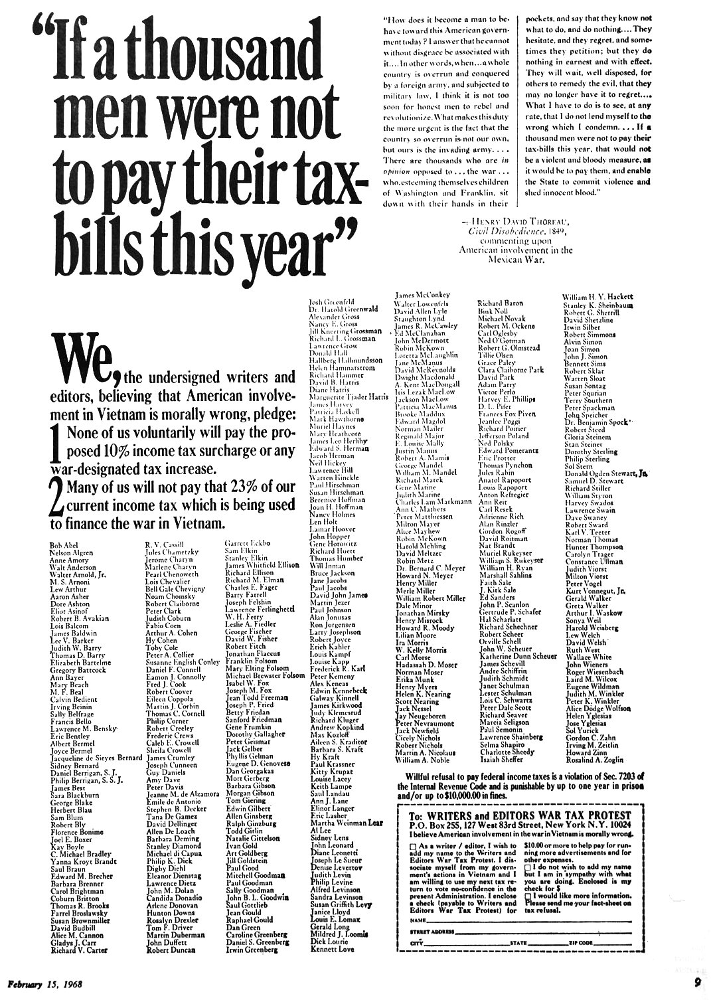

Tax resisters have frequently come together to take public oaths or to sign public pledges of resistance.
This signals to potential resisters that they will not be alone, and shows fearless defiance to the authorities.
I’ve collected dozens of examples.
Here are some of the more illustrative:

## Gandhi’s Campaigns in South Africa

When Gandhi launched his first satyagraha-based campaign in South Africa in 1906 (which was in part resistance to a new £3 poll tax on Indians in South Africa), an attendee of the meeting asked everyone present to take a solemn oath to steadfastly disobey the law, whatever the consequences.
Gandhi remarked:

> There is no one in this meeting who can be classed as an infant or as wanting in understanding. You are all well advanced in age and have seen the world; many of you are delegates and have discharged responsibilities in a greater or lesser measure. No one present, therefore, can ever hope to excuse himself by saying that he did not know what he was about when he took the oath.
>
> I know that pledges and vows are, and should be, taken on rare occasions. A man who takes a vow every now and then is sure to stumble. But if I can imagine a crisis in the history of the Indian community of South Africa when it would be in the fitness of things to take pledges, that crisis is surely now.…
>
> Resolutions of this nature cannot be passed by a majority vote. Only those who take a pledge can be bound by it. This pledge must not be taken with a view to produce an effect on outsiders. No one should trouble to consider what impression it might have upon the local Government, the Imperial Government, or the Government of India. Every one must only search his own heart, and if the inner voice assures him that he has the requisite strength to carry him through, then only should he pledge himself and then only would his pledge bear fruit.

His entire speech, which reflects on vows and the responsibility of vow makers, is worth reading in this context.

## Bardoli Tax Strike

Public pledges can test the determination and strength of the movement—that is, if the pledges really are commitments and not just gestures.
During the preparations for the Bardoli tax strike, the movement collected signed pledges from various regions as a way of feeling out which areas were most committed and which needed more prodding:

> The people… commenced taking signatures to a tentative pledge for non-payment of assessment. The deliberative meeting this time was very largely attended, more villages having sent their representatives and quite a number of them having sent the pledges duly signed. There was quiet deliberation and dogged determination in their voices, as each stood up to render an account of what his village had done. Their word would have been nothing worth, if they had all mechanically stood up and repeated parrot-like the cry of non-payment. Each told his tale in his own way. “58 men have given their signatures in our village, 12 have not yet. But that does not matter,” said one. “All excepting the village headman have signed the pledge,” said another, “but the headman is not hostile to us.” “Our Patel has already paid up and a Vania from a neighbouring village also, but we never counted on them,” said a third one. “There is a section among us which is recalcitrant, but we believe as though they were not of us. Our section will never pay, come what may, and trust the rest to the will of God,” said a fourth one. Quite a large majority said: “All have given their signatures. There is no fear of anyone flinching.”

According to Mahadev Desai, during the strike “[t]he bond of unity between the cultivating peasants themselves was the Satyagraha pledge.
The first month was entirely devoted to taking signatures on the pledge, and the reports from different camps gave minute details about every village:
the number of covenanters, shirkers, and whimperers, and the Sardar [commander] had to fix his programme according to the information received each day.”

People on the front lines of a resistance movement can also use pledges to communicate to the movement leadership or to each other that their commitment remains strong.
For instance, a woman was paying respects to the Bardoli tax strike commander, Vallabhbhai Patel, and handed him a small donation and a note that read:

> We are doing nothing out of the ordinary. This is a fight for our own interest, and for our hearths and homes. I am grateful to you for having taken the Satyagraha pledge from my husband, and I am here to give an additional pledge, that both of us shall willingly put up with whatever suffering that comes to our lot, in the shape of forfeiture of property moveable and immovable. I also promise that should my husband be privileged to be sent to jail, I shall cheerfully bid him godspeed.

## French Liberals

In 1829 several French newspapers printed the text of a pledge in which French liberals vowed to resist any taxes that the monarchy might try to institute without going through constitutional channels.
These newspapers were prosecuted by the crown for printing such a seditious thing, but in court they pointed out that the King himself, along with three other members of the nobility, had once signed a tax resistance pledge to protest against republican infringements on their privileges.

## A Vote in Castine

In Castine, Maine, in 1975, the “pledge” took the form of a vote:
at a specially-convened town meeting, the town voted 125 to 65 to refuse to collect a school funding tax—in defiance of a superior court order telling them that they must do so.

## Reform Act Vow

The Reform Act agitation really hit its stride in 1831 when a huge rally—150,000 people strong—vowed with a roar to stop paying taxes until the Act’s passage.
One account of the occasion read:

> He declared before God, that, if all constitutional modes of obtaining the success of the reform measure failed, he should and would be the first man to refuse the payment of taxes, except by a levy upon his goods [tremendous cheering, which lasted some minutes]. I now call upon all who hear me, and who are prepared to join me in this step, to hold up your hands [an immense forest of hands was immediately elevated, accompanied by vehement cheering]. I now call upon you who are not prepared to adopt this course, to hold up your hands and signify your dissent [not a single hand appearing, loud shouts and cheers were repeated].

## “New Rush”

In South Africa’s “New Rush” in 1874, a number of miners signed a pledge that read, in part, “I promise on my honour and in presence of the people that I shall not from this day forward—until released from this obligation by the officers of the League—pay any taxes or impositions whatsoever… for the support and maintenance of the Government of this territory; and that I shall buy from, sell to, or deal with only such men as have also taken this pledge or obligation; and that I shall to the utmost of my power, with purse and person, protect any and every officer and member of the League against coercion or consequences of what nature soever arising out of the action necessitated by this pledge.”

## American War Tax Resisters

<figcaption>the writers and editors war tax protest of 1967</figcaption>

This tactic has been popular in the American war tax resistance movement.

In 1967, for example, more than five hundred writers and editors added their names to a war tax resistance pledge that appeared as a newspaper advertisement.
The names included those of such well-known figures as James Baldwin, Noam Chomsky, Philip K. Dick, Lawrence Ferlinghetti, Betty Friedan, Allen Ginsberg, Norman Mailer, Henry Miller, Grace Paley, Thomas Pynchon, Susan Sontag, Benjamin Spock, Gloria Steinem, William Styron, Hunter S. Thompson, and Kurt Vonnegut.

Notes and Citations

* Gandhi, M.K. <i>Satyagraha in South Africa</i> 2nd ed. (1950) pp. 95–102
* Desai, Mahadev <i>The Story of Bardoli</i> (1929) pp. 48–49, 96–97, 170
* “The Refusal to Pay Taxes—A Precedent” <i>Southern Literary Messenger</i> September 1838 pp. 589–90
* Heavrin, Jean “Castine reasserts its tax rebellion” <i>Bangor Daily News</i> 5 August 1975, p. 1
* <i>The Annual Register, or a View of the History, Politics, and Literature of the Year 1831</i> (1832) p. 282
* “Rules Proposed for the Kimberley Defence League or Protection Association” <i>Correspondence Relating to the Colonies and States of South Africa</i>, part I (1876) pp. 21–s2
* Kaplan, Morris “Writers Protest Vietnam War Tax” <i>New York Times</i> 17 September 1967

