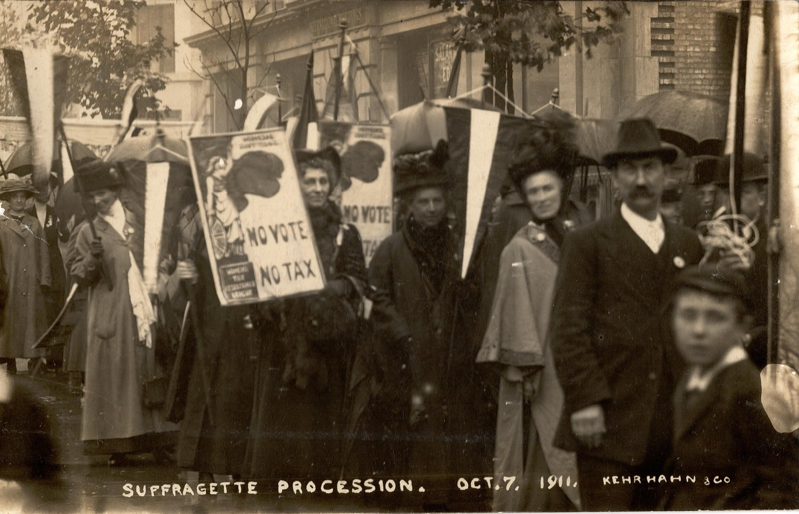

import { Badge } from '@astrojs/starlight/components';

If the government seizes property from tax resisters, your campaign can use these seizures as occasions to hold protest rallies or to shape the accompanying publicity.

## <Badge text="Example" size="medium" /> Women’s Suffrage Movement

The British women’s suffrage movement was particularly skilled at this.
Here is one example:

> [Henrietta Müller], far from relenting to save her property, publicly advertised the date of the seizure, and invited the women of England to come and witness the disgraceful spectacle of a woman being robbed by the minions of the law because she dared to ask for a voice in the disposition of her taxation.
> The invitation was accepted by hundreds of well-dressed but excited and indignant women, who crowded into Cadogan Square and nearly mobbed the bailiffs while they were removing the lares and penates from the Muller residence.
> An indignation meeting was afterward held in Miss Muller’s drawing-rooms and many bitter and vehement denunciations of the tyranny and injustice of the law were indulged in.

## <Badge text="Example" size="medium" /> War Tax Resisters

In 1989, the Internal Revenue Service seized the home of American war tax resisters Betsy Corner and Randy Kehler—on paper, anyway.
The couple defied the seizure and continued living in the home until they were arrested in late 1991 and held behind bars while the agency tried to auction off the home.
But even that wasn’t the end of the story.
Sympathetic activists continued to occupy the home in week-long shifts, ’round the clock, for 18 months, and they used each Thursday’s “changing of the guard” to stage a demonstration and keep the issue in the public eye.

Notes and Citations

* “A London Woman Wants the Franchise and Refuses to Pay Taxes” <i>Buffalo Express</i> 3 July 1884, p. 1
* “Peace Advocates Turn Tax Resistance Into a Ritual” <i>New York Times</i> 9 March 1992

