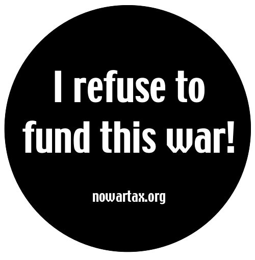
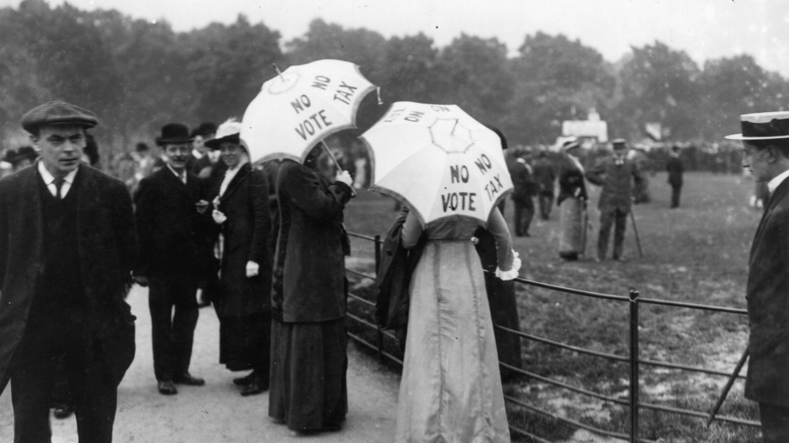

import { Aside } from '@astrojs/starlight/components';
import { Badge } from '@astrojs/starlight/components';

Your tax resistance campaign can increase its visibility by adopting uniforms, badges, ribbons, or other emblems that identify resisters and those who are working in concert with the campaign.
These can also demonstrate that the resisters feel pride in their resistance.

## <Badge text="Example" size="medium" /> Indian Independence Movement

An important part of the Indian independence struggle was the wearing of <i>khādī</i> (homespun cloth).
This had three main purposes:

1. to encourage the development of Indian self-reliance and industry as the economic foundation of Indian independence
1. to hurt the British government by boycotting British fabric and thereby reducing the profitability of the British Empire’s occupation of India
1. to serve as an emblem to identify and express the commitment of Indian patriots

Gandhi wrote:

> [T]he most effective and visible cooperation which all [Indian National] Congressmen and the mute millions can show is by not interfering with the course civil disobedience may take and by themselves spinning and using <i>khādī</i> to the exclusion of all other cloth.
> If it is allowed that there is a meaning in people wearing primroses on Primrose Day, surely there is much more in a people using a particular kind of cloth and giving a particular type of labour to the cause they hold dear.
> From their compliance with the <i>khādī</i> test I shall infer that they have shed untouchability, and that they have nothing but brotherly feeling towards all without distinction of race, colour, or creed.
> Those who will do this are as much Satyagrahis as those who will be singled out for civil disobedience.

Gandhi himself put in many hours at the spinning wheel, and demanded this of his followers as well.

“Gandhi caps” made from <i>khādī</i> became almost a uniform of the resistance.
One news dispatch from around the time of the Dharasana salt raid noted:

> …the growth of the Gandhi movement was shown by the increased number of persons wearing the Gandhi caps.
> In the cities… a majority of the people wear them; they also are beginning to be worn in villages in Punjab while even in aristocratic Simla one person in six of the population in the bazaars have donned caps, which is the symbol of the nationalist campaign.

<Aside type="tip" title="See also">
[Boycott Government Monopoly Goods or Particularly Taxed Goods](../../../tacticsthatexpandthearsenaloftechniques/boycottgovernmentrevenue) 
[Manufacture & Sell Alternatives to Taxed Goods](../../../tacticsthatexpandthearsenaloftechniques/makealternativestotaxedgoods)
</Aside>

## <Badge text="Example" size="medium" /> American Revolution

Gandhi’s campaign wasn’t the first blow against the British Empire that was struck by homespun cloth and the conspicuous consumption of locally-manufactured goods.
These were also important parts of the American Revolution.

Here is an example reported in a 1770 edition of the <i>Massachusetts Gazette</i>:

> On Wednesday evening the honorable speaker and gentlemen of the House of Burgesses gave a ball at the capitol… and it is with the greatest pleasure we inform our readers… [of] the patriotic spirit… manifested in the dress of the ladies on that occasion, who, to the number of near one hundred, appeared in homespun gowns; a lively and striking instance of their acquiescence and concurrence in whatever may be the true and essential interest of their country.

Patriotic Americans worked together at festive “spinning bees” to card, spin, weave, and sew—ways that everybody could demonstrate their revolutionary spirit and participate in the resistance.

## <Badge text="Example" size="medium" /> Rebecca Riots

The Rebecca Riots in Wales in the mid-19th century were notorious for the distinctive garb donned by the parties of resisters who would gather to tear down tollgates.

The leader of each party was usually a man dressed up in women’s clothing and a large bonnet, who sometimes also wore a horse-hair wig or carried a parasol, and who was given the name “Rebecca.”
Rebecca’s followers, or “daughters,” also were men wearing women’s clothes, or at least white blouses over their clothes, and sometimes bonnets or other high-crowned hats, occasionally with fern fronds, feathers, or other decorations on them.
They would paint their faces black or yellow, and sometimes drape their horses in white sheets.

In this case, the point of the costuming was not so much to express public pride as for other purposes, such as:

* to disguise the participants so that the government would be less able to retaliate against them
* to intimidate toll gate keepers with their strangeness and their reputation
* to create a fluid figurehead for the movement that could be adopted and then set aside by various people, so as to make the movement less vulnerable to reprisals against its leadership
* to make the resistance more festive and carnivalesque and thereby encourage participation
* to make it easier to identify fellow-resisters in the confusion of late-night raids on dark country roads
* to resonate with ancient folk forms of grassroots vigilantism and protest that had a similar character

<Aside type="tip" title="See also">
[Resonate with Myths, Legends, Folklore, or Historical Examples](../resonatewithlegends/)
</Aside>

## <Badge text="Example" size="medium" /> Relics of the Glastonbury Cows

Abby & Julia Smith refused to pay taxes to a local government that denied women the vote (and that took advantage of this by excessively taxing women’s property in order to ease the tax burden on male voters and to redistribute the money to male patronage recipients).
In response, the government periodically seized and auctioned off the Smith sisters’ cows (whom they had named “Votey” and “Taxey”).

Emblems made from hairs of the cows’ tails, woven into the shape of flowers and tied with ribbons bearing the slogan “Taxation Without Representation,” became popular adornments for supporters of the Smiths’ tax resistance.

## <Badge text="Example" size="medium" /> War Tax Resisters

In 2007, I spoke at a “Stop Funding the War in Iraq” rally near the offices of a U.S. Congressional leader.
The rally was being put on by anti-war groups that were eager to convince Congress to stop funding the war.
But the groups hadn’t yet put much thought into the idea that their members could cut off <em>their</em> war funding by resisting taxes.

But a local war tax resistance group was there, handing out stickers for people to wear that read “I refuse to fund this war!”
Just about everybody who was offered a sticker was eager to wear one, agreeing with the sentiment at least—one that harmonized with the theme of the day, but that pointedly made it more personal.
Perhaps a few protesters then looked around and wondered: “Has everyone else here started resisting <em>their</em> taxes? Maybe it’s time for me to start.”

## <Badge text="Example" size="medium" /> Fries Rebellion

The Fries Rebellion in the United States took place about a decade after the United States Constitution came into force, and soon after the success of the French Revolution.
The president of the U.S. government at the time was John Adams, who, despite his revolutionary credentials, represented the more authoritarian, aristocratic, pro-English political faction.
The faction that was out of power was more populist, democratic, and pro-French.

Tax resisters who participated in the Fries Rebellion sometimes wore French tricolor cockades in their hats to show their affinity with the democratic revolutionaries across the pond.
Others wore their old American revolutionary militia uniforms to demonstrate their belief that the current rebellion was more in harmony with the spirit of the American Revolution than were the policies of the Adams administration.

## <Badge text="Example" size="medium" /> Addiopizzo Movement

Businesses that pledge to refuse to pay the <i>pizzo</i> tax to the Sicilian mafia put “Addiopizzo” signs in their windows.
This signals that they are unafraid of mafia reprisals, and also helps consumers who joined the movement’s “Critical Consumption” buycott to know where they can shop <i>pizzo</i>-free.

Though it might seem that such signs would invite trouble from a mafia that notoriously relies on credible threats to keep its coffers full, the Addiopizzo movement has held so firm that mafia enforcers have been caught on police wiretaps warning each other to <em>avoid</em> harassing Addiopizzo-marked businesses because the likelihood of payout is so low that the risks associated with extortion aren’t worth it.

<Aside type="tip" title="See also">
[Participate in Buycotts and Boycotts](../../../tacticsthatexpandthearsenaloftechniques/buycottsandboycotts/)
</Aside>

## <Badge text="Example" size="medium" /> Australian Miners

In 1854, Australian miners who were resisting a license tax held a “monster meeting” at which they passed a number of resolutions, including these:

> [A]s it is necessary that the diggers should know their friends, every miner agrees to wear as a pledge of good faith, and in support of the cause, a piece of red ribbon on his hat, not to be removed until the license tax is abolished.
>
> That this meeting… desire to publicly express their esteem for the memory of the brave men who have fallen in battle [during “the late out-break”], and that to shew their respect every digger and their friends do wear tomorrow (Sunday) a band of black crape on his hat…

## <Badge text="Examples" size="medium" /> Other Ways to Show Pride

Many of these have been examples of resisters showing pride in their resistance.
This can short-circuit the traditional government gambit of publishing the names of tax evaders to try to shame them as bankrupts or deadbeats.
If the government tries to shame tax resisters in this way, but the resisters have already eagerly made their resistance public, this gambit loses its power.

When local governments in the U.K. tried this against poll tax resisters in the Thatcher years, the newspapers who published the lists of “shame” got letters from resisters who were outraged that they had not made the list—and who insisted that their names be included too!

The Women’s Freedom League was a British women’s suffrage activist group that refused to pay taxes on the salaries of its employees.
When it was threatened with a legal writ by the government, it decided to auction the writ in a fundraiser as though it were a treasured award.

<figcaption>Suffrage activists turn their parasols into billboards for the “No Vote, No Tax” slogan</figcaption>

Greek tax resisters in Penteli (near Athens) refused to pay new taxes the government had added to their utility bills.
To express their communal pride in resistance they hung their urgent “past due” notices from a Christmas tree in the town square as ornaments.

When the IRS levied war tax resister Thad Crouch’s salary, he remembers:

> How fortunate to be levied a week before tax day.
> What a great media hook!
> …[N]ot only would I publicly refuse to pay my taxes, I would throw a party to rejoice in my religious persecution and <em>I would invite the IRS!</em>…
>
> About forty people ranging from six months to 70 years old enjoyed that fun-filled night as we sang, beat drums, recited poems, and laughed beneath the “peace tax cranes.”
> A friend and I made origami peace cranes from tax returns and strung them from the ceiling.
> Midway through the party I took just a few minutes to thank everyone for coming.
> I explained my WTR [war tax resistance], the Religious Freedom Peace Tax Fund, and why I was rejoicing in a levy.
>
> …The most popular question was “Did you really invite the IRS?”
> We were happy not only to answer yes, but also to entertain guests with the voice mail message of an Austin IRS agent thanking me for the invitation but declining on behalf of their office.
> Guests howled with laughter that I hope dispelled their fears as it had done mine the week before.
>
> …So the next time the collection agent comes knocking and you find yourself faced with tough decisions, stress and fear, take time to rejoice.
> Laugh, throw a party, educate others, and dispel fear!

Notes and Citations

* Gandhi, M.K. “Civil Disobedience” <i>Non-Violent Resistance (Satyagraha)</i> (1961) pp. 306–07
* “Britain Facing Heavy Loss in No-Tax Drive” (Associated Press) <i>Binghamton Press</i> 2 June 1930, p. 21
* <i>Massachusetts Gazette</i> 12 February 1770, as found in Frothingham, Richard <i>The Rise of the Republic of the United States</i>, 5th ed. (1890) p. 240
* Evans, Henry Tobit <i>Rebecca Riots!</i> (2010)
* Speare, Elizabeth George “Abby, Julia, and the Cows” <i>American Heritage</i> June 1957
* Davis, W.W.H. <i>The Fries Rebellion</i> (1899), chapters 4 and 6
* Humphreys, Adrian “Beating the Mafia at their own game: After years of paying a ‘protection’ tax, Palermo businesses came together to fight back” <i>National Post</i> 28 January 2013
* “Victoria” <i>Colonial Times and Tasmanian</i> 22 December 1854, p. 2
* Burns, Danny <i>Poll Tax Rebellion</i> AK Press (1992), pp. 146–47
* “The Government Moves Against Us” <i>The Vote</i> 8 May 1914, pp. 35–36
* “Κρέμασαν τους λογαριασμούς της ΔΕΗ στο έλατο!” <i>To Proto Thema</i> 1 December 2011
* Crouch, Thad W. “The Austin Levy Party; A Different Response to Collection” <i>More Than a Paycheck</i> June 2002

