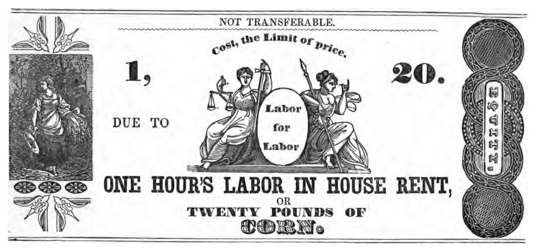

import Aside from '../../../components/ExtendedAside.astro';
import { Badge } from '@astrojs/starlight/components';
import WikipediaBadge from '../../../components/WikipediaBadge.astro';
import { YouTube } from 'astro-embed';

<figcaption>one of Josiah Warren’s “labor notes”</figcaption>

Some campaigns develop alternative currencies that facilitate tax resistance.
There are several reasons why tax resisters may find alternative currencies attractive:

1. **the “inflation tax”**\
   Most government-backed currencies are subject to inflation, which benefits the government at the expense of currency users.
   If the government has a monopoly on issuing money, it can manipulate the currency supply and generate a stealth tax that tax resisters can’t easily avoid.
1. **anarchist principles**\
   American anarchists like Josiah Warren, William B. Greene, and Benjamin Tucker challenged the government monopoly on currency as part of their critiques of coercive government.
   Warren’s “labor notes” are one early 19th century ancestor of the “Time Dollars” that are currently in use in some areas of the United States (see below).
1. **privacy / secrecy**\
   If you can remove yourself from the government’s money system, perhaps you can keep the government from finding out about your earnings and spending altogether.
   This can make those activities more difficult to tax.

   John T. Kennedy, writing of what he calls “economic secession,” put it this way:

   > Think of how much less profitable taxation would be if government didn’t know how much money you earned or how much money you had.
   > The Leviathan cannot extract the revenue necessary to sustain itself at anything like current levels without knowing where the money is.…
   > [I]f the means of economic privacy are available [people] must choose between keeping their own money in their own pockets or voluntarily turning it over to government.
   > Then you’ll see economic secession on a grand scale.

Here are some examples of how people have used alternative currencies to facilitate or augment tax resistance:

## <Badge text="Example" size="medium" /> Time Dollars

The state of Missouri issued what it called “Time Dollars” to people who volunteer to spend their time helping the elderly.
Volunteers could in turn use their Time Dollars to hire similar help if they need it later on.
The state promised that it would honor these Time Dollars itself if no home care workers were available who would accept such currency.
Although Missouri did not have a tax resistance motive in establishing this program, in 1985 they sought (and eventually obtained) an Internal Revenue Service (IRS) ruling that Time Dollars are not taxable income.

Many alternative currency projects in the United States are trying to follow the Time Dollar model, in some cases with the explicit goal of helping tax resisters.

## <Badge text="Example" size="medium" /> Norraths, Britannian gold pieces, & QQ coins

The in-game currencies used in massively-multiplayer online (MMO) games are also plausible challengers to legal tender.

If you’ve never played one of these games, you may be surprised at just how huge they have become, and just how many transactions take place in these fantasy currencies.
Because players can sell their hard-won game-world prizes on real-world auction sites like eBay, it is possible to exchange virtual money for real goods, real money for virtual goods, or virtual money for real money.
In 2001, an economist took the time to figure out what the exchange rate was between EverQuest Norraths and U.S. Dollars, and he concluded:

> [EverQuest has] the 77th largest economy in the world.
> [It] has a gross national product per capita of $2,266, making its economy larger than either the Chinese or Indian economy and roughly comparable to Russia’s economy.…
>
> The nominal hourly wage is about $3.42 per hour, and the labors of the people produce a GNP per capita somewhere between that of Russia and Bulgaria.
> A unit of Norrath’s currency is traded on exchange markets at $0.0107, higher than the yen and the lira.
> The economy is characterized by extreme inequality, yet life there is quite attractive to many.

Note that when he says that EverQuest had the 77th largest economy in the world, he means the *real* world.
Tax agencies do not yet tax this thriving economy, though most of its transactions are (in theory at least) easily-traceable.
Julian Dibbell wondered why the tax collector hasn’t come calling yet:

> If you haven’t misspent hours battling an Arctic Ogre Lord near an Ice Dungeon or been equally profligate spending time reading the published works of the Internal Revenue Service, you probably haven’t wondered whether the United States government will someday tax your virtual winnings from games played over the Internet.
> The real question is: Why hasn’t it happened already?
>
> …if you look on online marketplaces like eBay today, you will find a thriving, multimillion-dollar market in Golden Runic Hammers, Ethereal Mounts, and similarly exotic items—all of them won (and anything found or wrested from another player is “won” in the context of a game) or bartered for in this or that MMO quest, and many of them fetching prices in the hundreds, even thousands of dollars.

Dibbell tried to figure out how he *would* declare income earned in the course of the game if he wanted to.
He turned to an IRS instruction guide, which he found to include sections on “every conceivable form of income known to accounting”:

> To read it once is to realize that you know nothing about income.
> Here you’ll find a description of gains, ill-gotten and otherwise, so irregular that they can be taxed only according to that form of guesswork known as fair market value.
> Here are stocks, options, retirement watches, and stolen goods (“If you steal property, you must report its fair market value in your income in the year you steal it unless in the same year, you return it to its rightful owner”).

He determined that “items acquired either through barter or as prizes in a game” is the closest category.
But then it got tricky:

> Goods taken in trade or won at play are taxable the moment they fall into somebody’s hands, even if they are not sold for money.
> The more I read, the more I wondered whether reporting the amount I had brought home from selling virtual items on eBay was enough to satisfy the IRS.
>
> What about the assets I bartered for or won in the game but never sold in the real world, the suits of armor stashed here and there with their easily established fair market value?
> What if I traded those assets for their value in Ultima Online’s official currency, the Britannian gold piece, rather than for dollars?
> Wouldn’t it be easy to establish their value in dollars nonetheless and, if I owed American taxes on the exchange, put a number on the deal that the IRS could grasp and love?
> And what about all the other MMO players out there—how long could the IRS be expected in good conscience to leave the resulting millions of dollars in wealth untouched?

Hilarious!
Imagine opening the treasure chest behind the dragon you just dispatched in some virtual reality, only to find that it is one-third empty thanks to income tax withholding!
Is the chainmail armor that your digital character bought a business expense, and if so, how should you handle depreciation?
Can you imagine?

But the government has two choices: either enlist an army of IRS accountants and lawyers to come up with just these sorts of absurd regulations, or allow a huge virtual economy, at which many of its citizens fruitfully labor for hours and hours, to go untaxed… and potentially to spill out into the real-world economy.

Here’s another example:
An on-line currency called the “QQ coin” became a craze in China, and exposed latent demand for an alternative to the tightly-controlled legal tender there.

> In some rural areas, where debit and credit cards are scarce, stores began to accept QQ coins as payment for real goods and services.…
>
> “QQ coins were being traded with such volume and frequency that they did start to drag down the value of the <i>yuan</i>,” one financial analyst told the <i>Wall Street Journal</i>.
> In other words, demand was so great that QQ coins began to have more buying power than genuine Chinese banknotes.…
>
> The growing impact of QQ coins was also enough to worry top government ministries in China, including the central bank, which announced it was “on the lookout for any assault by such virtual currencies on the real economic and financial order.”

> The coins have also become the medium of exchange for online gambling and money laundering, said an executive of another online game operator.
>
> “Once the money becomes QQ coins, it can be transferred anywhere electronically,” he said.…
>
> Online auction sites… are part of the problem as they allow users quick and easy exchange of QQ coins back to real money.
>
> More than 100,000 auctions of discounted QQ coins happen on Taobao each day, according to mainland media, with transaction volume reaching an annual 200 million <i>yuan</i>.

## <Badge text="Example" size="medium" /> Honor Bonds

For a time in the United States, you could go to a bank and buy an “honor bond” (or “bearer bond”) for the face value of your purchase.
Such bonds were anonymous—anyone could redeem them, not just the person to whom they were issued.
And they earned interest.
So for a certain class of savvy people, tax resisters in particular, they were better than money for conducting high-denomination transactions.
The government has since cracked down on the practice.

## <Badge text="Example" size="medium" /> Liberty Dollars

The U.S. government also tightened the screws on a fellow who coined a currency called the “Liberty Dollar” that he hoped would be more reliable and valuable than the stuff they print out at the Mint—but not before some sixty million dollars worth of the currency were in circulation.
The government felt so threatened by this competitor that it convicted him of criminal charges in 2011 and confiscated the precious metal that his organization was using to mint its coins and to back its paper currency, on the grounds that the Liberty Dollar project amounted to money laundering, mail fraud, wire fraud, counterfeiting, and conspiracy.

The federal prosecutor in charge of the case said, after winning the conviction:

> Attempts to undermine the legitimate currency of this country are simply a unique form of domestic terrorism.
> While these forms of anti-government activities do not involve violence, they are every bit as insidious and represent a clear and present danger to the economic stability of this country.
> We are determined to meet these threats through infiltration, disruption, and dismantling of organizations which seek to challenge the legitimacy of our democratic form of government.

## <Badge text="Example" size="medium" /> Tems

In Greece, people turn with desperate creativity to a variety of alternative economic tactics, including the use of an alternative currency called “<i>tems</i>” that the Greek government has not yet figured out how to tax.

People can join the <i>tems</i> network and immediately start paying for goods and services by using a web-based interface to transfer some amount of this virtual currency.
This puts them into debt by however much they transfer, a debt that they can pay off by providing goods or services to another person in the network, who pays them with their own <i>tems</i> and brings their account back into balance.
The system does not permit people to go more than 300 <i>tems</i> into debt or to hoard more than 1,200 <i>tems</i> in their account.
This helps keep the currency stable, active, and close to its original intention as a facilitator of barter-like transactions.

## <Badge text="Example" size="medium" /> Bitcoin

As I was initially preparing this book, the alternative currency on the rise was “bitcoin,” a form of currency that is backed by the full faith & credit of its community of users and the sophisticated and clever algorithm that gives the currency value as a medium of exchange.

Bitcoins are composed of numbers, are minted by mathematics, usually never take material form, are rarely recognized as legal tender, and are backed by no material goods… and yet they seem strikingly more secure and useful and dependable, at least in some ways, than the currencies we have grown used to (for which, on close inspection, many of these same frightening conclusions hold true).

“Fr33 Aid” is a group of volunteers who organize free first aid and health services and who educate people about first aid skills (like CPR) and about the value of voluntary mutual aid at libertarian/anarchist-leaning conferences and other events in the United States.
On tax day in 2013, the group announced that they were abandoning their frustrating quest to gain government-certified nonprofit status.
They said they would instead withdraw from the state-monitored banking system and from state-controlled currency and instead do as much as possible with bitcoin.

“When we founded Fr33 Aid in early 2011, the banks all required a taxpayer ID number and government paperwork,” said Teresa Warmke, Fr33 Aid’s co-founder and treasurer.
“Bitcoin changed everything.
We can focus on our mission now that Fr33 Aid’s assets are safe in our Bitcoin wallet.”

She explained:
“Now that there are ways for us to do banking without government involvement, we decided fulfilling [onerous IRS requirements for nonprofits] would not be a responsible way for Fr33 Aid to spend its money nor for our volunteers to spend their time.”

The organization continued to accept donations denominated in dollars from people who have not yet adopted bitcoin, but converted such donations to bitcoin “in a timely manner.”
This way, Warmke says:
“If at some point either the bank or a government tries to confiscate our account for taxes they believe we owe or failure to file paperwork, they would only be able to find a few dollars for their trouble.”

<YouTube id="KSoY7hED5NQ" title="Bitcoin 2013 conference - Bitcoin For Nonprofits" />

The increasing use of certain varieties of cryptocoins is a challenge to tax collection.
One scholar wrote:

> Our tax reporting and collection system is built, among others, on the assumptions that (ⅰ) parties to a taxable transaction know each other (or can reasonably obtain information about one another and send information to each other), and (ⅱ) that there are some uniquely situated taxpayers (such as banks) that regularly collect financial information about other taxpayers in a centralized manner.
> The operation of Bitcoin defeats both assumptions.
> Parties to Bitcoin transactions do not necessarily know each other, and the operation of Bitcoin is decentralized.
> Thus, important assumptions that stand in the basis of our traditional collection mechanisms collapse.

> Cryptocurrencies possess the two most important characteristics of a traditional tax haven.
> First, because there is no jurisdiction in which they operate (they are “held” in cyberspace accounts known as online “wallets”), they are not subject to taxation at source.
> Second, cryptocurrency accounts are anonymous.
> Users can start as many online “wallets” as they want to buy or mine Bitcoins and trade them without ever providing any identifying information.
>
> Significantly, Bitcoin (and other cryptocurrencies) offer one additional major advantage to tax-evaders that traditional tax havens do not: the operation of Bitcoin is not dependent on the existence of financial intermediaries such as banks.
> Bitcoin is exchangeable peer-to-peer by definition.
> Bitcoin thus seems immune to the developing international anti-evasion regime [in which] financial institutions [are] the emerging agents of tax collection…
> Thus, cryptocurrencies have the potential to become super tax havens.

However, Bitcoin transactions are inherently very traceable.
Indeed, all of them are permanently registered on the “blockchain” which is available to anyone who wants to examine it.
So bitcoin use is only “anonymous” to the extent that those who use it take deliberate measures to keep it so.
It is not an effortless panacaea for the privacy-conscious tax evader.

<Aside type="wikipedia" title="Wikipedia">
  <WikipediaBadge title="Seigniorage" />
  <WikipediaBadge title="Benjamin Tucker" />
  <WikipediaBadge title="Josiah Warren" />
  <WikipediaBadge title="William Batchelder Greene" />
  <WikipediaBadge title="Time-based currency" />
  <WikipediaBadge title="EverQuest" />
  <WikipediaBadge title="Ultima Online" />
  <WikipediaBadge title="Tencent QQ" />
  <WikipediaBadge title="Bearer bond" />
  <WikipediaBadge title="Liberty dollar (private currency)" />
  <WikipediaBadge title="Complementary currencies" />
  <WikipediaBadge title="Community Exchange System" />
  <WikipediaBadge title="TEM (currency)" />
  <WikipediaBadge title="Bitcoin" />
  <WikipediaBadge title="Cryptocurrency" />
</Aside>

---

Notes and Citations

* Warren, Josiah [<i>Equitable Commerce</i>](https://archive.org/details/equitablecommer00warrgoog/page/n8/mode/2up) (1849) and [<i>True Civilization</i>](https://archive.org/details/truecivilizatio00warrgoog/page/n4/mode/2up) (1863)
* Greene, William B. [<i>The Radical Deficiency Of The Existing Circulating Medium, And The Advantages Of A Mutual Currency</i>](https://archive.org/details/mutualbankingsho00greeiala) (1857)
* Tucker, Benjamin Tucker [<i>Instead of a Book</i>](https://archive.org/details/cu31924030333052/page/n9/mode/2up) (1897), part two
* Balko, Radley [“Who Killed Paypal?”](https://reason.com/2005/08/01/who-killed-paypal-2/) <i>Reason</i> August 2005
* Kennedy, John T. “Economic Secession” <i>anti-state.com</i> 18 March 2003
* Cahn, Edgar S. [“Why the Taxman Didn’t Come”](https://archive.org/details/timedollarsnewcu0000cahn/page/75/mode/1up) <i>Time Dollars</i> (1992)
* Vaknin, Sam “Games people play” <i>United Press International</i> 14 June 2002
* Dibbell, Julian [“Dragon Slayers or Tax Evaders”](https://web.archive.org/web/20060127003957/http://www.legalaffairs.org/issues/January-February-2006/feature_dibbell_janfeb06.msp) <i>Legal Affairs</i> January/February 2006
* Hancock, Tom [“March of the QQ Penguin”](https://www.chinadaily.com.cn/a/201301/25/WS5a2a1586a3101a51ddf8e7c6.html) <i>The World of Chinese</i> 13 January 2013
* So, Sherman “Taobao carries on with QQ coins” <i>South China Morning Post</i> 12 August 2012
* Fowler, G.A. & Juying, Qin “QQ: China’s New Coin of the Realm? Officials Try to Crack Down As Fake Online Currency Is Traded for Real Money” <i>The Wall Street Journal</i> 30 March 2007
* Browning, Frank “Tax Revolt!” <i>Inquiry</i> 2 April 1979
* Feuer, Alan [“Prison May Be the Next Stop on a Gold Currency Journey”](https://www.nytimes.com/2012/10/25/us/liberty-dollar-creator-awaits-his-fate-behind-bars.html) <i>New York Times</i> 24 October 2012
* [“Defendant Convicted of Minting His Own Currency”](https://archives.fbi.gov/archives/charlotte/press-releases/2011/defendant-convicted-of-minting-his-own-currency) Federal Bureau of Investigation, Charlotte division, press release 18 March 2011
* Henley, Jon [“Greece on the breadline: cashless currency takes off”](https://www.theguardian.com/world/2012/mar/16/greece-on-breadline-cashless-currency) <i>The Guardian</i> 16 March 2012
* Agorist Don [“Greece Surrenders to the Underground Economy”](https://tirelessagorist.blogspot.com/2012/03/greece-surrenders-to-underground.html) <i>The Tireless Agorist</i> 23 March 2012
* “Fr33 Aid Abandons IRS Application and Begins Financial Operations in Bitcoin” Fr33 Aid press release, 15 April 2013
* Warmke, Teresa “Fr33 Aid Abandons IRS Application: Q&A” Fr33 Aid blog, 15 April 2013
* Marian, Omri “How Bitcoin Challenges the Federal Income Tax System” <i>In Bitcoin We Trust? A Forward Look at the Regulation, Use, and Growth of the Digital Currency</i> (Ohio State Entreprenurial Business Law Journal symposium)
* Bohannon, John [“Why criminals can’t hide behind Bitcoin: Even with cryptocurrency, investigators can follow the money”](https://www.science.org/content/article/why-criminals-cant-hide-behind-bitcoin-rev2) <i>Science</i> 9 March 2016
* Morris, David Z. [“How Tax Protesters Set Off the Bitcoin Revolution”](https://www.coindesk.com/layer2/2022/02/28/how-tax-protesters-set-off-the-bitcoin-revolution) <i>CoinDesk</i> 28 February 2022

