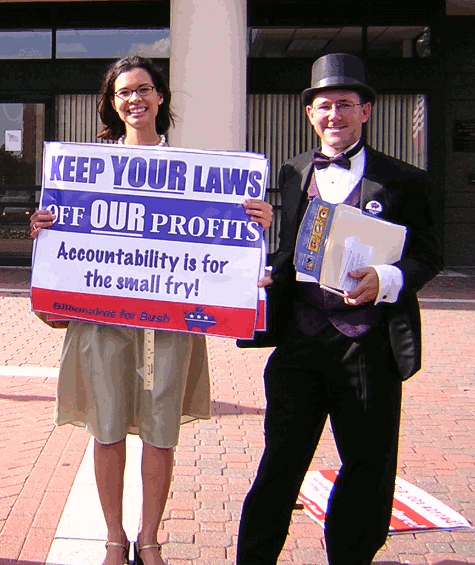

import { Aside } from '@astrojs/starlight/components';
import { Badge } from '@astrojs/starlight/components';
import WikipediaBadge from '../../../components/WikipediaBadge.astro';
import { YouTube } from 'astro-embed';

If you can encourage more people to evade taxes, even merely for self-interested reasons, you will take additional resources away from the government and increase the number of targets that tax enforcers have to pursue (which takes some pressure off of other resisters).
For this reason, some tax resistance campaigns can advance their goals by contributing to tax evasion in the culture at large.

## Eroding the Beliefs that Underlie Taxpayer Compliance

A government relies on three beliefs to establish a culture of taxpayer compliance.
These beliefs are vulnerable to attack by a tax resistance campaign:

1. Tax paying is the norm.
1. Taxes are spent wisely for things of public benefit.
1. Tax evaders will be caught and dealt with harshly.

These beliefs are mutually self-reinforcing:
The more people hold these beliefs, the more tax compliant they are—and the more tax compliant people are, the more these beliefs seem plausible.

For this reason, governments work hard to create a culture of taxpayer compliance.
If they succeed, compliance develops its own momentum and is easier to maintain.
It takes a lot less work for the government to keep taxpayer compliance from slipping from 90% to 80% than it does for the government to raise taxpayer compliance from 80% to 90%.

If taxpayer compliance is high, taxpayers convince themselves of the three beliefs.
A taxpayer may ask: “Why am I paying?” and then assume “Well, I must have good reasons: it’s because I’m a good citizen, and I want to contribute to useful things, and besides if I don’t I’ll get caught.
Everybody knows this.”

If taxpayer compliance is low, however, taxpayers have to *be* convinced—they ask instead: “Am I getting played for a fool?”

Governments spend a lot of effort trying to understand the psychology of taxpayer compliance and they engage in a lot of propaganda and other forms of manipulation in order to convince people to comply.

<YouTube id="ei7mpUJS1_I" title="The Spirit of ’43" params="start=25" />

One example is the World War II-era Disney short film <i>The Spirit of ’43</i> in which a skeptical Donald Duck learns that it will take “taxes to sink the Axis.”
Another is the 1955 short film <i>The Tsippori Affair</i>, produced by Israel’s propaganda department, in which audiences were shown the horrible things that would happen if nobody paid their taxes (for example, the schools would close and children would lounge about playing cards, drinking wine, and smoking cigarettes).

### Belief #1: Tax Paying Is the Norm

Here is an example of how the U.S. government props up this belief:
Every year the Internal Revenue Service (IRS) conducts a “Taxpayer Attitude Survey” of 1,500 randomly-phoned Americans.
The survey contains carefully-loaded questions like these (emphasis mine):

* “How much, if any, do you think is an acceptable amount to *cheat* on your income taxes?”
* “[Do you agree that] it is every American’s civic duty to pay their *fair share* of taxes?”
* “[Do you agree that] everyone who *cheats* on their taxes should be held accountable?”

Predictably, people overwhelmingly respond that cheating is bad and fair shares are good.
The IRS then puts out a press release that trumpets these results—insisting that they demonstrate that Americans overwhelmingly believe everybody should pay what the government demands.
Typically the lazy news media go along with it, composing stories that follow the press release script.

A tax resistance campaign can attack this “taxpaying is the norm” belief by reinforcing a different message:
“Lots of people don’t pay taxes:
Rich people with off-shore bank accounts—big corporations with crafty lobbyists—people who know the right people in the right places—and even ordinary people like you and me who know how the game is played.
If you’re paying everything the government says you owe, you’re paying a lot more than your ‘fair share.’ ”

One way you can spread this message is with stories about well-known people who successfully avoid their taxes (there always seem to be plenty of stories like these), and also stories about resisters and evaders who are “ordinary people like yourself.”

For example, when President Obama’s first Secretary of the Treasury, Timothy Geithner, was being confirmed by the Senate, the news came out that he had failed to declare some of his income on his tax returns and had taken some improper deductions.
Or when <i>The New York Times</i> finally got ahold of Donald Trump’s tax returns, they revealed that he didn’t pay income taxes most years, and when he did it was token amounts ($750).
This was in part thanks to grandiose business losses combined with sketchy deductions for business expenses (like $70,000 a year for hair care, or “consulting fees” to his own family members).
Cases like these reinforced the idea that everybody is trying to pull one over on the tax collector.

<figcaption>“Billionaires for Bush” protesters</figcaption>

A group of war tax resisters from the Bangor (Maine) Peace & Justice Center used this tactic in a tax day action:
They put on formal gowns and tuxedos, rented a white stretch limousine, and went to the federal building “to perform a bit of satire-filled street theater.”
Calling themselves the “Rich People’s Liberation Front,” they meant their performance “to expose the huuuge tax breaks which America’s corporations and our wealthiest citizens receive.”
They passed out candy suckers to the people who were lining up to pay their taxes—“Suckers for the suckers!”
Another group, calling itself “Billionaires for [U.S. President George W.] Bush,” protested in tuxedos, carrying signs reading “Taxes are not for everyone” and “Thank you for paying our fair share.”

Simply coming “out of the closet” as a tax resister can help.
If people stereotype tax resisters as antisocial eccentrics who are nothing like themselves, they’ll be reluctant to resist.
But if they see ordinary people like their neighbors resisting, they may be willing to consider the idea afresh.
One journalist who interviewed a tax evader was surprised to find that he was just an ordinary guy:

> In my mind, the Tax Evader has a scraggly beard, eats a lot of salt pork and beans, and owns either a copy of Thoreau or some antigovernment tract self-published in Montana.
> Just as the Tax Evader doesn’t believe in taxes, he also doesn’t go for showers.
> He is suspicious, owns at least one gun and tends to believe the IRS is always sneaking up on him.
> His body is gnarled and contorted by the lumps of cash he stores in his mattress.
> Because I don’t want to be the Tax Evader, I pay my taxes.

Can it really be that some people pay their taxes because they’re afraid that otherwise they’ll transform into the Unabomber by some bizarre alchemy?
Apparently so.

### Belief #2: Taxes Are Spent Wisely

In 2012, an IRS advisory group surveyed two groups of American “sole proprietors” (independent contractors or people who run small businesses).
One of these groups consisted of taxpayers the agency viewed as being most likely to be cheating on their taxes.
The other group was at the other end of the spectrum, thought to be the most fastidious about reporting their income and paying what was due.

They asked a series of questions to try to draw out which attitudes and characteristics were correlated with belonging to each group.
The answers were surprising:

* Were the less-compliant taxpayers less likely to think tax evaders would get caught?
  *No*—in fact just the opposite.
* Were they more likely to think that tax evasion is financially advantageous—in other words, that tax evaders are likely to come out ahead?
  *No again:* they were *more* likely to think tax evaders were taking a bad gamble and would probably end up worse off.
* Were they more likely to think that their business competitors were cheating on *their* taxes and that therefore they had to cheat to stay competitive?
  *No:* actually the *more*-compliant taxpayers were more likely to suspect their peers of being tax evaders.
* Maybe the less-compliant group just didn’t think there was anything wrong with tax evasion?
  *No:* fully 97% of them claimed to believe that everybody ought to report all of their income and pay all of their taxes dutifully.

What really distinguished the less-compliant group were two things:

1. They had a more negative impression of the government and the IRS (“respondents from the low-compliance group were more likely to report that the government is too big and wastes tax dollars, that tax laws are unfair, and that the IRS is unfair”).
1. They were more likely to be active participants in community groups, and to believe that other people in those groups shared these negative appraisals of the government.

While a cynic might suspect that economic self-interest or fear of the long arm of the law are at the forefront of people’s minds when they decide whether or not to pay taxes, this study shows that what really makes the difference is whether they feel they’re getting their money’s worth or whether the government is giving them a square deal.

The government is always eager to draw your attention when it spends your money on something nice.
There’s hardly a bridge, library, overpass, park, or other publicly-funded thing in my hometown that doesn’t have a plaque attached to it somewhere that lists the names of the city councillors and mayor who signed off on it.

Whenever tax revenue threatens to fall, those government departments that fear budget cuts quickly rush out press releases saying that the most popular parts of their budgets will certainly be the first ones hurt.
In the United States, this tactic has come to be known as “The Washington Monument Ploy” since 1969, when the head of the U.S. National Park Service responded to budget cuts by eliminating public access to popular attractions like the Washington Monument and the Grand Canyon for two days a week until Congress restored the funding.

While the government is busily reminding people of the good things it does with your tax money, you need to make sure the opposite message gets through loud and clear:
“The government squanders your hard-earned money by spending it wastefully and by giving padded government contracts to well-connected insiders.
Thanks to the government, undeserving and crooked people are getting rich at the expense of hard-working taxpayers.”

You can do this by spreading the news of government corruption and spending boondoggles (you won’t have much trouble finding good examples).

You may also find it helpful to contrast the way the government is *actually* spending its budget with the way people wish it were.
American war tax resistance groups conduct what they call “penny polls.”
They set up a table in a public space and invite passers-by to drop pennies into columns labeled with certain federal budget categories: military, health & welfare, environment, education, and so forth.
The passers-by are asked, in effect: pretend that you are deciding how to spend the country’s tax revenue—where do you think it should go?
As the pennies rise in the columns, this creates a sort of vote, by the congress of passers-by, on what they think the country’s spending priorities should be.
They are then invited to compare their priorities to the real numbers in the budget.
The contrast is usually very discouraging.

The Mennonite Central Committee turned the penny poll idea into an on-line game, and another website put together something similar: “The 3 Trillion Dollar Shopping Spree” which allowed visitors to fill their “cart” with everything from free healthcare for all to a revamped national power grid to a colony of giraffes to demonstrate how much their tax dollars could have bought if the government hadn’t been spending so much of their money on the Iraq War.

American Libertarian Party activists hand out fake million dollar bills, each one printed with an estimate of how quickly the U.S. government spends that much money.

One American war tax resistance group held a tax day protest in which they labeled the mailboxes at the post office with the names of military contractors like Lockheed-Martin, Halliburton, and Bechtel, as a way of pointing out where the tax money was really going to end up.
Ads in the <i>New York Times</i> before tax day, 1970, read “April 15th is ‘Support the Pentagon’ Day.”
Under that headline was a cartoon featuring a hapless taxpayer with a bit in his mouth and a load of generals, admirals, and armaments riding on his back.

Awareness of government spending is the flip side of what tax wonks call the “salience” of taxation—that is, how aware you are of the hand that is picking your pocket.
Your income tax would be very salient if you had to write a check to the government every couple of weeks.
If the money is automatically withheld from your paycheck before you get your hands on it, it’s less salient.
It would be less salient still if the tax were invisibly included in the price of the goods you buy.
Governments are eager to find ways to tax people in ways that make them less aware that they’re being taxed, because the less you’re aware the less you’ll complain (or resist).
For this reason, people hoping to *promote* tax evasion should try to *improve* people’s consciousness of being taxed.

For example, the Tax Foundation raised a ballyhoo every year about what it called “Tax Freedom Day”—“the day when the [United States] as a whole has earned enough money to pay off its total tax bill for the year.”
This date typically arrived about the same time of year as when federal income tax returns were due, which increased the press coverage.
The Foundation hoped that on Tax Freedom Day people would remember all of the work that they had done since January 1st, and would realize resentfully how much they’d been working to earn money for the politicians and their priorities.

### Belief #3: Tax Evaders Will Be Caught

In the weeks before the annual tax filing deadline the IRS usually breathlessly announces indictments against famous people and big-time tax evaders.
The intended message: don’t think of stepping out of line because you’re sure to get caught.
Anecdotes speak louder than statistics when the government tries to convince people that tax resistance is a dangerous pastime.

But you can fight back with anecdotes of your own (and often statistics, too, if it comes down to that).
“Evaders usually get away with it,” you can say.
Publicize examples of people (or businesses) who have been resisting or evading for a long time and getting away with it.

American war tax resister Wally Nelson was fond of carrying a sign or sandwich-board reading “Haven’t Paid Taxes Since 1948” (he died in 2002, and still hadn’t paid).
The unwritten but implicit continuation of the message is “…and they haven’t caught me yet, and I’m not afraid of them!”
His sign was an instant rejoinder to the fear that tax resistance is a guaranteed ticket to prison.

On a few occasions tax resisters have turned themselves in to the authorities to show how little they are afraid of prosecution.
For example, in Australia’s Northern Territory in 1921, “the residents drew up a monster petition, which almost everybody signed, and insisted on the government standing up to its own laws by taking action against them.
They also defied the government to put them into jail.”
And in 2000, three war tax resisters went to the IRS headquarters in Washington to turn themselves in.
“If the resisters are not arrested and prosecuted,” Mary Loehr of the National War Tax Resistance Coordinating Committee said (and they weren’t, and still haven’t been), “it will expose the myth that people go to jail for not paying their taxes.”

### These Attacks Are Also Mutually Reinforcing

Note that these attacks on the beliefs that reinforce tax compliance are also mutually reinforcing:
The less people hold these beliefs, the less compliant they will be.
And the less compliant people are, the less plausible these beliefs seem.

Yale professor James C. Scott studied resistance to government-mandated tithing in Malaysia (and elsewhere).
He noted that once tax resistance “has become a customary practice it generates its own expectations about what is permissible [and] raises the political and administrative costs for any regime that subsequently decides it will enforce the rules in earnest.
For everyday resisters there is safety in numbers and successful resistance builds its own momentum.”

## The Direct Approach

The examples above mostly concern promoting an atmosphere in which tax evasion seems like a good idea.
But there are also more direct ways people can assist in the tax evasion of others.
I’ve already mentioned the tactic of paying in cash so that your transactions leave less of a paper trail for the government to follow.

<Aside type="note" title="See also">
[Switch to Cash](../switchtocash/)
</Aside>

Here are a couple of others:

### <Badge text="Example" size="small" /> Manufacture the Paraphernalia of Tax Evasion

In Mexico City, you can visit a taco stand and walk away not only with lunch, but—for a small price—with fake receipts from a variety of restaurants, hotels, and stores, that you can then use to document spurious business expenses on your tax returns.

In New York City, you can purchase “sales suppression software” that stealthily erases transactions from electronic cash registers and point-of-sale systems to make it easier to neglect to book the revenue.

### <Badge text="Example" size="small" /> Spread Rumors that a Tax Has Been Abolished

This worked with great success at the time of the French Revolution, when such rumors became self-fulfilling prophecies.

This was also common in Czarist Russia, when people extrapolated from the propaganda-fuelled image of a benevolent Czar to conclude that a Czar so good *must* have abolished such awful taxes.

And the United States has long had a cottage industry of people who are convinced that the real United States Constitution (America’s “benevolent Czar”) would never permit something as awful as the federal income tax.

<Aside type="note" title="See also">
[Resonate with Myths, Legends, Folklore, or Historical Examples](../../tacticsofeducationandpublicrelations/resonatewithlegends/)
</Aside>

Another example of this is the “black tax credit” which became a craze in the United States for a while.
In 1993, newspaper columnist Lena Sherrod wrote that racial discrimination in the United States amounts to “a hidden Black tax”—and she estimated that Black households had each lost $43,209 to this tax since the days of Jim Crow.
She concluded her column with this tongue-in-cheek advice:

> So when income-tax time rolls around, on line 59 of form 1040—which asks you to list “other payments”—simply enter $43,209 in “Black taxes” and compute accordingly.

The rumor mill took Sherrod’s smirking suggestion and transformed it into a bona fide urban legend.
Tens of thousands of people applied for the fictitious “black tax credit” and the IRS mistakenly granted tens of millions of dollars in refunds because of it.

## Why Promote Tax Evasion?

This is a good example of how different varieties of tax resister will likely form very different opinions about the usefulness and wisdom of a tactic.

<Aside type="note" title="See also">
[Varieties of Tax Resister](../../varietiesofresister/introduction/)
</Aside>

If your campaign is largely focused on protest and you were to encourage a bunch of people to evade their taxes for non-idealistic reasons it would be more likely to confuse your message than to enhance your protest.

On the other hand, if you are trying to deprive the government of resources as a way of forcing it to change, you may feel “the more, the merrier” and welcome tax evaders of all stripes.
And if you are evading a tax as a conscientious objector, because you feel that paying the tax would itself be wrong, then you might feel that it’s better that people resist the tax selfishly and without knowing why than that they pay it from mistaken feelings of civic duty.

### It’s Hard to Get the Genie Back in the Bottle

If your campaign aspires to reform or replace the existing government, should you succeed you may want taxpayers to become compliant again.
However, once you have eroded the beliefs that support taxpayer compliance, it’s hard to restore them.

For example, the state of Israel was founded after an independence campaign that included tax resistance against the British administration of Palestine.
After Israel won its independence, it found that its citizens were reluctant to give up the habit of tax resistance, and the government had to put a great deal of effort into changing people’s minds.

In the United States, also, an independence struggle that prominently included tax resistance led to an independent government that almost immediately was faced with tax revolts like the Whiskey Rebellion, the Fries Rebellion, and the Shays Rebellion.
These were often led by rebels who felt themselves to be acting in the patriotic, revolutionary tradition.

<Aside type="tip" title="Wikipedia">
  <WikipediaBadge title="Tax noncompliance" />
  <WikipediaBadge title="The Spirit of ’43" url="https://en.wikipedia.org/wiki/The_Spirit_of_%2743" />
  <WikipediaBadge title="Timothy Geithner" />
  <WikipediaBadge title="Tax returns of Donald Trump" />
  <WikipediaBadge title="Billionaires for Bush" />
  <WikipediaBadge title="Washington Monument syndrome" />
  <WikipediaBadge title="Mennonite Central Committee" />
  <WikipediaBadge title="Libertarian Party (United States)" />
  <WikipediaBadge title="Tax Day" />
  <WikipediaBadge title="Behavioral economics and public policy" />
  <WikipediaBadge title="Tax Foundation" />
  <WikipediaBadge title="Tax Freedom Day" />
  <WikipediaBadge title="Wally Nelson" />
  <WikipediaBadge title="National War Tax Resistance Coordinating Committee" />
  <WikipediaBadge title="James C. Scott" />
  <WikipediaBadge title="Automated sales suppression device" />
  <WikipediaBadge title="Tax protester constitutional arguments" />
  <WikipediaBadge title="Slavery reparations scam" />
  <WikipediaBadge title="Whiskey Rebellion" />
  <WikipediaBadge title="Fries’s Rebellion" url="https://en.wikipedia.org/wiki/Fries%27s_Rebellion" />
  <WikipediaBadge title="Shays’s Rebellion" url="https://en.wikipedia.org/wiki/Shays%27s_Rebellion" />
</Aside>
---

Notes and Citations

* Taxpayer Advocate Service [“Behavioral Science Lessons for Taxpayer Compliance”](https://www.taxpayeradvocate.irs.gov/wp-content/uploads/2020/08/ARC16_Volume3_03_BehavioralScience.pdf) (2016) is a good overview of some of the findings from studies of factors that affect taxpayer compliance
* “The Spirit of ’43” Walt Disney Studios (1943)
* Likhovski, Assaf [“Training in Citizenship: Tax Compliance and Modernity”](http://bluefieldcomp2.pbworks.com/w/file/fetch/105052251/Training%20in%20Citizenship%20Tax%20Compliance%20and%20Modernity.pdf) <i>Law & Social Inquiry</i>, Vol. 32, No. 3. (September 2007), pp. 665–700
* IRS Oversight Board 2012 Taxpayer Attitude Survey (February 2013)
* “Tax Day 2002: Thousands of War Tax Resisters Say No to Militarism and Yes to Life on Tax Day” <i>More Than a Paycheck</i> June 2002
* Haberman, Clyde [“Dressed To the Nines For the 1040”](https://www.nytimes.com/2004/04/16/nyregion/nyc-dressed-to-the-nines-for-the-1040.html) <i>New York Times</i> 16 April 2004
* Margonelli, Lisa [“The Tax Evader: Francisco’s life outside the system”](https://www.sfgate.com/news/article/The-Tax-Evader-Francisco-s-life-outside-the-2619512.php) <i>SF Gate</i> 30 April 2003
* Beers, Tom; LoPresti, Eric; and San Juan, Eric [“Factors Influencing Voluntary Compliance by Small Businesses: Preliminary Survey Results”](https://www.taxpayeradvocate.irs.gov/wp-content/uploads/2020/11/Research-Studies-Factors-Influencing-Voluntary-Compliance-by-Small-Businesses-Preliminary-Survey-Results.pdf) Office of the Taxpayer Advocate (2012)
* [Penny Poll](https://nwtrcc.org/programs-events/action-ideas/penny-poll/) (NWTRCC website)
* “Tax Day Protests Across the U.S. Scheduled for Friday, April 15, 2005” (NWTRCC press release) 11 April 2005.
* “April 15th is ‘Support the Pentagon’ Day” (ad) <i>New York Times</i> 22 March 1970
* Blank, J.D. & Levin, D.Z. [“When Is Tax Enforcement Publicized?”](https://papers.ssrn.com/sol3/Delivery.cfm?abstractid=1575803) <i>Virginia Tax Review</i> Vol. 30 (2010)
* Ahern, W.F. [“N. Australia in Revolt, Refuses to Pay Taxes”](https://www.fultonhistory.com/Newspaper%2014/New%20York%20NY%20Evening%20Call/New%20York%20NY%20Evening%20Call%201921/New%20York%20NY%20Evening%20Call%201921%20-%202074.pdf) <i>The New York Call</i> 1 August 1921 p. 7
* [“War Tax Resisters Will Turn Themselves in to IRS”](https://web.archive.org/web/20061017104345/http://www.commondreams.org/news2000/0707-02.htm) (War Resisters League press release) 7 July 2000
* Scott, James C. “Everyday Forms of Resistance” <i>Copenhagen Papers</i>, Vol. 4 (1989) pp. 33–62
* Black, Thomas & Gould, Jens Erik [“Mexicans Evading Tax Mock Calderon’s Bid to Wean Nation Off Oil”](https://www.banderasnews.com/0912/nz-evadingtax.htm) <i>Bloomberg</i> 2 December 2009
* Caron, Paul [“Sales Suppression Software Is Taking a Bite out of NYC Taxes”](https://taxprof.typepad.com/taxprof_blog/2015/06/sales-suppression-software-.html) <i>TaxProfBlog</i> 3 June 2015
* Taine, Hippolyte “The Revolution” <i>We Won’t Pay: A Tax Resistance Reader</i> (2008) pp. 140–53
* Scott, James C. “False Consciousness or Laying It on Thick?” <i>Domination and the Arts of Resistance</i> (2008) pp. 96–103
* Sherrod, Lena “Forty Acres and a Mule” <i>Essence</i> April 1993, p. 124
* “IRS Pays $30M In ‘Slavery Credits’ ” Associated Press 11 February 2009

