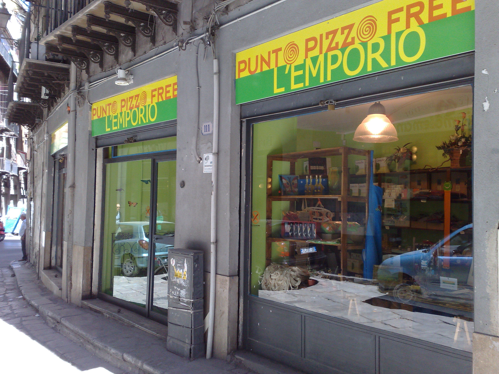

import { Badge } from '@astrojs/starlight/components';

Resisters can reduce government revenue by manufacturing and selling untaxed alternatives to taxed or government-monopoly products.

## <Badge text="Example" size="medium" /> Pizzo-Free Shopping

<figcaption><i>pizzo</i>-free shopping in Palermo</figcaption>

The “Addiopizzo” movement in Italy founded a supermarket and stocked its shelves exclusively with goods from producers who had vowed not to pay protection money (<i>pizzo</i>) to the mafia.
They also maintain a buycott list of such companies to help consumers make <i>pizzo</i>-free shopping choices.

## <Badge text="Example" size="medium" /> American Revolution

While American revolutionaries boycotted British products like tea, paint, and cloth, they also encouraged local industry to make alternative products:

> Members of Boston’s Whig Party demonstrated their patriotism by nursing tea leaves and mulberry trees in their gardens.
> New England farmers were exhorted to convert their oak plains into sheep pastures and produce enough wool to clothe every American.
> Colonists were urged to abstain from eating lamb or mutton in order to encourage American woolen manufactures.
>
> In less than a year the boycott had so disrupted Transatlantic trade that thousands of British workers lost their jobs.

Gatherings at which dozens of people would card and spin yarn, weave fabric, or sew clothing were simultaneously acts of resistance and patriotic rallies.
Towns competed with each other over how many yards of cloth they could produce, and the results of such contests were reported in the newspapers.
At society balls, a woman who turned up in anything but a homespun cloth dress risked being shunned.

> …at the first commencement exercises of Rhode Island College (later Brown University), the president proud-spiritedly wore wholly homespun clothing.
> At Harvard, the faculty and students had all taken to homespun in support of their women spinners, of whom the Boston Chronicle had bragged “[T]hey exhibited a fine example of industry, by spinning from sunrise until dark, and displayed a spirit for saving their sinking country, rarely to be found among persons of more age and experience.”

American tea drinkers did their part by switching to “balsamic hyperion”—dried raspberry leaves—which could be produced domestically.
Massachusetts patriots vowed in 1768:

> …that we will not, at funerals, use any gloves except those made here, or purchase any article of mourning on such occasion, but what shall be absolutely necessary; and we consent to abandon the use, so far as may be, not only of all the articles mentioned in the Boston resolves, but of all foreign teas, which are clearly superfluous, our own fields abounding in herbs more healthful, and which we doubt not, may, by use, be found agreeable…

## <Badge text="Example" size="medium" /> Indian Independence Movement

<figcaption>Gandhi spinning thread</figcaption>

Homespun cloth, or <i>khādī</i>, was an iconic part of the Indian independence movement (which also promoted the small-scale, domestic production of salt to break Britain’s taxed monopoly).
Gandhi insisted that everyone in the resistance movement should participate in producing such cloth, and of course should wear nothing but.

## <Badge text="Examples" size="medium" /> Homebrew and Homegrown

Homebrewing and home distilling are good ways to avoid the often steep excise taxes on alcoholic beverages.
I’ve brought bottles of my homebrewed beer and cider to tax resistance gatherings, and when I have, I’ve talked up homebrew as being a good candidate for the <i>khādī</i> of today.

Governments often institute high “sin taxes” that are designed to discourage purchases of unwholesome items by the poor as much as they are to raise revenue.
But this can backfire by increasing the incentives for moving the commerce on such products into the underground economy.
When Britain increased the excise tax on distilled spirits in Ireland in the 1840s, for example, they found that the revenue from the tax <em>dropped</em> by over seven thousand pounds.
The reason? Not that people were drinking less, but that moonshining had suddenly become a lot more popular.

A few people have started growing their own tobacco to combat increasingly prohibitive tobacco excise taxes.
Audrey Silk grew and cured enough tobacco at her Brooklyn home in 2009 to roll nine cartons worth of cigarettes, which would have cost more than $1,000 at taxed rates at the time.

As more jurisdictions are giving up on marijuana prohibition, the underground marijuana industry now has a new role to play in helping people avoid the high taxes that usually accompany legalization.

Notes and Citations

* American Consul, Naples “Organized Crime III: Confronting Organized Crime in Southern Italy” 6 June 2008 (cable “08Naples38” released in the WikiLeaks dump)
* Morris, David “Economic Independence Day” <i>AlterNet</i> 30 June 2005
* Macdonald, Anne <i>No Idle Hands: The Social History of American Knitting</i> (2010) p. 59
* Lincoln, William & Hersey, Charles <i>History of Worcester, Massachusetts</i> (1862) pp. 69–70
* “English Extracts” <i>New Zealand Gazette and Wellington Spectator</i> 18 November 1843 (reproducing an article from the <i>Hobart Town Advertiser</i> 17 October 1843)
* Fernandez, Manny “Now in Brooklyn, Homegrown Tobacco: Local, Rebellious and Tax Free” <i>New York Times</i> 24 February 2011

