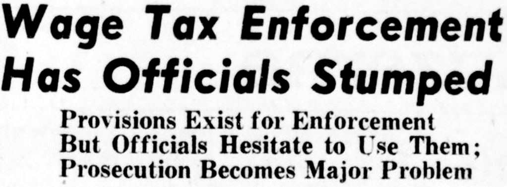

import { Badge } from '@astrojs/starlight/components';

Tax resisters, as well as people who are just disgusted with their taxes, frequently stumble on the passive-aggressive tactic of paying their taxes in a way that is inconvenient for the tax collector.
Sometimes they will also choose a symbolic mode of payment.

## <Badge text="Example" size="medium" /> Evan Reeves

Evan Reeves wrote 5,574 separate checks, for $0.96 each, to pay his 2009 U.S. federal income taxes.
On each check, in the “memo” field, he wrote the name of a U.S. soldier who died in the Afghanistan or Iraq wars.
He enlisted like-minded friends to help him fill in the checks.

## <Badge text="Example" size="medium" /> Umbrella Movement

The pro-democracy “umbrella movement” in Hong Kong used this technique in 2014.
Taxpayers were asked to pay in a way that causes inconvenience for the state—by dividing up their tax payments into a number of individually-submitted, small amounts (分拆支票交稅 — Faanchaak Jipiu Gaau Seui) of HK$6.89, $68.90, or $689.
These amounts were meant to be symbolic of the 689 members of the 1,200-member election committee who elected anti-democratic, Beijing-leaning Leung Chun-ying as Hong Kong’s chief executive.

The protesters took Evan Reeves’s action as an inspiration, and even got competitive about it.
One Hong Kong protester, Raymond Kwong, broke Reeves’s record by paying with 9,280 checks (also symbolic: commemorating the 9/28 launch date of the “umbrella revolution” campaign).

Kowng used rubber-stamps, some hand-carved, to fill out each check, and then he hand-signed each one.
He said he felt like something out of the Charlie Chaplin film <i>Modern Times</i> while going through all the motions of stamping and signing each check, a process that took about 54 hours.
Between the cost of the checks, the postage, the stamps & ink, he also said he had to spend about HK$500 above and beyond the amount of the tax.

In 2019, the activists were able to exploit another trick.
They discovered that when they paid taxes through an on-line portal, the government had to pay the portal operators $1 per transaction.
So they created a tool that would divide their taxes into multiple $1 increments and pay each one individually, so the protesters could legally pay their taxes in full while giving the government nothing.

## <Badge text="Example" size="medium" /> Pennsylvania Wage Tax Resistance

<figcaption>headline from the Pennsylvania wage tax resistance campaign of 1953</figcaption>

Pennsylvanians resisting an unpopular wage tax in 1953 discovered that the government could quickly hit them with fines or jail time if they refused to pay entirely, but that if they paid a tiny fraction of the tax, the government couldn’t move against them without doing a complicated assessment first to determine how much extra was owed:

> This could be a long and dreary legal procedure for a school district or council, especially if there is more than one such delinquent.
> Therefore, many residents are beating the wage tax levy by simply clunking a single coin on the tax collector’s desk.

## <Badge text="Example" size="medium" /> Origami Pigs

A fellow who thought he did not deserve his $137 traffic fine paid it by folding 137 dollar bills into origami pigs and arranging them in a pair of Dunkin’ Donut boxes to pay them at the police department (this is a play on the derogatory slang term for police—“pigs”—and on the American stereotype of police officers as inveterate donut consumers).

## <Badge text="Examples" size="medium" /> Low-Denomination Currency

Many people have hit on the idea of paying their taxes using the lowest denomination legal currency available.
Here are some examples:

* Richard Ross paid his $4,079 property tax bill by lugging eleven sacks of loose change to the county treasurer.
* Normand Czepial paid his Quebec property taxes with 213,625 pennies submitted in an inflatable children’s swimming pool (alas, Canadian law allows anyone to refuse to accept more than twenty-five pennies in a single transaction).
* Tax resisters in Bilbao paid part of their fine with 20,000 pennies.
* Ron Spears paid a past-due property tax bill with 33,000 pennies, carried into the county treasurer’s office “in buckets on a hand truck.”
* Nick Stafford paid sales tax on his automobiles by carting five wheelbarrows full of pennies to the Department of Motor Vehicles (DMV).
  > As of 8 p.m. Wednesday, workers at the DMV were still counting coins and Stafford said they expected to finish around 1 a.m.
  > Stafford said he would remain at the DMV until the counting was complete.

When a group called “Illinois Tax Revolution” started recommending that people pay their property taxes in one-dollar bills, McHenry County Treasurer Glenda Miller responded by requiring taxpayers to remain present in the office while their money is counted.

> “The five hours that it took for my staff to count the cash prevented her from continuing her regular office duties,” Miller said.

## <Badge text="Examples" size="medium" /> Non-Monetary Symbolic Payments

Homeless artist John Ed Croft tried to use aluminum cans, “the currency of the homeless,” to pay his income tax in 1987.

Australian war tax resister Robert Burrowes has tried to pay his taxes in a number of odd ways: with a truckload of “Aboriginal land,” with medical supplies, with 104 trees, and with 94 shovels.

In 1971, American war tax resister Sally Buckley tried to pay her taxes with “four boxes of medical supplies” which she trusted the government would not use as harmfully as it would her money.

In 1982 the Iowa Peace Network pooled resisted tax money from several war tax resisters and used it to buy grain to pay to the Internal Revenue Service (IRS) in lieu of the taxes.
In 1983, Mark Judkins tried to pay his $78 tax bill with $300 in food.
In 1984, “Christians for Peace” brought a truckload of food to the IRS building in Stauton, Virginia in lieu of the group members’ taxes.
In each case, the IRS turned down the payments, which were then donated to food programs for the needy.

Notes and Citations

* “不合作抗稅運動　市民寄二千張支票轟炸稅局” <i>Passion Times</i> 17 December 2014
* Stempeck, Matt & Teng, Fiona “Hong Kong Protest Movement Tech” <i>Civicist</i> 10 December 2019
* “Wage Tax Enforcement Has Officials Stumped” Wilkes-Barre, Pennsylvania <i>Sunday Independent</i> 15 March 1953, p. D9
* Pierce, Jacob “Tax Machine: A Portlander protests America’s wars one small IRS check at a time” <i>Willamette Week</i> 17 November 2010
* “Man Pays $137 Traffic Ticket With 137 Origami Pigs In Donut Boxes” <i>The Huffington Post</i> 12 September 2012
* “Tax protest: $4,000 bill paid in coins” <i>Associated Press</i> 18 February 2009
* “Man tries to pay tax with 200,000 pennies” <i>Toronto Sun</i> (QMI) 15 July 2010
* “Left Bank Collectives in Bilbao denounce ‘alarming and exorbitant’ military spending” <i>Deia</i> 29 June 2009
* Swift, Mary “Pennies used to protest tax bill” <i>Daily Record</i> 26 August 2010
* Ristau, Reece “Virginia man spends $1,000 to deliver 300,000 pennies to Lebanon DMV” <i>Bristol Herald Courier</i> 11 January 2017
* Craver, Kevin P. “Residents have to stick around if they pay property taxes in dollar bills, McHenry County treasurer says” <i>Northwest Herald</i> 27 August 2016
* Hedemann, Ed War <i>Tax Resistance: A Guide to Withholding Your Support from the Military</i>, 5th ed. (2003) pp. 60, 80–81
* “IRS Refuses Goods For Tax Payment” Associated Press dispatch as found in the <i>Schenectady Gazette</i> 16 April 1971
* “World of Friends: A Public Witness for Peace” <i>Friends Journal</i> 1 April 1982, p. 17
* “World of Friends: Payment of Food as Taxes” <i>Friends Journal</i> 15 December 1983, p. 23
* Shenk, Steve “Virginia peace group offers food for thought” <i>Gospel Herald</i> 1 May 1984, p. 317

