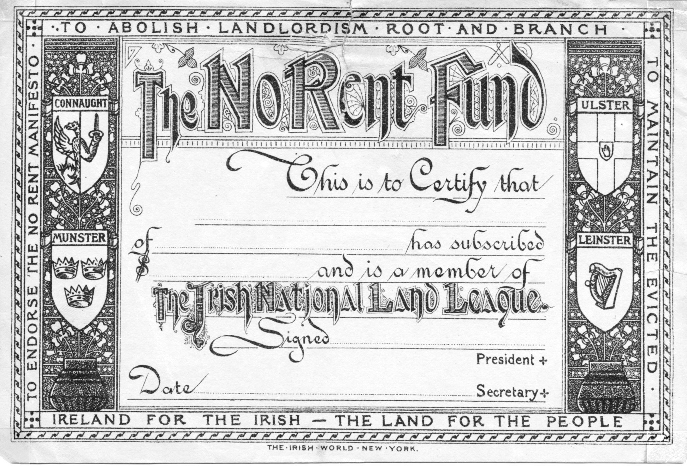

import { Badge } from '@astrojs/starlight/components';

Tax resisters recognize the importance that taxes have for the functioning of the government, and how refusal to provide that money can be a way of making change happen.
But a government’s subjects also provide crucial support to the regime in other ways, and some tax resistance campaigns have attacked these as well.

## <Badge text="Example" size="medium" /> Quakers

Quakers were careful not to pay war taxes, but their rules of discipline might also remind them not to help the military in other ways—for instance “by grinding of grain, feeding of cattle, or selling their property for the use of the army,” or by purchasing government bonds for war.

Sticking to such principles could be costly.
In 1852 Thomas Luscombe refused either to rent his cart to haul military baggage or to pay two shillings to hire a cart from a less-conscientious carter, and for this he was hauled into court and fined £4, ten shillings, and six pence.
Since he also refused to pay this, a bailiff then seized £10 worth of goods from his home (equivalent to around £850 today)—about 100 times the amount he originally refused to surrender.

Government bonds are an obvious target for people trying to restrict the resources available to the government.
John Payne wrote a tract in 1793 entreating Quakers to divest from government bonds that the government was using to raise war funds.
What he said then applies at least as much today:

> [T]he King [once] had the power of summoning the barons to the field, and the barons their retainers: by these means armies were raised, fields fought, and blood-stained laurels acquired.
> But now <em>immense sums</em> are wanted; and without them War would be an impossibility.
> The magnitude of the money necessary infinitely exceeds any resource which the kingdom can immediately supply: therefore the ingenuity of ministers has recourse to the aid of <i>Funding</i>; that is, of establishing a fictitious capital, which shall bear a certain rate of interest; and any person, purchasing of Government a portion of this fictitious capital, is put into the receipt of interest according to the sum he purchases, and the country is burthened with taxes to support the payment of such interest.…
>
> <em>War cannot be now supported without the Funding System.</em>
> As no man then can deny this solemn truth, is it not astonishing to find Quakers holders of stock, not only in their individual, but in their <em>collective capacity?</em>
> What then is the conclusion?
> The Quakers, at the time they declare their fundamental principles prohibit War, are actively and voluntarily supplying the <em>only prop</em> by which the modern system of War is supported.

Payne himself went even further in his attempts to avoid paying for war:
He bricked up a third of the windows of his home to reduce his property tax (which was assessed based on the number of windows), he disabled his coach to avoid its license fee, and he rode miles out of his way to avoid road tolls.

## <Badge text="Example" size="medium" /> Brethren

Another American “peace church,” the Church of the Brethren, voted in 1972 to divest from U.S. government bonds, and from defense industry stocks, in protest against militarism and the Vietnam War.

## <Badge text="Example" size="medium" /> Rent Strikes

If you’re paying rent to the government or to government-protected elites, this is pretty close to a tax, and a rent strike feels a lot like a tax strike.
Such was the case, for instance, in the fourteen-month, 3,000-tenant strong Kirkby Rent Strike of 1972–73 which was in reaction to a government-imposed rent hike on government-built slum housing.

<figcaption>a card to identify supporters of the Irish National Land League’s rent strike</figcaption>

The National Land League of Ireland launched a nationwide rent strike in 1881 that was intended to pressure the government (and to strike a blow for land reform and against “landlordism”):

> [The League] feels bound to advise the tenant farmers of Ireland from this day forth to pay no rents under any circumstances to their landlords until Government relinquishes the existing system of terrorism and restores the constitutional rights of the people.

Resistance leader Charles Stewart Parnell wrote:

> It is useless to say that telling the tenants to pay no rents in a famine year, unless they get a sufficient reduction to enable them to live, is communistic and revolutionary.
> It is no more communistic than to compel the owner of a private hoard of provisions on board a wreck to share it with his starving companions.
> The preservation of property is secondary to the preservation of life.
> Where a whole community is in danger from the selfish action of a small minority, this axiom applies with full force.

## <Badge text="Example" size="medium" /> The Viper

In colonial North Carolina, the government began seizing ships that did not carry papers indicating that the stamp tax had been paid for the ship.
The residents of the port city of Wilmington decided to stop selling supplies to government ships until the government agreed to stop the seizures.
“This agreement was carried out until the <i>Viper</i>, after being entirely without rations for a day or two, was driven to terms and stopped her seizures.”

## <Badge text="Example" size="medium" /> Greece

In Greece in 2011, members of a union representing electrical power workers cut power to a federal government building, protesting the hypocrisy of the government adding a new tax to utility bills while at the same time it was failing to pay its own electric bills.

## <Badge text="Example" size="medium" /> Lotteries

In some areas, the government monopolizes certain forms of gambling, and uses the proceeds as another funding source.
Stefano Valdegamberi, one of the founders of the <i>Futuro Popolare</i> party, called on Italians to join him in boycotting state-run lotteries and gambling facilities.
“There is only one form of effective tax resistance where no risk is involved: the boycott of all paid games authorized by the State Monopoly.”

## <Badge text="Example" size="medium" /> Bribes

Governments sometimes subsidize the salaries of their front-line employees by allowing them to solicit bribes from the people whose lives they are authorized to interfere with.
Anti-corruption activists in India responded to this by printing up fake “zero rupee” bank notes.

> This blatantly false, oversized purple bill, complete with Gandhi’s portrait, can be handed to any officials who ask for a bribe in order to shame them into changing their behavior.
> The note communicates that not only will a person not pay a bribe, but also that they are not alone—they are part of a movement of people who support them in ending corruption.

Notes and Citations

* Philadelphia Yearly Meeting “Attend to Your Tender Scruples” <i>American Quaker War Tax Resistance</i>, 2nd ed. (2011) p. 145
* “The Seizure of the Friends’ Goods” <i>The British Friend</i> December 1852, p. 302
* Pacificus (pseud. for Payne, John) “To the Society of the People Called Quakers” 13 May 1793
* Smith, H.E. <i>Annals of Smith of Cantley, Balby, and Doncaster, County York</i> (1878) pp. 26–27
* “From the General Board” <i>Messenger</i> 1 May 1972, p. 6
* “Kirkby Rent Strike 1972 (Documentary)” Working Class Self Organization’s blog, 8 April 2012
* “Ireland” <i>Donahoe’s Magazine</i> December 1881, p. 569
* Parnell, Charles Stewart “Refuse to Pay Extortionate Rents” in Gross, David (ed.) <i>We Won’t Pay: A Tax Resistance Reader</i> (2008) p. 266
* Saunders, William L. <i>Lessons from Our North Carolina Records</i> (1889) pp. 10–11
* “Protesting Greek power workers cut ministry supply” Associated Press 16 November 2011
* “Valdegamberi (consigl. reg. Veneto): ‘Boicottiamo tutti i giochi di Stato’ ” <i>jamma.it</i>
* Guinard, Antoine “How a non-profit in India is fighting corruption with fake money” <i>Public Radio International</i>

