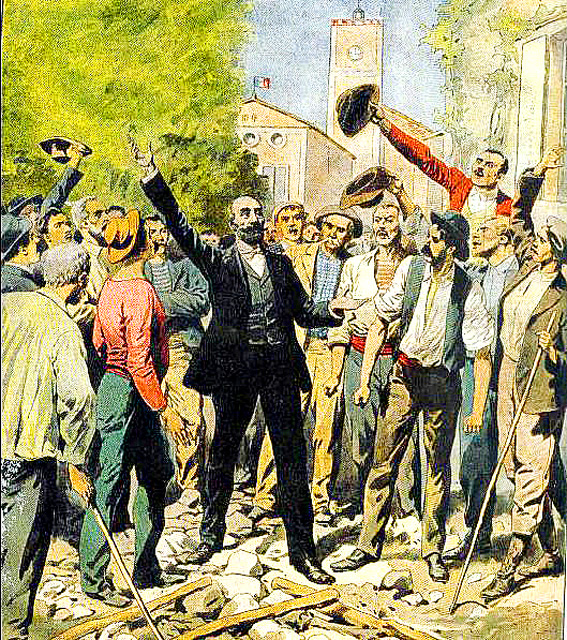

import Aside from '../../../components/ExtendedAside.astro';
import { Badge } from '@astrojs/starlight/components';
import WikipediaBadge from '../../../components/WikipediaBadge.astro';

Some tax resisters believe that while they refuse to give to the government, it is more consistent or comprehensive to also reject what the government has to give.

## <Badge text="Example" size="medium" /> Indian Independence Movement

Gandhi felt that people who decide to put themselves fully in opposition to the government must also renounce the privileges of citizenship and not try to pick and choose which parts of government to reject:

> There is no State run by Nero or Mussolini which has not good points about it, but we have to reject the whole, once we decide to non-cooperate with the system.
> “There are in our country grand public roads, and palatial educational institutions,” said I to myself, “but they are part of a system which crushes the nation.
> I should not have anything to do with them.
> They are like the fabled snake with a brilliant jewel on its head, but which has fangs full of poison.”
> So I came to the conclusion that the British rule in India had crushed the spirit of the nation and stunted its growth, and so I decided to deny myself all the privileges, services, courts, titles.

When Gandhi was commander-in-chief of the Indian independence movement, he not only instructed his nonviolent army to resist taxes, wear untaxed domestic cloth, break the British salt monopoly by harvesting salt, and so forth—but he also told them to resign their government posts, to renounce any government-awarded titles or authority, to take their children out of government schools, to stop appealing to the government’s laws or its courts, and to stop voting or running for office.
He explained why:

> This is the way of noncooperation, or peaceful severing of relations.
> That is, that we should neither seek help from the Government nor offer it any help.
> How can we part company with it?
> First we should renounce titles.
> For us now to hold titles is a sin.
> Next we should give up the courts.
> The dispensing of justice should lie in our own hands.
> The courts strengthen the roots of the Government.
> Lawyers should give up their practice.
> If it is possible for them they should, after giving up legal practice, serve the country.
> Even if they cannot serve the country the giving up of legal practice would be by itself sufficient service.
> They should take up other trades.
> Parents should withdraw their children from schools and universities.
> Boys who have reached the age of 16 should be treated as friends and advised to withdraw.
> They should be told not to continue their studies in these institutions.
> They should be told to go to school at institutions where they can remain free.
> We should not go for education to a place where the Government’s flag flies.
>
> The Congress has also said that we should not go into the Councils.
> The election to the Councils will take place on the 30th.
> It is the day when we shall be tested.
> First we should persuade the candidates to withdraw.
> If they do not give in, it will be the duty of voters to remain at home and not to cast their votes.
> We should go on pleading with the candidates till the night of the 29th.
> We should fall at their feet and beseech them not to stand for the Councils.
> If they do not come round but persist in going into the Councils it will be your duty to refuse all help and do no work for them.
> Again, soldiering is a sin. You should not get recruited as soldiers, but it is your duty to become soldiers of freedom.
>
> …With great humility I ask you: What have you done?
> Have you withdrawn your boys from schools and colleges?
> If your boy is grown up have you made him aware of his duty?
> Have you given him your blessing in this matter?
> If you have not done this, why are you gathered here?
> It is the duty of boys to leave schools and to convince their elders.
> Have you decided not to vote?
> Have you taken the swadeshi vow?
> These questions concern everyone.
> Government recruitment should stop.
> We should take our litigation to our elders and seek justice.
> This will put an end to the “prestige” of the Government.
> The Government will at the same time realize that its hundred thousand whites can no longer rule over three hundred million people.
> So long the Government has carried on its rule over us by making us quarrel among ourselves, by offering us enticements and by giving and taking help.…

The British occupation government responded by asking its Indian employees, who were normally forbidden to engage with political questions, to declare themselves to be against Gandhi’s movement.
This instead triggered even more resignations from those who were not active in the independence movement but who were not prepared to explicitly oppose it.

During the Bardoli tax strike, many members of the Bombay Legislative Council resigned in protest, some of them co-signing a letter in which they wrote that “when a Government forgetful of its own obligations commits grave breaches of law, and ruthlessly attempts to trample under foot such noble and law-abiding people, it is but fair and proper for us, as a protest against the high-handed policy of Government in that <i>taluka</i> [district], to resign our seats on the Bombay Legislative Council, and so we request your Excellency to accept our resignations of the same.”

During that strike many local officials also resigned their posts.
This meant a great deal of sacrifice for them and their families.
By resigning, these officials, who were often members of the local elite who had been bought off by the Raj with titles and state-guaranteed privilege, risked all of that.
Resistance spokesman Sailendra Ghose noted that “the government in some provinces has refused to allow village officers to resign, dismissing those who refuse to carry out their duties and thus depriving their heirs of their hereditary rights as village chiefs.”

## <Badge text="Example" size="medium" /> Quakers

Quaker Meetings would frequently require not only that members adhere to their peace testimony by refusing to participate in military service or to pay war taxes, but also that those members who had been in the military prior to becoming Quakers renounce their claims to military pensions.
Here is how the New England Yearly Meeting put it in their “rules of discipline” of 1808:

> It is our sense and judgment, that it will not be consistent with our testimony against war, for any of our members to receive pensions from government, for military services performed before they became members, though reduced to necessitous circumstances; but that this necessity should be relieved by monthly and quarterly meetings, and thereby preserve our religious testimony against the anti-christian practice of war, and manifest their sympathy for their brethren, by contributing to their comfortable support.

## <Badge text="Example" size="medium" /> Ghis

Ghislaine “Ghis” Lanctôt embarked on a project of absolute individual independence from the governments of the world—something she calls “personocratia”—in the early 1990s.
She refused to cooperate with the government in any way, but she also took a careful inventory of the benefits and privileges of citizenship, and was careful to reject those too.

She started by giving up her state health insurance card, and later discarded her driver’s license and stopped paying traffic fines, gave up her claim to a family trust, and eventually let her passport expire.
In the course of her endeavor, she made a list of various state privileges that she was turning her back on: social security, professional licensing, insurance, legally protected property, certifications, intellectual property rights, the courts, access to banks, and so forth.

## <Badge text="Example" size="medium" /> Beit Sahour

In Beit Sahour, during the first intifada, Israeli military occupation authorities would retaliate against tax resisters by seizing their identity cards.
This made it difficult for these resisters to travel, get medical care, be employed, avoid arbitrary arrest, or “to pursue anything resembling a normal life under occupation.”
But the people of Beit Sahour fought back in a daring fashion:
Hundreds of them *voluntarily* surrendered their identity cards rather than submit to this intimidation.

## <Badge text="Example" size="medium" /> French Wine Regions Tax Strike

<figcaption>Marcelin Albert leading the tax strike</figcaption>

During the French wine regions tax strike of 1907, the municipal governments of the area resigned <i>en masse</i>.
Tax strike leader Marcelin Albert claimed that 12,000 municipalities in the south of France were left without governments as a result of the resignations.
One report noted:

> The quitting of municipal officers is usually attended with much ceremony.
> Generally a crape streamer is hoisted at the flagstaff, and the Mayor burns his official sash in public.

## <Badge text="Example" size="medium" /> The Boekes

War tax resisters Beatrice and Cornelis Boeke felt that in order for their tax resistance to be consistent, they must also refuse to use state-run monopolies like the postal service and railways, relinquish their passports, stop contributing to retirement accounts, and renounce any claim to the protection of the police, courts, and military.
When the government started providing funding even for private schools, they withdrew their children and home-schooled them.
They even stopped handling government-issued currency.
They took this so far that they abandoned their home rather than call the police when vagrants moved in.

## <Badge text="Example" size="medium" /> Tasmania

In Tasmania, in 1874, 26 magistrates resigned their offices rather than try to enforce a widely-resisted tax.

> Such an expressive demonstration on the part of gentlemen holding the commission of the peace incited the people to stronger resistance; for it appeared to them that a law which could not be conscientiously administered by the retiring justices was unworthy of obedience.

<Aside type="wikipedia" title="Wikipedia">
  <WikipediaBadge title="Mahatma Gandhi" />
  <WikipediaBadge title="Bardoli Satyagraha" />
  <WikipediaBadge title="Quakers" />
  <WikipediaBadge title="Guylaine Lanctôt" />
  <WikipediaBadge title="Beit Sahour tax strike" />
  <WikipediaBadge title="Revolt of the Languedoc winegrowers" />
  <WikipediaBadge title="Kees Boeke" />
  <WikipediaBadge title="Beatrice Boeke-Cadbury" />
</Aside>

---

Notes and Citations

* Gandhi, M.K. [“On Non-Violence”](https://archive.org/details/nonviolentresist00gand/page/358/mode/2up) <i>Non-Violent Resistance (Satyagraha)</i> (1961) pp. 358–61
* Gandhi, M.K. “Speech at Public Meeting, Banaras—26 November 1920” <i>The Collected Works of Mahatma Gandhi</i> (1966), Vol. 19, [pp. 31–33](https://archive.org/details/collectedworksof0019gand/page/31/mode/1up)
* “India Urged to Refuse to Pay Taxes to British” <i>The New York Call</i> 9 April 1921, p. 1
* Desai, Mahadev <i>The Story of Bardoli</i> (1929) [pp. 159](https://archive.org/details/in.ernet.dli.2015.122169/page/n175/mode/1up), [184](https://archive.org/details/in.ernet.dli.2015.122169/page/n200/mode/1up)
* “Gandhi Urged Calm Should He Be Seized” <i>New York Times</i> 12 March 1922
* Rhode Island Yearly Meeting “Not Consistent to Receive Military Pensions” <i>American Quaker War Tax Resistance</i>, 2nd ed. (2011) p. 228 [<i>Rules of Discipline of the Yearly-meeting, Held on Rhode-Island for New England</i> (1809) [p. 147](https://archive.org/details/rulesdiscipline06friegoog/page/n159/mode/1up)]
* Lanctôt, Ghislaine <i>Escape In Prison</i> (2010)
* Rigby, Andrew [“The tax war”](https://archive.org/details/livingintifada0000rigb/page/118/mode/2up) <i>Living the Intifada</i> (1991)
* Hastings, Thayer “A Snapshot of Ingenuity: Civil Disobedience and the ‘Sahouries’” <i>The Advocacy Project</i> 29 August 2012
* “Strike of a French City” <i>New York Times</i> 10 June 1907
* “650,000 in a Procession” <i>Poverty Bay Herald</i> 3 August 1907
* “French Mayors Must Stay” <i>New York Times</i> 13 June 1907
* Joseph, Fiona [<i>Beatrice: The Cadbury Heiress Who Gave Away Her Fortune</i>](https://archive.org/details/beatricecadburyh0000jose/mode/1up) (2012)
* Fenton, James <i>A History of Tasmania</i> (1884) [p. 355](https://archive.org/details/ahistorytasmani00fentgoog/page/355/mode/1up)

