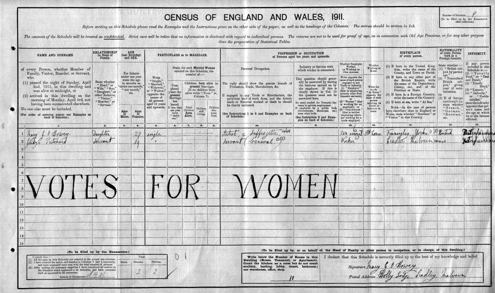

import { Badge } from '@astrojs/starlight/components';

The story of the birth of Jesus, as given in the gospels, begins with his pregnant mother and her husband travelling to Bethlehem in order to enroll in the census that Caesar Augustus had launched as part of his plan “that all the world should be taxed.”

A government doesn’t launch a census just because it’s curious, but usually, as with Augustus, as the prelude to a tax.
It’s the government’s way of “casing the joint” before the big heist.
Some tax resistance campaigns have decided that it’s best to begin resisting early by resisting such a census.

## <Badge text="Example" size="medium" /> Poll Tax Rebellion

Refusing to register was one way people resisted Thatcher’s poll tax.
The government had difficulty tracking people as they moved from place to place and from one council’s jurisdiction to another, and it sometimes couldn’t learn who the taxpayers were unless they volunteered to be counted.

Resisters also successfully refused to provide information about their employment that could be used to seize taxes from their paychecks.
According to one account:

> [T]he councils still had one insurmountable headache.
> They had to find out where people worked.
> This was a real nightmare because other than asking the people concerned, they had no real way of getting the information they needed.
> When a liability order was granted by the court, non-payers were sent a form which requested details of employment.
> Failure to fill it out carried a fine of £100 and £400 if the non-payer provided false information.
> But this didn’t act as a deterrent either, because, if people couldn’t pay the Poll Tax itself (and the court costs which were added), then it made little difference if the council added another £100.
> A survey carried out by the Audit Commission in late 1989 showed that, nationally, only 15% of people who received the form actually sent it back.
> Like electoral registration, it was widely ignored even though this was a criminal offence.

## <Badge text="Example" size="medium" /> Household Tax Resistance

<figcaption>non-registration is key to the Household Tax resistance campaign</figcaption>

The Household Tax resistance movement in Ireland was characterized by the refusal of households to register to pay the tax.

> This is not a charge to fund your local community, it is a tax to fund private speculators, bondholders, and the bailout.
> Our incomes and services are being decimated to pay this private debt.
> Now people have a chance to register their opposition by not registering for this tax.
> By not registering, we can make this a referendum on the bailouts for the rich and the cuts for us.

Only about half of Irish households had registered by the legal deadline at the end of March, 2012.
Ruth Coppinger of the Campaign Against Household and Water Taxes declared victory:

> This is more than was achieved by Poll Tax non-payment which started off at 15% in the first year, 1989, and which only reached 45% boycott in the year of its abolition.

## <Badge text="Example" size="medium" /> Episcopalians in Scotland

The official church of Scotland had a habit through the centuries of taxing everyone in Scotland for its support, even members of rival churches.
This annoyed people who preferred another denomination.
And this annoyance became especially loud whenever the “official” church changed.

When the Presbyterians succeeded the Episcopalians as the church of record in 1688, one way Episcopalians resisted was by refusing to pay the tax and refusing to participate in a church-run census.
William Maitland, in his <i>History of Edinburgh</i>, fretted over difficulties in estimating the population at this period of time, noting:

> [T]he greatest Defect is owing to the Episcopalian Inhabitants, who, being of a different Communion from the established Church, are not subject to the Controul and Examination of its Ministers; wherefore, many of them refuse to give Accounts either of the Names or Numbers of Persons in their Familities.

## <Badge text="Example" size="medium" /> Queensland Water Tax Strike

In Queensland, Australia, in 1926, the government tried to sneak a tax on farmers who used wells or water pumps to irrigate their lands.
The farmers rebelled.

Since the tax took the form of a stiff fee that accompanied the mandatory registration of such wells or water pumps, it was natural that the tax resistance included mass refusal to register.
Local Producers’ Associations across Queensland gathered and voted to refuse registration.

A month after the tax went into effect, facing this campaign of mass refusal, the government backed down and rescinded the tax… but it did not eliminate the requirement to register wells and water pumps, which was the pretext the tax had been hooked onto.
Some Associations were suspicious, and continued to counsel their members to refuse to register even after their tax resistance victory.
A Mr. Roome of the Woodmillar LPA put it this way:

> A lot of farmers were under the impression that because [the] registration fee had been withdrawn, everything in the garden was lovely.
> But the regulations were still there, and farmers who were under that impression would receive a rude awakening.
> Only formal registration had to be made, but they would find that if they furnished the particulars asked for they would give the Government an opportunity to later on impose the charges.
> The danger was still there, whereas if they refused to register the onus was on the Government to get the particulars, and prove that the farmers put down wells or sunk dams, etc.
> Once they gave the information they were at the mercy of the Government.…
> The excuse by the Government was that they wanted to get a survey of the water facilities which was absolutely ridiculous.
> The whole thing was a farce, and an excuse to impose a tax.
> The only way was to refuse to register, which he hoped would be done by members of all branches, and also refuse to pay the tax.

The Association passed a resolution encouraging its members to continue to refuse to register.

## <Badge text="Example" size="medium" /> Boycotting “Count Days”

In the United States, school districts often get government funding based on how many students are in attendance on certain “count days.”
The more students are at school on those days, the more money the district can get from the various governments that provide school funding.
Districts do a lot to try to increase attendance on “count days” for this reason—stunts like bringing elephants to campus, giving away gift bags, holding ice cream socials, and hosting carnival rides at school.
But one parent, Carrie Klauber of Colorado, decided to use this as leverage, saying she would keep her children home from school on count days, and thereby deprive the district of money, to try to push her district to adopt better policies.

## <Badge text="Example" size="medium" /> Census Resistance in Fiji

Fiji initiated a poll tax on indentured workers from India in 1924.
The Indians had no political representation on the island, were banned from the schools, and could only emigrate on a single ship voyage offered once per year: they were considered disposable migrant labor.
The workers thought that this new tax, which amounted to 12 days’ pay, was a bait-and-switch violation of the contracts that had brought them to Fiji, and so they vowed to resist.
As one account put it:

> A start will be made in January to register all those liable to pay the residential tax, and prison will be the fate of him who does not comply with the law.
> Leading Indians in every district declare that they will willingly go to gaol before they register their names, and a general passive resistance is highly possible, with all its attendant strikes and bitter feeling.

## <Badge text="Example" size="medium" /> The British Women’s Suffrage Movement

<figcaption>a 1911 census form filled out as a protest</figcaption>

The women’s suffrage movement in the United Kingdom, more so than anywhere else, used tax resistance in its struggle.
Suffragists also resisted government attempts to get information from them, both because these attempts were part of the effort to tax them, and because the laws that governed such information-gathering had been passed by a male-exclusive government.

In 1910, Winifred Patch wrote:

> I have recently received a paper from the Inland Revenue Office headed “Duties on Land Values. Notice to Furnish Information,” asking for the names and addresses of any persons to whom I pay rent or for whom I may collect rents, a penalty not exceeding £50 being incurred if this information is wilfully withheld.…
> As I am denied the rights of citizenship I absolutely decline to facilitate in any way the carrying out of the provisions of Mr. Lloyd George’s Finance Bill, and am returning my paper with this written across it.
> I am hoping, through the Women’s Tax Resistance League, of which I am a member, to obtain expert information which will enable me to make it impossible for the Government to exact the £50 penalty, and will leave them with no alternative but to imprison me in default.
> Will other women join me in making this protest?
> I feel that there must be many like myself who would gladly risk imprisonment for the cause, but who, for various reasons, find it very difficult, if not impossible, to take part in the more active protests which have hitherto brought women into conflict with the law.
> I cannot help hoping that we have here another vantage ground from which to attack a Government which refuses us justice.

Teresa Billington-Grieg took up Patch’s suggestion and rallied the troops:

> The famous forms on which the owners and lease-holders of the country have to prepare the necessary statistics for the levying of the new [land] tax have been issued now in practically all parts of England, and they will be issued in Scotland within a few days.
> Already these forms have been returned unfilled up, and with a curt comment as to the status of the women applied to, by some of our members in England.
> They will be so returned by many Suffragists across the border.
> Neither information nor money will be forthcoming in response to the Inland Revenue Department’s demands.
> As far as possible this piece of Government business will be impeded first by the determined refusal of information, and, second, by the withholding of the money claimed in taxes.
>
> Such refusal to yield to tyranny is always desirable.
> But at the present moment it carries an additional value in that it can be employed to improve the chances of the Conciliation Women’s Suffrage Bill.
> From now until the fate of the Bill is decided, every woman to whom any Government application for information or for taxes is made should not only refuse to comply because of the unrepresented condition of her sex, but should add a rider to the effect that she will gladly supply information and provide the money claimed if the Women’s Suffrage Bill at present before Parliament becomes law this Session.

Margarete Wynne Nevinson put it this way:

> Here I have one of Mr. Lloyd George’s wonderful forms, with its numerous questions, to answer which intelligently I should require, apparently, the training of a lawyer and surveyor, and a fund of universal knowledge which I do not possess.
> I am asked to answer those questions, but am not considered fit to vote for a member of Parliament.
> This Form is addressed to me because I have a little freehold property, but it starts off with “Sir.”
> I am sending it back, pointing our that I must be addressed as “Madam,” and not “Sir,” and that as I have not vote, I do not see what this matter has to do with me.
> If you think of it, it is rather an insult to all women property holders to be addressed as “Sir,” and not by their proper title of courtesy.
> The State seems to take for granted that there can be no free women or women freeholders in the country, but that all the land must be owned by men.

The following year, Charlotte Despard announced that this strategy of non-cooperation would be extended to the national census. One news account said:

> The census would cost a great deal of money, said Mrs. Despard, and involve an enormous amount of labor.
> So far as they were concerned, this census should not be taken.
>
> “We shall prove,” said Mrs. Despard, “whether there is a people, or whether there can be a people without the women.
> We shall call upon women householders and women lodgers all over the country to refuse absolutely all information when the census takers come round.”
>
> Women, she went on, had been proud to belong to the nation, but they had been denied their citizenship.
> Was it not logical, therefore, that they should say, “Very well; citizens we are not, and we shall not register ourselves as citizens?”
> That was logical, as a protest should be, and it would be effective.
>
> Speaking of the preparations for the census, Mrs. Despard asserted that the officials were trying to get cheap labor: little girls from the schools at six and seven shillings a week.
> Mrs. Despard added that the members were going to obstruct other Government business and make other protests, and they would stop the census boycott only when they had the promise of the Prime Minister that a Woman’s Suffrage Bill would be introduced this session.

Notes and Citations

* <i>Luke</i> chapter 2
* Burns, Danny <i>Poll Tax Rebellion</i> AK Press (1992), pp. 164–65
* “TDs join anti-Household Charge protest” <i>Irish Examiner</i> 15 February 2012, quoting Ruth Coppinger
* “Half of home owners boycotting taxes” <i>Leitrim Observer</i> 18 August 2012
* Maitland, William <i>The History of Edinburgh from Its Foundation to the Present Time</i> Book II (1753) p. 218
* “Producers in Conference” <i>The [Rockhampton] Morning Bulletin</i> 12 July 1927, p. 13
* Klauber, Carrie “Keeping kids home for Count Day” <i>Boulder Daily Camera</i> 1 October 2010
* “Indians in Fiji Refuse to Pay Tax” <i>Barrier Miner</i> 12 January 1924, p. 3
* Patch, Winifred “Women and the Land Taxes” <i>The Vote</i> 10 September 1910, p. 233
* Billington-Grieg, Teresa “Women and Taxation” <i>The Vote</i> 24 September 1910, p. 258
* Nevinson, Margarete Wynne “Income-Tax Courtesy” <i>The Vote</i> 15 October 1910, p. 293
* “Census Boycott” <i>The [Adelaide] Advertiser</i> 23 March 1911, p. 9

