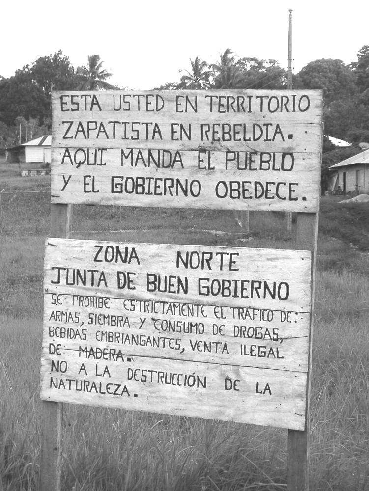

Some tax resistance campaigns have tried to partially or completely secede from the government that is taxing them, or to set up alternative parallel or quasi-governmental institutions to compete with those of the established government.

If a resistance movement can do traditionally government-sponsored public works better or more justly than the government can, people will have that much more reason to refuse their taxes.

## Louisiana During Reconstruction

When white supremacists in Louisiana lost the gubernatorial election in 1872, they formed their own parallel government led by the losing candidate, with their own separate legislature and their own separate militia (with which they briefly occupied the statehouse).
They insisted that <em>they</em> were the legitimate government of Louisiana and recommended that people pay taxes to them and not to the usurpers.
They asserted:

> Public opinion throughout the Union is against the usurpation, and our only danger, if there be any, will come from ourselves. If the people of Louisiana will sanction, by obedience and acquiescence, this Government, they will give it the only validity it can ever acquire. It is only by our own submission that our cause can be defeated.… We must remember that there can be no de facto government as against a de jure government in a State, and that the only way by which the [governor] Kellogg usurpation can become established as a government is by acquiescence of the people… The people of New-Orleans are not to pay taxes, can not, in fact, pay them, nor are they giving any recognition to the usurpers.

This shadow government was not only a direct threat to the Kellogg government, but also indirectly made it difficult for that government to raise funds.
One editorialist explained:

> [Kellogg] can borrow no money, for his government is so notoriously illegal that no lender would expect payment. If he should undertake to sell property for taxes, there would be no buyers, because an illegal Government could not give a valid title. Hence he is reduced to the necessity of resorting to bluster and threats.

## Rebecca Riots

The Rebeccaites, confident from their success in destroying tollbooths, started to also adjudicate disputes in a quasi-governmental fashion.
For instance, they would pay visits to fathers of illegitimate children and exact promises from them that they would provide support for the mothers.

## French Wine Region Tax Strike

During the 1907 tax strike that erupted in France, local government officials resigned <i>en masse</i> and “local Separatist committees professed to take the Government’s place and set up a sort of provincial government.”

## The Zapatista Movement

<figcaption>a sign outside a Zapatista autonomous town warns that “here the people rule and the government obeys”</figcaption>

The Zapatista movement in Mexico established municipios autónomos (autonomous towns) in regions where they were active:

> The Tzeltal, Tzotzil, Tojolabal, and Chol Indians (among others) who lived in the autonomous townships called their political philosophy <i lang="es">resistencia</i>: civil resistance to government authority. In the late 1990s there were thirty-eight Zapatista townships in Chiapas, including less than 10 percent of the 700,000 Indians in the state, but with a political impact in the indigenous communities that far outweighed their size.
>
> The Zapatistas sought not to found a new Indian nation but to make a place for Indian self-determination within the Mexican state. In their townships they kept their own birth and death records, discouraging followers from registering with official bureaucracies. They stopped paying taxes to any government and refused to allow social workers from government health and welfare agencies to set foot inside what they considered their boundaries. They opened their own health clinics staffed by volunteer Mexican and foreign doctors and local herbal healers and organized agricultural and crafts cooperatives that operated mainly through regional barter. In some townships they held trials and set up jails.

## Catalan Independence Movement

Some people and businesses who are sympathetic with the present-day Catalan independence movement started paying their federal taxes directly to the Catalan regional government rather than to Spain.
Some Catalan municipalities also stopped forwarding taxes to the central government.

## Spanish Tax Resisters

An ongoing Spanish tax resistance movement is urging people to create new, grassroots, autonomous, locally-focused governments of their own, and it encourages them to redirect their taxes from the existing federal government into these new government-like projects:

> [T]he construction of autonomy will require a lot of resources. This process should be based on the ability to work and the generosity of many people, but needs to rely on these resources to make it possible.
>
> By fiscal autonomy we mean all the pathways of redistribution that will make the tax system support initiatives that will really benefit people. That is to say that the portion that each person is responsible for providing to the common good must be destined for new public services that really place the basic needs of people higher on the scale of priorities. Therefore it becomes a priority, and all but essential, to generate dynamics of ever more massive civil disobedience against the pilfering of our resources on the part of the state, and to reclaim them for popular self-government.

## German Parliament

In 1848 in Germany the military and executive tried to break up the elected parliament.
The parliament then called on the people to refuse to pay any more taxes to the government.
When the government tried to cut off funds for parliament, people responded by paying their taxes directly to parliament.

Notes and Citations

* “Another Twitch in the Fusion Corpse” <i>New York Times</i> 11 April 1873
* “Kellogg’s Desperate Threats” <i>The Ouachita Telegraph</i>, 29 March 1873, p. 1 (quoting the New York World)
* Evans, Henry Tobit <i>Rebecca Riots!</i> (2010 ed.), pp. 116–17, 130–31, 154
* “The French Wine Bill” <i>Otago Witness</i> 26 June 1907, p. 19
* Preston, Julia & Dillon, Samuel <i>Opening Mexico: The Making of a Democracy</i> (2004) p. 443
* “Alella decideix pagar els impostos a l’agència tributària catalana i no a l’espanyola” <i>VilaWeb</i> 16 January 2013
* “Un ayuntamiento en manos de Solidaritat se declara ‘insumiso fiscal’” <i>La Voz de Barcelona</i> 4 December 2013
* “Un grupo de ayuntamientos promoverá una campaña de insumisión fiscal como la planteada por Òmnium Cultural” <i>La Voz de Barcelona</i> 15 July 2011
* “La insumisión fiscal como estrategia de rebeldía” <i>¡Rebelaos!</i> p. 16 (translation mine)
* Maurice, C. Edmund <i>The Revolutionary Movement of 1848–9 in Italy, Austria-Hungary, and Germany</i> (1887) p. 412

