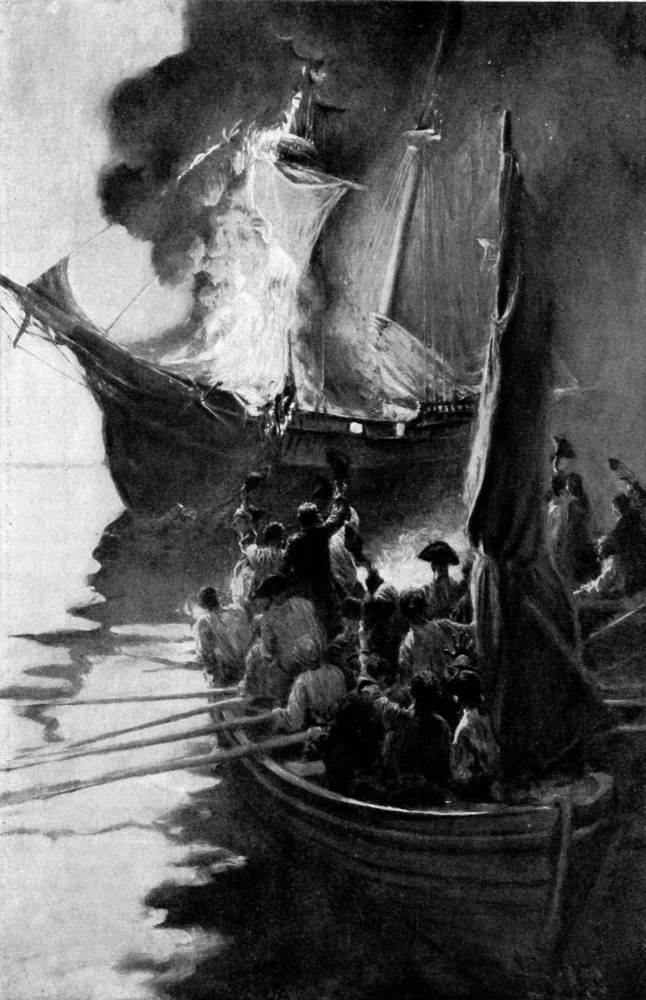

import { Badge } from '@astrojs/starlight/components';

Tax resistance campaigns can smuggle goods to market to evade a tax or a government-enforced monopoly.
Smuggling can serve a tax resistance movement in several ways:

1. It can deprive the government of revenue.
1. It can raise money for resistance activities.
1. It can forge bonds between a variety of people in a geographically distributed, semi-organized underground, in a way that can then be capitalized on for other resistance activities.

## <Badge text="Example" size="medium" /> American Revolution

In the years leading up to the American Revolution, smuggling was commonplace.
The economy of the American colonies relied on smuggling to such an extent that the government’s threat to crack down on the evasion of duties on imported molasses did more to fan the flames of revolution than any of its other saber-rattling.
Revolutionary John Adams wrote later, “I know not why we should blush to confess that molasses was an essential ingredient in American independence.
Many great events have proceeded from much smaller causes.”

<figcaption>the burning of the Gaspée</figcaption>

In 1772, American smugglers and their supporters burned the <i>Gaspée</i>—a ship the government was using to track down smugglers—and captured its crew in a well-organized guerrilla attack that prefigured the later attacks of the Revolutionary War.

## <Badge text="Example" size="medium" /> Whiskey Rebellion

The U.S. government tried to defeat moonshiners during the Whiskey Rebellion by purchasing as much taxed whiskey as it could get its hands on (ostensibly as requisitions for the Army) while at the same time trying to interrupt the black market for untaxed whiskey by seizing what they could find of it.
This didn’t work as planned, as the rebels adjusted by smuggling their goods out of the state where the tax law did not apply.

Notes and Citations

* Adams, John “Letter to William Tudor, 11 August 1818” <i>The Works of John Adams</i>, Vol. X (1856) [p. 345](https://archive.org/details/worksjohnadams10adamrich/page/345/mode/1up)
* Hamilton, Alexander “Report on Opposition to Internal Duties” 5 August 1794 <i>Hamilton’s Works</i> Vol. IV (1851) [p. 589](https://archive.org/details/worksalexanderh13hamigoog/page/589/mode/1up)

