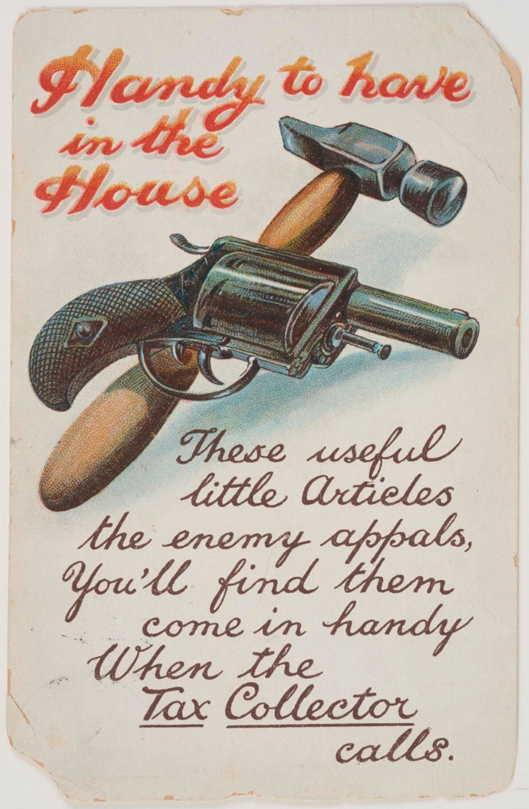

import { Badge } from '@astrojs/starlight/components';

Some tax resistance campaigns resorted to violent attacks on tax collectors to make it difficult for the government to collect taxes (or sometimes just in revenge for past exactions and abuses).

<figcaption>A postcard illustration. This card was sent to a member of the Women’s Tax Resistance League.</figcaption>

## <Badge text="Example" size="medium" /> French Revolution

I have examples of this from a variety of campaigns, but there is not enough variety to them to make it worth repeating them all here.
The French Revolution, alone, gives a set of vivid examples:

> Especially against collectors of the salt-tax, custom-house officers, and excisemen the fury is universal.
> These, everywhere, are in danger of their lives and are obliged to fly.
> At Falaise, in Normandy, the people threaten to “cut to pieces the director of the excise.”…
> For four hours the clerks are on the point of being torn to pieces; through the entreaties of the lord of the manor, who sees scythes and sabres aimed at his own head, they are released only on the condition that they “abjure their employment.”

> At Saint-Etienne-en-Forez, Berthéas, a clerk in the excise office, falsely accused of monopolizing grain, is fruitlessly defended by the National Guard; he is put in prison, according to the usual custom, to save his life, and, for greater security, the crowd insist on his being fastened by an iron collar.
> But, suddenly changing its mind, it breaks upon the door and drags him to death.
> Stretched on the ground, his head still moves and he raises his hand to it, when a woman, picking up a large stone, smashes his skull.—These are not isolated occurrences.

> [A]t Béziers, thirty-two employés, who had seized a quantity of contraband salt on the persons of armed smugglers, are pursued by the crowd to the Hôtel-de-Ville; the consuls decline to defend them and run away; the troops defend them, but in vain.
> Five are tortured, horribly mutilated, and then hung.

> “The arrears of taxes to be collected is here very considerable, while all proceedings of constraint are dangerous and impossible to execute, owing to the fears of the bailiffs, who dare not perform their duties, and the violence of the tax-payers, on whom there is no check.”

## <Badge text="Example" size="medium" /> Whiskey Rebellion

Once violent assault becomes a credible enough outcome for tax collectors, the implicit threat itself can be a deterrent (in much the same way that government violence may eventually lead to “peaceful,” “voluntary” compliance with its orders).

For example, during the Whiskey Rebellion, a process server excused his failure to complete his job by saying “from a variety of threats to himself personally, although he took the utmost precaution to conceal his errand, that he was not only convinced of the impossibility of serving the process, but that any attempt to effect it would have occasioned the most violent opposition from the greater part of the inhabitants; and he declares that if he had attempted it, he believes he should not have returned alive.”

Notes and Citations

* Taine, Hippolyte <i>The French Revolution</i>, Vol I. (1897) p. 68, 272–75
* “Letter of the Minister of Justice, Duport” 7 January 1792, quoted in Taine, Hippolyte op. cit., p. 279
* Hamilton, Alexander “Report on Opposition to Internal Duties” (5 August 1794) <i>The Works of Alexander Hamilton</i>, Vol. IV (1851) p. 582

