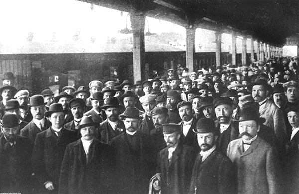

import { Aside } from '@astrojs/starlight/components';
import { Badge } from '@astrojs/starlight/components';
import WikipediaBadge from '../../../components/WikipediaBadge.astro';

Tax resisters can put up a fight when police or soldiers attempt to enforce tax laws or take reprisals against resisters.
Here are some notable examples:

## <Badge text="Example" size="medium" /> Greek “Won’t Pay” Movement

In the summer of 2012 a crowd on the Greek island of Hydra attacked local police after they detained a restaurateur for tax evasion:

> The police, along with the restaurant owner, had to retreat to the island’s police station, which was besieged until riot police arrived Saturday morning.
> Locals cut off the station’s electricity and water supplies.

## <Badge text="Example" size="medium" /> Poll Tax Rebellion

There were battles between police and protesters during the poll tax rebellion of the Thatcher years.

In Bristol, a crowd charged the police and rescued demonstrators who had been arrested.
“One police officer was kicked unconscious when he tried to make an arrest.
Six more were dragged out of their van.”

In London, “As the police baton-charged the crowd… they were resisted by a hail of bricks, bottles, and stones.”

Police brutality turned a demonstration into a riot in Trafalgar Square.
“Mounted riot police baton-charged the crowd.
The crowd, angered by this violent provocation, retaliated by throwing sticks, banner poles, bottles—anything they could find.
Young people, armed only with placards, fought hand to hand with police.…
As the missiles began to rain down the police retreated:”

> …Pedestrian isles were being torn up and real serious lumps of concrete being thrown at the romper-suited police.
> I found myself with rock in hand.
> The first I threw was aimed at a group of police.
> I watched it bounce off a shield.
> My second rock was more specifically aimed at their front line.
> Again, it was well-deflected.
> I saw a rock strike a policeman’s visor and he didn’t even blink.
> The police were shielding themselves from the missiles raining down, but they were vulnerable to rocks aimed at their legs and midriffs.
> The police were taking a battering.
> Every now and then a policeman would crumple to his knees and the crowd would roar.

More than 100 police officers would be treated for injuries sustained during the riot.
A spokesman for the police said, “I have never seen such sustained and savage violence used directly against the police.”

## <Badge text="Example" size="medium" /> Vyborg Manifesto

<figcaption>the Russian duma-in-exile arrives in Vyborg, Finland</figcaption>

After the Russian duma-in-exile issued its tax resistance manifesto, the government said that if people refused to pay taxes, it would send in troops who would show no mercy.
“Without waiting for soldiers to put the threat of the government into execution, the peasants have inaugurated a campaign of guerrilla warfare against the troops already in the province.…
Within the last few days a number of military sentinels have been shot down in ambush or attacked by the peasants.”

## <Badge text="Example" size="medium" /> Rebecca Riots

The Rebecca Rioters in Wales targeted constables who tried to stop or investigate the riots or to conduct tax seizures.

In one case, hundreds of Rebeccaites met at a Pontyberem village, and while there “made some special constables promise not to serve, and took away their staves.”
Here are some other examples:

> They then attacked the house of the blacksmith, who had previously said he would face fifteen of the best Rebecca boys, and who also had been sworn in as a special constable; according to his own statements he was a man devoid of fear.
> The smith—fearless man of Vulcan—had, however, departed; but smash! went in his door and windows, and his deserted smithy was practically destroyed.…
>
> At the outset of these proceedings the toll-man “Dick” contrived, by running over ditch and dell, to warn a parish constable, one Evan Thomas, otherwise “The Porthyrhyd Lion,” of his own mishap, as well as the peril to which he thought him exposed, Evan being somewhat unpopular in the neighbourhood.
> On receiving this hint, away bolted “Ianto,” scampering over the ditches and fields until he found a cow-house where he lay concealed in anxious suspense the remainder of the night.
> Notwithstanding the retreat of “Ianto,” about seventy of the tribe visited his domicile, smashed in his windows and doors, destroyed his shelf and dresser, and all his crockery, as well as the spokes of a new cart, put a cheese on the fire, cut down some of the trees in the garden, and then simultaneously raised the cry, “Alas! poor Ianto!”…
> Evan the constable… if found, was to have his ears cut off.…
>
> These riotous proceedings caused considerable excitement and alarm…
> The different persons in the neighbourhood who were sworn in as special constables… gave up their staves, with the determination of refusing on any future occasions to interfere with the movements of Rebecca or the protection of the toll-house.

> John Evans and John Lewis, two Sheriff’s officers from Carmarthen, were sent… to make a distress on the goods and chattels of William Philipp…
> They were attacked by about twenty-five of the ’Beccas, and beaten in a dreadful manner.…
> John Evans was compelled to go on his knees before them, and put the distresses and authority to distrain in the fire.
> He was then made to take his oath on the Bible, which one of them put in his hands, that he would never again enter the premises to make another distress.
> He was compelled to make use of the following words: “As the Lord liveth, and my soul liveth, I will never come here to make any distress again.”
> After taking the oath, he was set free, and the two bailiffs returned to town.

> William Chambers, who led a police unit that wounded and arrested some Rebeccaites, was targeted multiple times.
> On one occasion, a stack of his corn was burned, on another, a stack of straw met the torch.
> Later his farm and outbuildings were all engulfed in flames.
> A horse of his that had been rescued from another of his farms as it burned down was later shot.

## <Badge text="Example" size="medium" /> Tithe War

During the Tithe War in Ireland, British troops killed 18 resisters who were trying to reclaim seized livestock.
In return, the resisters killed 18 troops in an ambush:

> A number of writs against defaulters were issued by the Court of Exchequer, and entrusted to the care of process-servers, who, guarded by a strong police-force, proceeded on their mission with secrecy and despatch.
> Bonfires along the surrounding hills, however, and shrill whistles through the dell, soon convinced them that the people were not unprepared for hostile visitors.
> But the yeomanry pushed boldly on: their bayonets were sharp, their ball-cartridge inexhaustible, and their hearts dauntless.
> Suddenly an immense assemblage of peasantry, armed with scythes and pitchforks, poured down upon them—a terrible hand-to-hand struggle ensured, and in the course of a few moments eighteen of the police, including the commanding-officer, lay lifeless on the plain.
> The remainder consulted safety in flight—marking the course of their retreat by the blood which trickled from their wounds.
> In the <i>mêlée</i>, Captain Leyne narrowly escaped with his life.
>
> A coroner’s jury pronounced this deed of death as “Wilful murder against some persons unknown.”
> A large Government rewards was offered, but it failed to produce a single conviction.

<Aside type="tip" title="Wikipedia">
  <WikipediaBadge title="I Don’t Pay Movement" url="https://en.wikipedia.org/wiki/I_Don%27t_Pay_Movement" />
  <WikipediaBadge title="Poll tax riots" />
  <WikipediaBadge title="Vyborg Manifesto" />
  <WikipediaBadge title="Rebecca Riots" />
  <WikipediaBadge title="Tithe War" />
</Aside>

---

Notes and Citations

* [“Island authorities denounce attack on tax police”](https://finance.yahoo.com/news/island-authorities-denounce-attack-tax-133812046.html) Associated Press 19 August 2012
* Burns, Danny <i>Poll Tax Rebellion</i> AK Press (1992), pp. 85, 89 (quoting a rioter who was quoted in the New Statesman, 6 April 1990), 98
* “Massacre of Peasants Threatened” <i>Syracuse Journal</i> 27 September 1906, p. 1
* A letter by George Rice Trevor quoted in an appendix to Evans, Henry Tobit <i>Rebecca Riots!</i> (2010 ed.) p. 213
* Evans, Henry Tobit <i>Rebecca Riots!</i> (2010 ed.), pp. 113–14, 151, 156, 167
* Fitzpatrick, William John <i>The Life, Times, and Correspondence of the Right Rev. Dr. Doyle</i>, Vol. II (1862), [p. 272](https://archive.org/details/lifetimesandcor05fitzgoog/page/272/mode/1up)

