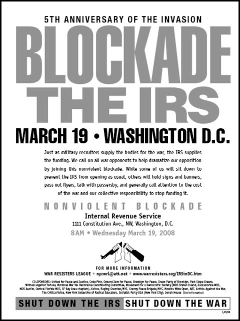

Tax resisters have used nonviolent blockades to disrupt tax offices.

For example, poll tax resisters in Glasgow once occupied a tax office, and, as the staff retreated, the resisters took their places at the walk-up windows.
One of the occupiers, John Cooper, remembers:

> I just sat down at the desk and said through the glass, “Can I help you?”
> I says, “It’s okay; you don’t need to pay any more, it’s abolished!” and the guy says, “Are you sure?”
> I says, “I’m positive. You know what I’d do with this money: go and spend it, have a good time.”
> He says, “You’re having me on.”
> I could see the guy was still uncertain, so there was a bunch of pads for phone messages—I ripped [a page] off and said, “If there’s any bother just send that in to us.”

Some blockades are more symbolic or perhaps aspirational.
Anti-war demonstrators used handcuffs to lock the doors of an Internal Revenue Service (IRS) building in Rochester, New York, for about a half hour in 1972.
Another group of anti-war activists, including representatives from the War Resisters League and the National War Tax Resistance Coordinating Committee, performed a sit-down blockade at IRS headquarters for about an hour in 2008.

Notes and Citations

* Burns, Danny <i>Poll Tax Rebellion</i> AK Press (1992), p. 160 (quoting John Cooper, 8 May 1991)
* [“IRS Office ‘Handcuffed’”](https://nwtrcc.org/wp-content/uploads/2015/11/Niagara-Falls-NY-Gazette-1972-Mar-Grayscale-1473.pdf) Associated Press dispatch from the <i>Niagara Falls Gazette</i> 31 March 1972, p. 2
* Sullivan, Andy [“Thirty-two arrested in Washington antiwar protest”](https://www.reuters.com/article/world/middle-east/thirty-two-arrested-in-washington-antiwar-protest-idUSN19301284/) Reuters 19 March 2008

