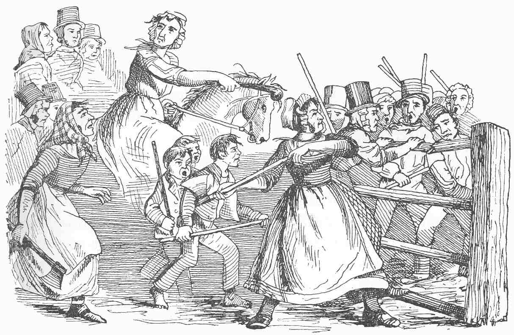

Tax collectors rely on tools, and, increasingly, on computerized automation. Disabling these tools can strike a blow against the tax bureaucracy.

## Parking Meters and Traffic Cameras

There was a semi-organized movement in Chicago to make parking meters unusable—smashing them, disassembling them, making them unreadable with spray-paint, stuffing them with pennies, jamming them with glue or expanding foam, or removing them entirely.
Resisters gleefully swapped tales of parking meter destruction on TheExpiredMeter.com.

Disabling speed-trap cameras has become almost a sport in some parts of the United States.
I’ve seen video footage of people disguised in Santa suits who temporarily disabled cameras by walking from one to the next and wrapping them in colorful gift boxes, in broad daylight, as if they were putting up a municipal holiday display.
Others have used everything from “sticky notes, Silly String, and even a pick-axe” to stop the cameras from taxing drivers.
In Palmer Park, Maryland the authorities had to install a second set of surveillance cameras to keep an eye on their speed cameras because they were getting vandalized so frequently.

(It’s worth noting that although these cameras are ostensibly designed to deter infractions of traffic safety laws, governments often use them as pure revenue raisers—and some have been caught manipulating speed limits and the timing of traffic lights in a way that <em>degrades</em> safety but that increases the anticipated revenue from the cameras.)

## Keene’s “Robin Hoods”

A group of creative activists from Keene, New Hampshire, formed a group called “Robin Hood of Keene.”
They shadow parking enforcement officers on their rounds and quickly fill expired meters before the enforcers can reach them to write out tickets.

> Members of the group place cards under windshield wipers that read, “Your meter expired; however, we saved you from the king’s tariffs, [signed] Robin Hood and his Merry Men. Please consider paying it forward,” and include an address where donations can be sent.

In 2013, the city, alleging that the Robin Hooders have “repeatedly and intentionally taunted, interfered with, harassed, and intimidated” the meter officers, filed for a restraining order against the group.
The activists insist that this has nothing to do with any intimidation or harassment on their part, but with the city’s loss of revenue from the thousands of parking tickets the group has prevented.

> In the filing, parking enforcement officer Linda Desruisseaux said, “Besides following me, crowding around me, making video recordings of my activities, and placing coins in expired meters to prevent me from writing tickets, these individuals repeatedly taunt and harass me, asking why I am stealing peoples’ money and telling me to get another job… In particular, Graham Colson likes to taunt me by saying, ‘Linda, guess what you’re not going to do today—write tickets.’… The taunting and harassment tends to get worse when there is a group, as they try to one-up each other at my expense.”

## Toll-Booths

During the sixteen months of the Rebecca Riots in Wales, there were over a hundred attacks on toll-houses and toll-gates.
“During this period, all the gates and bars in the Whitland, Tivyside, and Brechfa Trusts were destroyed.
Two gates only out of the twenty-one survived in the Three Commotts Trust, whilst between seventy and eighty gates out of about one hundred and twenty were destroyed in Carmarthenshire.
Only nine were left standing out of twenty-two in Cardiganshire.”

Here is one description of how the destruction was carried out:

> The secret was well kept, no sign of the time and place of the meditated descent was allowed to transpire. All was still and undisturbed in the vicinity of the doomed toll-gate, until a wild concert of horns and guns in the dead of night and the clatter of horses’ hoofs, announced to the startled toll-keeper his “occupation gone.” With soldier-like promptitude and decision, the work was commenced; no idle parleying, no irrelevant desire of plunder or revenge divided their attention or embroiled their proceedings. They came to destroy the turnpike and they did it as fast as saws, and pickaxes, and strong arms could accomplish the task.
>
> No elfish troop at their pranks of mischief ever worked so deftly beneath the moonlight; stroke after stroke was plied unceasingly, until in a space which might be reckoned by minutes from the time when the first wild notes of their rebel music had heralded the attack, the stalwart oak posts were sawn asunder at their base, the strong gate was in billets, and the substantial little dwelling, in which not half an hour before the collector and his family were quietly slumbering, had become a shapeless pile of stones or brick-bats at the wayside.

<figcaption>Rebecca and her daughters</figcaption>

When the Scleddy turnpike-gate was attacked, Rebecca and her daughters “broke the gates, posts, walls, and toll-boards into pieces so small that in the morning there was not a piece of the timber larger than would make matches.”

Toll-booth destruction was also part of the riots in Naples in 1647: “the toll-booths throughout the town were demolished; the mob went from one gate to another. Everywhere the toll-gatherers had escaped—nobody thought of making any resistance…”

Toll-booth attacks are also part of the current “won’t pay” movement in Greece.
Resisters there have been mobbing highway toll plazas, raising the bars, and waving cars through.

## Miscellany

Danny Burns reports that during the poll tax rebellion in Thatcher’s Britain, “it was widely reported that Anti-Poll Tax activists had managed to put a bug into the computer, which randomly wiped out every sixth record on the register.
The virus story was never proven. However, a month before it was mentioned in the newspapers, its effects were accurately described to two Anti-Poll Tax activists by two computer hackers one of whom had worked for Lothian Regional Council and had been sacked.”

In Anjou during the French Revolution resisters seized the tax clerks’ horses and sold them at auction.
In Limoux they invaded the homes of tax officials and took their registers and office furniture and dumped them in the river.
In Touraine no sooner were the new tax rolls published but resisters rose up, forced the officials to surrender them, and tore them to pieces.
In Creuse, as the clerk began to read the latest tax roll, “the women spring upon him, seize the tax-roll, and ‘tear it up with countless imprecations.’”

When the IRS seized tax resister Mary Cain’s newspaper, and put a chain and padlock on the front door of its offices, “Mrs. Cain sawed off the lock and chain and mailed them to the Internal Revenue Department with a defiant note.”

Notes and Citations

* “Parking Meter Revolt: Frustration Over High Costs” CBS Chicago 24 March 2009
* [“Santa’s helpers disable naughty cameras in Tempe”](https://www.youtube.com/watch?v=T43LtGNFLPw&feature=youtu.be) (video)
* “Slaying Fuels Debate Over Speed Cameras” Associated Press 27 April 2009
* Ingersoll, Geoffrey “Maryland Police Are Deploying Cameras To Watch Other Cameras” <i>Business Insider</i> 13 September 2012
* Evans, Henry Tobit <i>Rebecca Riots!</i> (2010 ed.) pp. 11 (quoting from “Rebecca and Her Daughters” <i>The Red Dragon</i>, Vol. XI, 1887, p. 328; but I think that in its turn was quoting from “Rebecca” <i>The Quarterly Review</i> June 1844, p. 128), 17, 70
* von Reumont, Alfred <i>The Carafas of Maddaloni</i> (1854) p. 312
* Burns, Danny <i>Poll Tax Rebellion</i> AK Press (1992), pp. 129–30
* Taine, Hippolyte <i>The French Revolution</i>, Vol I. (1897) pp. 16, 68 (note), 242, 280
* “Mary Cain, Mississippi Editor Who Fought U.S. Taxes, Dies” <i>New York Times</i> 8 May 1984

