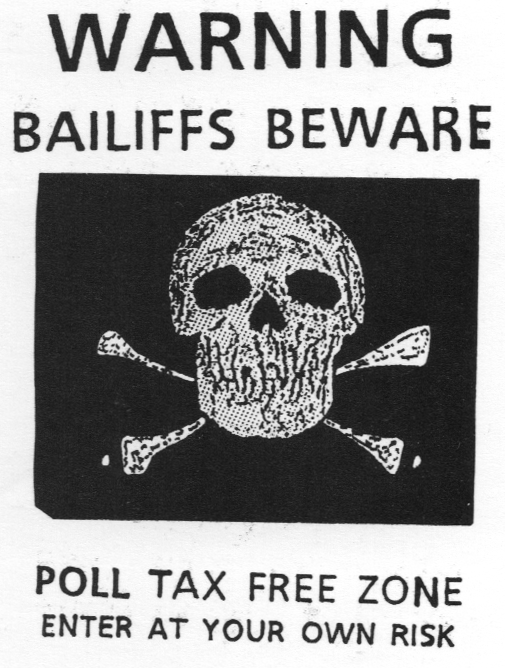

import { Aside } from '@astrojs/starlight/components';
import { Badge } from '@astrojs/starlight/components';
import WikipediaBadge from '../../../components/WikipediaBadge.astro';

Tax resistance campaigns can use the same intimidation tactics against collaborators with the tax system as they can against people who work more directly for it.
Collaborators include people in other government agencies who take reprisals against resisters or who assist the tax bureaucracy in some way, witnesses who testify in court against resisters or who provide information to police or prosecutors, people who bid on seized goods that the government puts up for auction or who take jobs as auctioneers, people who provide services to or rent office space to tax officials, employees of repossession companies that contract with the government to seize property for back taxes, and so forth.

## <Badge text="Example" size="medium" /> Fries and Whiskey Rebellions

Witnesses who were called to testify against the Fries Rebels “were generally very reluctant to give information, being afraid the insurgents would do them some injury.”
During the Whiskey Rebellion, “William Richmond, who had given information against some of the rioters… had his barn burnt, with all the grain and hay which it contained…”

John Lynn made the mistake of renting part of his house to the federal tax registrar of whiskey distilleries.

> About twelve persons, armed and painted black… broke into the house of John Lynn, where the office was kept, and after having treacherously seduced him to come down stairs and put himself in their power, by a promise of safety to himself and his house, they seized and tied him, threatened to hang him, took him to a retired spot in a neighboring wood, and there, after cutting off his hair, tarring and feathering him, swore him never again to allow the use of his house for an office, never to disclose their names, and never again to have any sort of agency in aid of the excise; having done which, they bound him naked to a tree, and left him in that situation till morning, when he succeeded in extricating himself.
> Not content with this, the malcontents some days after made him another visit, pulled down part of his house, and put him in a situation to be obliged to become an exile from his home, and to find an asylum elsewhere.

## <Badge text="Example" size="medium" /> Rebecca Riots

During the Rebecca Riots…

> …the dead body of Thomas Thomas… was found in a river near Brechfa!
> This man had been very much opposed to the Rebecca movement, and… had been to Carmarthen to make a complaint to the authorities against some Rebeccaites; on his return home that night he found his house, etc., on fire.
> Bearing this in mind, together with other circumstantial evidence, it is plain that he had some bitter enemies in the neighbourhood, and it was generally believed that he had been waylaid and murdered.

Thomas had on another occasion testified against his servant and had him jailed, and for this the Rebeccaites had ransacked his house, destroying what they could.

## <Badge text="Example" size="medium" /> Tithe War

During the Tithe War in Ireland, resisters prevented people from cooperating with attempts to seize and auction off resisters’ goods:

> [T]he assembled spectators were afraid to bid, lest they should incur the vengeance of the peasantry…
> Not one man in a hundred had the hardihood to declare himself the purchaser.

In order to take his tithes “in kind” from the farmers in his parish, one clergyman had to import some sixty workers “from distant counties, and at high wages, who yet were incapable of obtaining more than a small portion of tithes, being interrupted by a rabble—chiefly women—though men were lurking in the background to support them.”

<Aside type="note" title="See also">
[Disrupt Tax Auctions](../disrupttaxauctions/)
</Aside>

## <Badge text="Example" size="medium" /> Bardoli Tax Strike

During the Bardoli tax strike, anyone from outside the district who came to purchase land that the government had seized for non-payment was told in no uncertain terms that they might buy the land, but they would have to get their labor, goods, and services somewhere else: “they might have lands just for the fun of it, but not to cultivate.”

## <Badge text="Example" size="medium" /> Stamp Act Resistance

In colonial North Carolina during the Stamp Act agitation, “stamp masters were seized and forced to swear they would have nothing to do with the stamps.”
When rebels learned that a ship bearing the stamps had arrived, they called out a 700-person strong militia, “seized the vessel, and held her until her commander promised not to permit the stamps to be taken from her.”

## <Badge text="Example" size="medium" /> Reform Act Agitation

During the Reform Act uprising in the 1830s,

> Threats had been employed to prevent auctioneers from selling distrained goods; and an auctioneer in Bath had been obliged, in consequence of intimidation, to issue a handbill, in which he gave public notice, that he would not receive for sale any goods distrained for the non-payment of King’s Taxes.

## <Badge text="Example" size="medium" /> Household Tax Resistance

Irish Household Tax resisters mobbed Ireland’s Minister for Public Expenditure and Reform, surrounding his car and chanting “fucking scumbag.”
Another politician who witnessed the event said:
“In my view, there was an element of thuggery to it.
Some of the protestors prevented him from getting out of the car park.”

## <Badge text="Example" size="medium" /> Tax Resistance in Spain

When the municipality of Ondárroa tried to hire an outside debt collection company—Gesmunpal—to go after resisters, “the nationalist left spread slogans via Internet in favor of ‘civil disobedience,’ as well as calls and letters against the company.
Gesmunpal resigned.”

## <Badge text="Example" size="medium" /> Poll Tax Rebellion

Poll tax resisters in Thatcher’s Britain threatened tax system collaborators, for example:

> Attacks and threats have been made against Bristol newsagents and shops where people can pay the Poll Tax.
> Windows have been smashed and graffiti daubed over businesses which have become agents for the Bristol-based company “Penalty Points.”
> The firm installs special tills with its agents to collect the community charge on behalf of local authorities for a fee.
> Mr. Ross Hendry, a spokesman for the company… said “because of the attacks, one newsagent in Patchway has now declined taking an agency after a brick was thrown through his window.”
> He said another newsagent in Bishoport Avenue, Hartclife had the words “Poll Tax scab” and “you’re the first” scrawled in white paint across his window.
> A Circle K store in Cardiff where the revolutionary scheme was launched on April 9th with 48 agents, had its door locks jammed with superglue.

Intimidation of bailiffs (people authorized to seize and sell property for tax arrears) was widespread:

> Housing schemes and estates were plastered with posters.
> One showing a vicious dog, read “Bailiffs? Make my day!”
> Another showing a picture of Malcolm X holding a machine gun looking out from behind the curtains, read: “Bailiffs we’re ready.”
> A third showed a picture of a bailiff swinging in a noose.
> It read “Dead bailiffs don’t knock on doors.”
> In some areas bailiffs and registration officers were photographed and their portraits were reproduced on posters which read “wanted” and listed their “crimes.”
> These images were extremely popular…
> People were used to seeing images of themselves in the role of victim.
> Now wherever they looked there were images of their adversaries in this role.…
>
> Wherever the council registration officers went they were harassed.
> In Glasgow violent threats drove canvasser Robert Stevenson to quit his job.
> He was physically threatened twice in four weeks and continually harassed:
>
> > I’d just put the form through the door when this guy across in the garden opposite started shouting.
> > He was sitting in the garden with about four others and they were all giving me dirty looks.
> > He said that if I came back to collect the form I would need a tank for protection.
> > I was in no doubt that they were serious. I didn’t finish my last street. I just chucked it.
>
> …another canvasser… was “harassed by a gang.”
> In this case, it was reported that:
>
> > Four or five youths cornered him in a close in Gairbraid Avenue and subjected him to abuse.
> > A Strathclyde police spokesman revealed: “They said it was a ‘No Poll Tax Area’ and told the worker to get out, which he did.”
>
> Following these reports, the Poll Tax registration officer admitted that ‘there had been at least four other incidents involving canvassers’ and… canvassers had been threatened (leaflets were grabbed from their hands).
> Already over two members of his staff had resigned because of fears about their personal safety.…
>
> Mr. Trueman, a Poll Tax snooper whose job was to call on people and badger them into filling the registration forms, [was] unable to cope with the abuse…
>
> > Mrs. Trueman found the corpse of her husband as she came back from shopping.
> > Fred Trueman, 52, an employee of Bristol City, had hanged himself.
> > “No-one can imagine what terrible pressure he had to work under,” she claimed.
> > “He was sworn at and threatened; he couldn’t stand it any more.”

<Aside type="tip" title="Wikipedia">
  <WikipediaBadge title="Fries’s Rebellion" url="https://en.wikipedia.org/wiki/Fries%27s_Rebellion" />
  <WikipediaBadge title="Whiskey Rebellion" />
  <WikipediaBadge title="Rebecca Riots" />
  <WikipediaBadge title="Tithe War" />
  <WikipediaBadge title="Bardoli Satyagraha" />
  <WikipediaBadge title="Stamp Act Congress" />
  <WikipediaBadge title="Reform Act 1832" />
  <WikipediaBadge title="Poll tax (Great Britain)" />
</Aside>

---

Notes and Citations

* Davis, W.W.H. <i>The Fries Rebellion</i> (1899), [p. 45](https://archive.org/details/friesrebellion1700dav/page/45/mode/1up)
* Hamilton, Alexander “Report on Opposition to Internal Duties” (5 August 1794) <i>The Works of Alexander Hamilton</i>, Vol. IV (1850), [pp. 578–99](https://archive.org/details/worksalexanderh13hamigoog/page/578/mode/1up)
* Evans, Henry Tobit <i>Rebecca Riots!</i> (2010 ed.), p. 17
* Fitzpatrick, William John <i>The Life, Times, and Correspondence of the Right Rev. Dr. Doyle</i>, Vol. II (1862) [pp. 404–05](https://archive.org/details/lifetimesandcor05fitzgoog/page/404/mode/2up)
* Desai, Mahadev <i>The Story of Bardoli</i> (1929) [pp. 170–71](https://archive.org/details/in.ernet.dli.2015.122169/page/n188/mode/1up)
* Saunders, William L. <i>Lessons from Our North Carolina Records</i> (1889) [p. 10](https://archive.org/details/lessonsfromourno00saun/page/10/mode/1up)
* <i>Hansard’s Parliamentary Debates</i>, Third Series, Vol. VIII (1832) p. 702
* [“Minister Howlin and Tommy Carr (84) branded scumbags”](https://www.independent.ie/regionals/wexford/news/minister-howlin-and-tommy-carr-84-branded-scumbags/27731383.html) <i>Wexford People</i> 29 February 2012
* Astui, Iratxe “Finaliza en Ondarroa el boicot fiscal sin afrontar los impagos” <i>El Correo</i> 19 July 2011 (translation mine)
* Burns, Danny <i>Poll Tax Rebellion</i> AK Press (1992), pp. 65–66, 130, 132 (quoting from the <i>Bristol Evening Post</i> 10 May 1990, the <i>Glasgow Evening Times</i> 9 July 1988, and <i>Der Spiegel</i> 5 March 1990)

