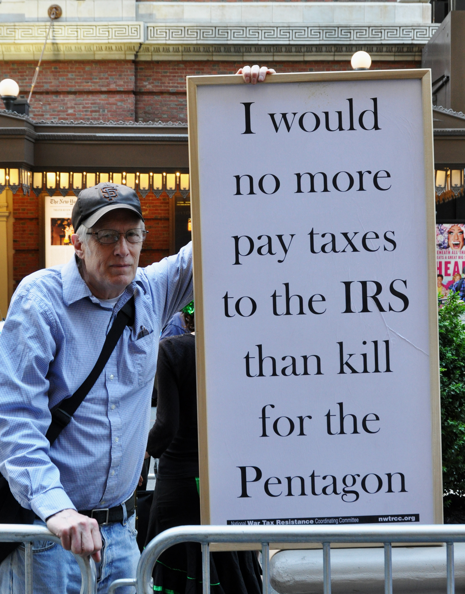

import Aside from '../../../components/ExtendedAside.astro';
import { Badge } from '@astrojs/starlight/components';
import WikipediaBadge from '../../../components/WikipediaBadge.astro';

Tax agencies thrive on bureaucracy and paperwork.
Many of the earliest examples of writing in the worlds’ museums are tax records.
Some mischievous tax resisters have discovered that this is a vulnerability that they can target.

In the United States, for example, the Internal Revenue Service (IRS) once estimated that it costs about 35¢ on average to process an electronically-filed return, compared to an average of $2.87 for a paper return.
This suggests that one way resisters could make a dent in the agency’s budget and efficiency is simply by insisting on filing paper returns.
If this tactic became widespread, it could cripple the tax collecting bureaucracy.
George Jakabcin, IRS assistant deputy associate chief information officer for systems integration, said in 2008 that the agency “would be in a world of hurt” if even half of the people who had switched to electronic filing at that time changed their minds and switched back to paper.

> We no longer have the capability to process the additional 43 million returns manually.
> We no longer have the facilities, we don’t have the IT infrastructure in place to support them, we don’t have the people, and some would argue that we are beginning to lose the expertise.

## <Badge text="Example" size="medium" /> American War Tax Resisters

The IRS has tried to crack down on people who send them paperwork just to waste their time.
They came up with something they call the “frivolous filing penalty” and they can ding people $5,000 each time they file any sort of paperwork that takes a position the agency considers to be “frivolous.”
The agency can assess this penalty immediately and on the whim of whichever bureaucrat is handling the case, without going to court, and the victim is only allowed to appeal the fine to a judge if he or she pays it first!

War tax resister Karl Meyer wasn’t about to let the IRS think it could intimidate him that way.
In 1984, at the height of the “Cabbage Patch Kids” craze (each doll slightly different), he invented what he called “cabbage patch resistance”—filing a different, blatantly “frivolous” tax return *every day*, “addressed to a different employee or office of the IRS.”
He was assessed $140,000 in penalties in 1984 alone (though the penalty per frivolous return was only $500 back then).
The IRS never has collected that money.
The best it could manage was to seize and sell Meyer’s car, for a little over $1,000.

War tax resister Ed Hedemann has made plans for what he calls “zombie war tax resistance.”
He has filled in years of tax returns ahead of time and put them in pre-stamped envelopes so that his survivors can continue to file (but, of course, refuse to pay!) after he’s dead and gone.
“Why give the government a break from having to deal with your resistance when you die?” he asks.

<figcaption>War tax resister Ed Hedemann</figcaption>

Hedemann also periodically files Freedom of Information Act requests for any information the IRS and other government agencies have collected about his activities—hundreds of pages, as it turns out—and he’s put together a guide for other tax resisters to follow in making their own requests.

## <Badge text="Example" size="medium" /> American Constitutionalists

“Constitutionalist” and “sovereign citizen”-style tax protest groups in the United States are fond of harassing tax officials and other government employees with lawsuits, liens, bogus quasi-official court filings, and other such paperwork.
In one example, Eddie Kahn’s “Guiding Light of God Ministries” filed some 2,000 misconduct complaints against IRS agents.
A newspaper article about a subsequent legal case against the group noted that:

> Some agents have said that their supervisors ordered them to back off from audits or collection efforts in the face of [such] threats, just to avoid investigations by the Treasury inspector general for tax administration.

## <Badge text="Example" size="medium" /> Hacking the Tax Agency

Other paperwork tricks are more like “hacking.”
They treat the tax agency as a system that processes input and produces output, and note that certain pathological inputs can result in outputs that were not anticipated by the system designers.

For example, the IRS mistakenly gave away twenty million dollars in the 2008 filing season when crafty people figured out that if they substantially *overpaid* their taxes with a bad check, the IRS would cut them a hefty refund check before they noticed they’d been had.

There is also an ongoing epidemic of “identity theft” tax fraud in the United States in which fraudsters file for phony tax refunds in the names of other, real people.
This often causes the tax collection bureaucracy to swing into action against the *victims* of the identity theft—once the IRS figures out it’s been swindled—which is both a waste of resources and a way of further alienating the population from the government and its tax agency.

## <Badge text="Example" size="medium" /> Alliance of the Libertarian Left

South Carolina’s state government passed a law that required all organizations that “directly or indirectly advocate, advise, teach, or practice the duty or necessity of controlling, seizing, or overthrowing the government of the United States, the state of South Carolina, or any political division thereof,” to register their activities with the South Carolina Secretary of State and to pay a five-dollar filing fee.
A member of the Alliance of the Libertarian Left decided to register, but with a twist:

> When belligerence and inhumanity prevail, the peaceful and the humane must find honor in being categorized as the enemies of the prevailing order.
> Please keep me updated as to the status of our registration.
> I look forward to hearing back from you as to our official recognition as enemies of your state and its government.…
>
> P.S. I am told that there is a processing fee in the amount of $5.00 for the registration of a subversive organization.
> Our organization is in fact so dastardly that we have refused to remit the fee.

## <Badge text="Example" size="medium" /> Prussian Farmers

Prussian farmers in 1922 used the bureaucracy against itself.
A <i>New York Times</i> report noted:

> They have all filed protests and demanded that they be relieved from paying the tax until the protests are settled.
> That means a delay of at least three years in collecting the taxes, and it is said that the Provincial Treasury is inclined to grant this request.
> The big agrarians declared that they would do the same thing with all the tax laws.
> In Berlin the people might decree what pleased them, they (the agrarians) would not pay the taxes or subscribe to the compulsory loans.
> They want to sabotage the whole taxation system that they hate, and consequently they want to make so much work for the Treasury officers that the latter don’t know which way to turn.

## <Badge text="Example" size="medium" /> Poll Tax Rebellion

An early form of resistance to Thatcher’s poll tax was called the “send it back” campaign.
People were advised to send in their registration forms for the tax, as the law required, but to accompany them with questions that would require further manual processing by the councils that were processing the registrations:

> Government regulations state: “…if for any reason you consider that you are not a ‘responsible person’ please let me know and return the form to me without completing it.”
>
> [The anti-poll tax campaign called] Stop It wants people to take up this offer by writing to ask if they should be the “responsible person” and suggests they ask who will have access to the information supplied and why the authorities require exact dates of birth.…
>
> Labour MP Brian Wilson, chairman of Stop It, said: “It is a campaign of obstruction within the law that does not lead people to incur the substantial penalties that are built into the legislation.”
> The aim was to have the legislation amended or abandoned.

For this and other reasons, the councils were inundated with paperwork.
“Councils sat under a mountain of paper.
Everything they did seemed to create more work,” wrote campaign historian Danny Burns.
He quotes from the Poll Tax Legal Group:

> The paperwork involved with administering the charge is enormous—and likely to get worse.
> Backlogs switch from one area of activity to another.
> Indeed, local authorities cannot really do anything without generating more paperwork.

## <Badge text="Example" size="medium" /> Chicago Property Tax Strike

The Association of Real Estate Taxpayers in Chicago led tens of thousands of property owners to demand reassessments of their property during the Great Depression.
This swamped the Board of Review and allowed the property owners to legally delay tax payment.

When the Association filed a lawsuit, they did so in the form of gigantic, 7,000-page, two-foot-thick book volumes that listed each of the 26,000 co-litigants in the suit along with their assessments, tax bills, and the locations of their property.

## <Badge text="Example" size="medium" /> #EverybodyFileAProtest

A columnist for the <i>Dallas News</i> created an #EverybodyFileAProtest campaign in 2017, encouraging people in the Dallas-Fort Worth area to challenge their property tax assessments.
He claims 40,000 more people than usual filed protests that year.
“The idea was to clog up the system so that appraisal districts would settle informally, either in person or online, with homeowners to avoid so many appeal hearings.”

<Aside type="wikipedia" title="Wikipedia">
  <WikipediaBadge title="Karl Meyer (activist)" />
  <WikipediaBadge title="Cabbage Patch Kids" />
  <WikipediaBadge title="Sovereign citizen movement" />
  <WikipediaBadge title="Eddie Ray Kahn" />
  <WikipediaBadge title="Identity theft" />
  <WikipediaBadge title="Poll tax (Great Britain)" />
  <WikipediaBadge title="Association of Real Estate Taxpayers" />
</Aside>

---

Notes and Citations

* “Repeated Efforts to Modernize Paper Tax Return Processing Have Been Unsuccessful; However, Actions Can Be Taken to Increase Electronic Filing and Reduce Processing Costs” Treasury Inspector General for Tax Administration report #2009‒40‒130, 10 September 2009, p. 2
* Kristan, Joe “IRS Innovations in Data Security” <i>Tax Update Blog</i> 30 May 2008 (quoting from the <i>TaxAnalysts</i> blog)
* [“Tax resister mails a protest return every day”](https://news.google.com/newspapers?nid=892&dat=19840415&id=E0VQAAAAIBAJ&sjid=6FcDAAAAIBAJ&pg=7090,3131120) <i>Chicago Sun Times</i> 15 April 1984
* “IRS Hits Jackpot” <i>In These Times</i> 27 March 1985
* Brockmann, Stephen “ ‘Cabbage Patch Resistance’ marks a true war-tax hero” <i>The Milwaukee Journal</i> 12 April 1985
* Meyer, Karl “Files Daily Tax Returns” (letter) <i>Friends Journal</i> 15 May 1984, p. 21
* Hedemann, Ed “Zombie War Tax Resistance” <i>More Than a Paycheck</i> December 2011, p. 4
* Hedemann, Ed [“The IRS Files”](https://nwtrcc.org/wp-content/uploads/2015/10/mtap1210.pdf) <i>More Than a Paycheck</i> December 2010, p. 1
* Johnston, David Cay [“Court Is Asked to Block False Complaints Against I.R.S.”](https://www.nytimes.com/2003/12/09/business/court-is-asked-to-block-false-complaints-against-irs.html) <i>New York Times</i> 9 December 2003
* “Inadequate Controls Over Dishonored Checks Put Millions of Dollars at Risk for Erroneous Refund Issuance” Treasury Inspector General for Tax Administration report #2009‒40‒143, 23 September 2009, p. 4
* “IRS Oversight Board Annual Report to Congress: 2011” (see for instance Table 4 on p. 27)
* Gehrke-White, Donna [“ID theft victims in line for hours to get IRS help”](https://www.sun-sentinel.com/2012/08/15/id-theft-victims-in-line-for-hours-to-get-irs-help/) <i>SunSentinel</i> 15 August 2012
* Johnson, Charles [“Civic duties”](https://radgeek.com/gt/2010/02/09/civic-duties/) <i>Rad Geek People’s Daily</i> 9 February 2010
* “Prussian Farmers Fight Income Tax” <i>New York Times</i> 9 April 1922
* Cramb, Auslan [“Labour reveals return to sender poll tax protest”](https://news.google.com/newspapers?id=Izc1AAAAIBAJ&sjid=OKYLAAAAIBAJ&pg=2549,2855170) <i>Glasgow Herald</i> 11 March 1988, p. 7
* Burns, Danny <i>Poll Tax Rebellion</i> AK Press (1992), p. 129, quoting from “Poll Tax Legal Group, Law Review No. 4, March 1991”
* Beito, David T. <i>Taxpayers In Revolt: Tax Resistance During the Great Depression</i> (1989) [pp. 59](https://archive.org/details/taxpayersinrevol0000beit/page/59/mode/1up), [81](https://archive.org/details/taxpayersinrevol0000beit/page/81/mode/1up)
* Lieber, Dave [“How to file a Texas property tax protest—and why you must”](https://www.dallasnews.com/news/watchdog/2017/04/20/how-to-file-a-texas-property-tax-protest-and-why-you-must/) <i>The Dallas Morning News</i> 20 April 2017; [“Ironically, the leader of this year’s property tax protest campaign fails at his own”](https://www.dallasnews.com/news/watchdog/2017/10/12/ironically-the-leader-of-this-years-property-tax-protest-campaign-fails-at-his-own/) <i>The Dallas Morning News</i> 12 October 2017

