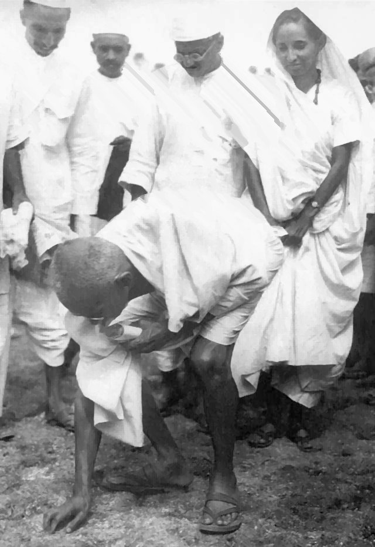

Tax resistance campaigns have sometimes chosen a particular tax to resist because it is easier to resist, because the ramifications of resisting it are less frightening, because the tax has some symbolic importance, or because the tax itself is particularly unpopular.
This can encourage more people to begin resisting.

## The Salt March

<figcaption>Gandhi illegally gathering salt from a natural salt deposit</figcaption>

Gandhi’s salt march and the salt tax resistance campaign, for example, are now recognized as momentous.
But at the time, many commentators ridiculed all of the fuss being made over a piddling little tax.
War tax resister Joanne Sheenan notes:

> Gandhi’s Salt March initially involved only 80 people, but the act of picking up the salt from the sea and making their own salt in defiance of British taxed salt was revolutionary. The power of the Salt March was that it became a massive campaign—there was something everyone could do. Some packaged the salt, some sold it, all could refuse to buy the taxed salt and buy the alternative.

The British occupation government knew that this piddling little tax had big symbolic value and that resistance could cause big trouble.
To give you some idea of how concerned they were: at one point they hired hundreds of people to destroy natural salt deposits on a beach where Gandhi planned to try to gather salt in defiance of the monopoly.

## Phone Tax Resistance

The American war tax resistance movement for a long time targeted the federal excise tax on telephone service.
This tax had historically been instituted and raised to help fund war spending, and so it had symbolic value as a “war tax.”

Because it was a small and easily-resisted tax, people could start resisting quickly and without having to fear terrible government reprisals.
The small amounts resisted also meant that government action against any particular resister would be unlikely to be cost-effective.
Resistance became so widespread during the Vietnam War that the government went so far as to seize the cars of some resisters who owed a few dollars in phone tax.

## TV License Resistance

War tax resisters in Denmark have a similar campaign in which they refuse to pay a portion of their radio and TV tax.
In Denmark, people are supposed to pay that tax individually, whereas income taxes are withheld automatically by employers under a pay-as-you-earn scheme.
For this reason the radio and TV tax is one that the average person can more easily resist.

## The Bardoli Tax Strike

By succeeding in a small-scale tax resistance campaign you can inspire confidence and contribute to the success of a later, large-scale campaign.
Vallabhbhai Patel, commander of the Bardoli tax strike of 1928, told his followers:

> [U]nderstand, the issue with Government is not merely one of losing a few lakhs [hundreds of thousands] of rupees of land revenue. It can raise a crore [ten million] of rupees today, if it wishes, by arbitrary taxation. But it is afraid, and rightly too, lest if we win the battle, the whole of India may do tomorrow what Bardoli is doing today. Similarly you have to realise on your part that it is not merely yourselves that you represent but you hold in your hand the honour of the whole of India.

Notes and Citations

* Sheehan, Joanne “Gandhi’s Three Elements of Nonviolent Social Transformation” <i>More Than a Paycheck</i> October 2005
* “Civil Disobedience” <i>The Canberra Times</i> 29 March 1930, p. 5
* Desai, Mahadev <i>The Story of Bardoli</i> (1929) p. 142

