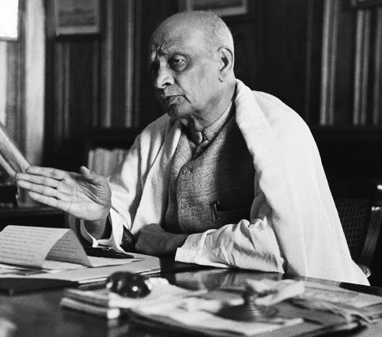

import Aside from '../../../components/ExtendedAside.astro';
import { Badge } from '@astrojs/starlight/components';
import WikipediaBadge from '../../../components/WikipediaBadge.astro';

A tax resistance campaign can increase participation and discourage attrition by enforcing a social boycott against non-resisters: shunning them and denying them the benefits of community and society.

## <Badge text="Example" size="medium" /> Bardoli Tax Strike

Social boycott was an important tool of the Bardoli tax refusal campaign during the independence struggle in India.
Mahadev Desai, in <i>The Story of Bardoli</i>, writes:

> It is this weapon that exasperated the Government, but they were helpless because social boycott was no offence under the Penal Code.
> And the <i>Sardar</i> [Vallabhbhai Patel, who commanded the campaign] poured ridicule on Government for grudging the people the use of this their only weapon.
> “What do you do yourselves?
> Yours is a close corporation maintained by force of arms and its motive is no nobler than keeping a nation in bondage.
> We resort to this weapon simply for the sake of self-defence and self-preservation.”
> But he never omitted to emphasize its limitations, the very first being that in no circumstances should a Satyagrahi refuse to minister to the physical needs of the party boycotted.
> “Eschew by all means molestation or oppression.
> We may not refuse anyone milk, water, foodstuffs, help in case of illness or worse.
> We cannot afford to prosecute boycott at the expense of our humanity.”

<figcaption>Vallabhbhai Patel</figcaption>

Among the ways the Bardoli strikers boycotted landowners who paid property taxes was by refusing to rent their fields or to work as agricultural laborers for them.

## <Badge text="Example" size="medium" /> American Revolution

During the American revolution, boycotts of British imports were enforced by social boycott.
One resolution of boycotters read:

> [W]e will not purchase any goods of any persons who, preferring their own interest to that of the public, shall import merchandise from Great Britain, until a general importation takes place; or of any trader who purchases his goods of such importer: and… we will hold no intercourse, or connection, or correspondence, with any person who shall purchase goods of such importer, or retailer; and we will hold him dishonored, an enemy to the liberties of his country, and infamous, who shall break this agreement.

Another said:

> [W]hoever shall… in any wise aid or abet in unloading, receiving, or vending the tea sent or to be sent out by the East India Company while it remains subject to the payment of a duty here is an enemy to America—
> …That a Committee be immediately chosen to wait on those Gentlemen, who it is reported are appointed by the East India Company to receive and sell said tea, and to request them from a regard to their own characters and the peace and good order of this town and province immediately to resign their appointment.

## <Badge text="Example" size="medium" /> The Anti-Pizzo Movement

Sicily’s branch of the Confindustria industrialists’ union unanimously voted in 2007 to expel any member who was caught paying protection money (the most primitive variety of tax) to the mafia.
A few dozen members were in fact expelled from the group under this policy.

## <Badge text="Example" size="medium" /> Quakers

Many Quaker meetings had a policy of “disowning” members who failed to practice war tax resistance or tithe resistance.
Sometimes, even failing to report that the government had subjected you to “sufferings” for your resistance could make you suspect.
If Quakers failed to report anything of this sort, others might visit them and ask how they had managed to avoid government reprisals while maintaining their refusal to pay.

Disowning was something like excommunication.
It withheld the benefits of meeting membership from the disobedient Quakers until such time as they repented and made satisfactory amends—which might include publicly admitting the wrong of their behavior at a future meeting.

Occasionally, as during the American Revolution, disownings like these might lead to schisms and the emergence of rival meetings with different policies.

## <Badge text="Example" size="medium" /> The Tithe War

During the Tithe War in Ireland, according to one report:

> [P]ersons accused of the crime of tithe-paying are summoned to appear and give an account of their conduct, and defaulters undergo the punishment of being abandoned at once by every person in their employment.
> Country gentlemen and farmers are left without a servant or labourer to perform the most necessary work.
> The hay is left to rot on the ground, and the cattle to perish for want of the necessary food, drink, and care; and even on the roads it is common for the horses of the mails and stage-coaches to be changed by the coachmen and passengers, because the unhappy recusant innkeeper has been deserted by every one, even to his hostler.

Another report complained:
“The people of Ireland have now virtually abolished tithes.
They will neither pay the tax themselves, nor have any dealings or intercourse with those who do…
The man who in any way upholds the obnoxious system, whatever his previous character or services may have been, is branded as an object of universal execration.”

## <Badge text="Example" size="medium" /> South African Miners

When resisters at the “New Rush” in South Africa in 1874 pledged to refuse to pay further taxes, each one also pledged, “that I shall buy from, sell to, or deal with only such men as have also taken this pledge or obligation.”

## <Badge text="Example" size="medium" /> Newly Enfranchised Pennsylvania Women

Women in Pennsylvania suddenly found themselves taxable in the wake of the success of the women’s suffrage movement.
But then they also became subject to strong social pressure to resist these new taxes.
According to one report:

> [One] woman, who is reported to have failed to pay her tax, asserted she was laughed at by her friends when she paid her tax in former years, and she would not be laughed at any longer.

<Aside type="wikipedia" title="Wikipedia">
  <WikipediaBadge title="Bardoli Satyagraha" />
  <WikipediaBadge title="Mahadev Desai" />
  <WikipediaBadge title="Vallabhbhai Patel" />
  <WikipediaBadge title="Pizzo (mafia)" />
  <WikipediaBadge title="Quakers" />
  <WikipediaBadge title="Tithe War" />
</Aside>

---

Notes and Citations

* Desai, Mahadev <i>The Story of Bardoli</i> (1929) [p. 170](https://archive.org/details/in.ernet.dli.2015.122169/page/n188/mode/1up)
* Lincoln, William <i>History of Worcester, Massachusetts</i> (1862) [p. 70](https://archive.org/details/historyofworces00linc/page/70/mode/1up)
* “Resolutions of the Town of Boston, November 5, 1773” in <i>The Writings of Samuel Adams</i>, (1907) Volume III, [pp. 67–69](https://archive.org/details/writingssamuela02adamgoog/page/n92/mode/1up)
* Kington, Tom [“Shopkeepers revolt against Sicilian mafia”](https://www.theguardian.com/world/2008/mar/09/internationalcrime.italy) <i>The Observer</i> 8 March 2008
* “Tithes in Ireland” <i>The [New Brunswick] Courier</i> 25 August 1832, p. 2 (in part quoting the <i>Liverpool Mercury</i> of 20 July 1832)
* “Extract from the ‘Diamond Field’ Newspaper of November 25, 1874” <i>Correspondence Relating to the Colonies and States of South Africa: Further Correspondence respecting the Affairs of Griqualand West and the Diamond Fields</i> (1876) [p. 22](https://babel.hathitrust.org/cgi/pt?id=mdp.39015084562621&seq=34)
* [“6 Women Defy Tax Collector”](https://news.google.com/newspapers?id=lSMpAAAAIBAJ&sjid=69cEAAAAIBAJ&pg=3359,1284405&hl=en) <i>The Nevada Daily Mail</i> 4 May 1927, p. 1

