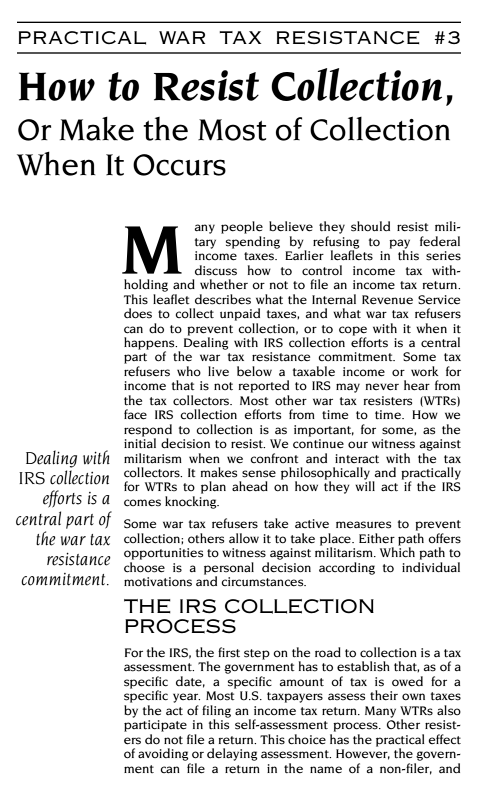

When you’re trying to expand the ranks of tax resisters in your campaign, you need good educational tools.
People are often reluctant to resist either because they aren’t sure how to go about it, or because they only have a vague idea of the likely consequences (and may have an exaggerated idea of their frightfulness).

## American War Tax Resisters

NWTRCC once conducted a survey of anti-war activists who were <em>not</em> tax resisters.
One question they asked was: “Which resources would help you decide to participate [in a tax resistance campaign]?”
The most popular answer was: “clear idea of likely consequences.”
The two top responses to a question about “the most important reason you have not done war tax resistance” were “fear legal consequences” and “need more information.”

People are comfortable with the familiar.
If you ask them to take a leap into the unknown, they will imagine the worst possible consequences as a way of justifying their reticence.
If you can be clear, thorough, and credible in demonstrating how to resist and what the consequences are likely to be, you can eliminate what may be the biggest obstacle to the growth of your campaign.

<figcaption>the cover of one of NWTRCC’s “practical war tax resistance” pamphlets</figcaption>

This is easier said than done, however.
It can be difficult to be clear and thorough about consequences if you are going up against a tax agency that is arbitrary or that changes its processes suddenly.
And it can take time to establish credibility.

NWTRCC publishes a number of specialized how-to pamphlets that cover various methods of tax resistance (such as refusing to file, filing and refusing to pay, or living on a non-taxable income) and strategies for coping with possible consequences (such as government collection efforts).

NWTRCC also organizes a nationwide network of volunteers who offer one-on-one counseling sessions for potential resisters or for current resisters who are running into snags.
The national office keeps abreast of changes in the tax law and in IRS enforcement trends, and sends out bulletins and holds periodic counselor training sessions to keep the network up-to-date.

Local groups in NWTRCC also conduct workshops at which people can learn about the variety of war tax resistance methods and ask questions of people who have experience with them.

## British Women’s Suffrage Movement

Ethel Ayres Purdie ran what she called the “Women Taxpayers’ Agency” and counseled British women’s suffrage activists on how best to resist their taxes on “no taxation without representation” grounds and how they could exploit legal quirks to legally avoid taxes.

Members of the Women’s Tax Resistance League regularly gave lectures on their tactics of choice at suffragist meetings, and recruited new resisters at these lectures.

## The Poll Tax Rebellion

People who resisted Thatcher’s poll tax gained confidence thanks to the efforts of the Poll Tax Legal Group which, among other things, “produced over 30 accessible legal bulletins on the Poll Tax and a book called <i>To Pay or Not To Pay</i>.”

To combat the threat of property seizure (sometimes the threat itself could be enough to intimidate people into stopping their resistance) the movement made efforts to educate the public about the seizure process and about ways to frustrate it:

> [T]he first task of Anti-Poll Tax Unions was to inform people about what the bailiffs could and couldn’t do. In Scotland, people were advised not to tell the sheriffs where they worked, not to tell them which banks they used, and not, under any circumstances, to let them into their houses. They were also told to inform the local group as soon as the sheriffs threatened anything. The Anti-Poll Tax Unions advised people to move possessions to local friends’ houses before the date of the poinding and offered to help with the moving. People were told to leave their cars well away from their homes. They were informed that a wrongful poinding could be appealed against and, in many cases, this was done successfully. People were also told how to avoid bailiff action by signing away their possessions to people who lived outside of the area or, preferably, to their children. There are now young children who technically own all of their parents’ possessions.
>
> Some local law centres went onto the offensive against the bailiffs, providing information to the public which totally undermined their actions. One morning in May 1991, the bailiffs delivered over 4,000 intimidation notices to people throughout Bristol. By 7:30 a.m. the law centre had heard about this and contacted all local radio stations. By 8:00 p.m. the news bulletins which went out every fifteen minutes, reported:
> > Today bailiffs have delivered notices for payment to over 4,000 people in Bristol. A spokesperson from the law centre said that they were illegal and should be ignored.
>
> So most people ignored them.

Notes and Citations

* Burns, Danny <i>Poll Tax Rebellion</i> (AK Press, 1992), pp. 136, 151

