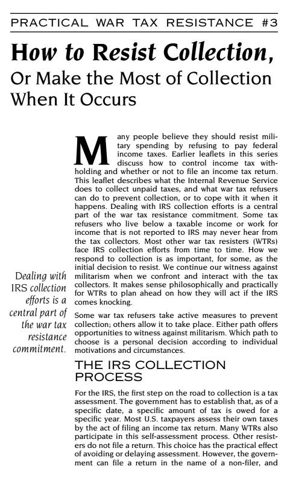

import { Aside } from '@astrojs/starlight/components';
import { Badge } from '@astrojs/starlight/components';
import WikipediaBadge from '../../../components/WikipediaBadge.astro';

To expand the ranks of tax resisters in your campaign, you need good educational tools.
People are often reluctant to resist either because they aren’t sure how, or because they have only a vague idea of the likely consequences (and may have an exaggerated idea of their frightfulness).

## <Badge text="Example" size="medium" /> American War Tax Resisters

The National War Tax Resistance Coordinating Committee (NWTRCC) once conducted a survey of anti-war activists who were *not* tax resisters.
One question they asked was: “Which resources would help you decide to participate [in a tax resistance campaign]?”
The most popular answer was: “clear idea of likely consequences.”

The two top responses to a question about “the most important reason you have not done war tax resistance” were “fear legal consequences” and “need more information.”

People are comfortable with the familiar.
If you ask them to leap into the unknown, they may imagine the worst possible consequences to justify their reticence.
If you can be clear, thorough, and credible in demonstrating how to resist and what the consequences are likely to be, you can eliminate a big obstacle to the growth of your campaign.

<figcaption>the cover of one of NWTRCC’s “practical war tax resistance” pamphlets</figcaption>

This is easier said than done, however.
It can be difficult to be clear and thorough about consequences if you are confronting a tax agency that is arbitrary or that changes its processes unpredictably.
And it can take time to establish credibility.

NWTRCC publishes several specialized how-to pamphlets that cover various methods of tax resistance and strategies for coping with possible consequences.

NWTRCC also organizes a nationwide network of volunteers who offer one-on-one counseling sessions for potential resisters or for current resisters who run into snags.
The national office keeps abreast of changes in the tax law and in Internal Revenue Service enforcement trends, and sends out bulletins and holds periodic counselor training sessions to keep the network up-to-date.

Local groups that affiliate with NWTRCC also conduct in-person and on-line workshops at which people can learn about the variety of war tax resistance methods and ask questions of people who have experience with them.

<Aside type="tip" title="Links">
NWTRCC’s “practical war tax resistance” pamphlets:
1. [<i>Controlling Federal Tax Withholding</i>](https://nwtrcc.org/PDFs/practical1.pdf)
1. [<i>To File Or Not To File An Income Tax Return</i>](https://nwtrcc.org/PDFs/practical2.pdf)
1. [<i>How To Resist Collection, Or Make the Most Of Collection When It Occurs</i>](https://nwtrcc.org/PDFs/practical3.pdf)
1. [<i>Self-Employment—An Effective Path For War Tax Refusal</i>](https://nwtrcc.org/PDFs/practical4.pdf)
1. [<i>Low Income/Simple Living As War Tax Resistance</i>](https://nwtrcc.org/PDFs/practical5.pdf)
1. [<i>Organizational War Tax Resistance, Employers, Contractors, and Financial Institutions</i>](https://nwtrcc.org/PDFs/practical6.pdf)
1. [<i>Health Care and Income Security for War Tax Resisters</i>](https://nwtrcc.org/PDFs/practical7.pdf)
1. [<i>Relationships and War Tax Resistance</i>](https://nwtrcc.org/PDFs/practical8.pdf)
</Aside>

## <Badge text="Example" size="medium" /> British Women’s Suffrage Movement

Ethel Ayres Purdie ran what she called the “Women Taxpayers’ Agency.”
She counseled British women’s suffrage activists on how best to resist their taxes on “no taxation without representation” grounds and how to exploit legal quirks to legally avoid taxes.

Members of the Women’s Tax Resistance League regularly gave lectures on their tactics of choice at suffragist meetings, and recruited new resisters at these lectures.

## <Badge text="Example" size="medium" /> The Poll Tax Rebellion

People who resisted Thatcher’s poll tax gained confidence thanks to the efforts of the Poll Tax Legal Group.
That group “produced over 30 accessible legal bulletins on the Poll Tax and a book called <i>To Pay or Not To Pay</i>.”

Sometimes the mere threat of property seizure could intimidate people into stopping their resistance.
So the movement educated the public about the seizure process and about the many ways they could frustrate it:

> [T]he first task of Anti-Poll Tax Unions was to inform people about what the bailiffs could and couldn’t do.
> In Scotland, people were advised not to tell the sheriffs where they worked, not to tell them which banks they used, and not, under any circumstances, to let them into their houses.
> They were also told to inform the local group as soon as the sheriffs threatened anything.
> The Anti-Poll Tax Unions advised people to move possessions to local friends’ houses before the date of the poinding and offered to help with the moving.
> People were told to leave their cars well away from their homes.
> They were informed that a wrongful poinding could be appealed against and, in many cases, this was done successfully.
> People were also told how to avoid bailiff action by signing away their possessions to people who lived outside of the area or, preferably, to their children.
> There are now young children who technically own all of their parents’ possessions.
>
> Some local law centres went onto the offensive against the bailiffs, providing information to the public which totally undermined their actions.
> One morning in May 1991, the bailiffs delivered over 4,000 intimidation notices to people throughout Bristol.
> By 7:30 a.m. the law centre had heard about this and contacted all local radio stations.
> By 8:00 p.m. the news bulletins which went out every fifteen minutes, reported:
> > Today bailiffs have delivered notices for payment to over 4,000 people in Bristol.
> > A spokesperson from the law centre said that they were illegal and should be ignored.
>
> So most people ignored them.

<Aside type="tip" title="Wikipedia">
  <WikipediaBadge title="National War Tax Resistance Coordinating Committee" />
  <WikipediaBadge title="Ethel Ayres Purdie" />
  <WikipediaBadge title="Poll tax (Great Britain)" />
  <WikipediaBadge title="Anti-Poll Tax Unions" />
</Aside>
---

Notes and Citations

* Burns, Danny <i>Poll Tax Rebellion</i> (AK Press, 1992), pp. 136, 151

