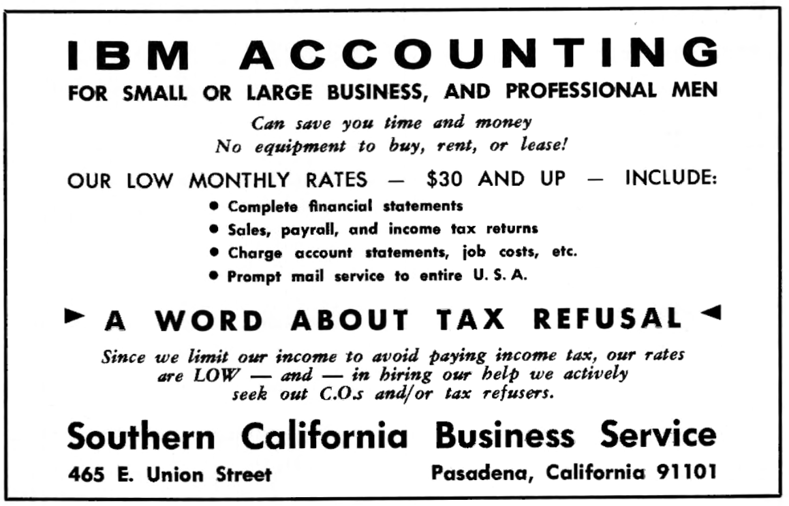

Some tax resisters have formed businesses that help them and their partners and employees to resist.
Under a regime that enforces taxation by means of a pay-as-you-earn scheme, this can be very helpful in making tax resistance possible for employees.

For example, American war tax resister Ed Guinan opened a print shop called “Collective Impressions” and used it to facilitate his and his employees’ resistance.
He withheld taxes from everybody’s paychecks as the law required, but instead of sending this money to the IRS, he sent it directly to the U.S. Arms Control and Disarmament Agency.
“They return it with a polite note saying that they cannot accept it,” Guinan said, “and we put it into a tax escrow account which cannot be used for normal business expenses” (see also: put your taxes in an escrow account in lieu of payment).

<figcaption>an advertisement in an 1967 edition of the Quaker magazine Friends Journal highlights the company’s support for tax resisting employees</figcaption>

A small Christian sect called the Restored Israel of Yahweh has war tax resistance among its tenets.
Some members of the group formed a small construction business and helped those of its employees who were also members of the sect to resist their taxes—carrying this so far that the business’s officers would eventually face criminal tax evasion convictions.
(The sect paid the fines of its convicted members.)

Notes and Citations

* Browning, Frank “Tax Revolt!” <i>Inquiry</i> 2 April 1979
* Goldberger, Peter “Resentencing of Restored Israel of Yahweh defendants” wtr-s email list, 24 March 2008

