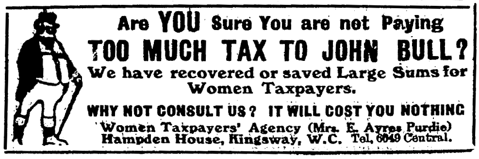

If you anticipate that your tax resistance campaign is going to involve courtroom battles, it will be useful to develop legal expertise or to have experts you can call on.

## Dublin Water Charge Strike

During the Dublin water charge strike in 1994–96, the courts became another mechanism resisters could use to disrupt the government in the hopes of forcing it to concede:

> Every possible legal angle was pursued by the campaign’s legal team—down to legal definitions of what constituted a householder, making the councils prove that the person they had summonsed actually lived at the address, that they owned the property, etc., etc. We weren’t doing this because we had any illusions in the impartiality of the court system. We knew that even though we were successful in finding various legal loopholes, these would all be closed one by one and that the judges would be doing their best to facilitate the councils…
>
> But by contesting every detail of every summons we could make the system unworkable. There were tens of thousands of non-payers. After several months the councils had only managed to get a couple of dozen cases through the courts. Someone calculated that at the rate they were managing to proceed it would take them something like 220 years to process all the cases. And it was costing them more in legal fees than they could ever hope to take back in charges—even if they managed to bully everyone into paying.
>
> Any time the council did manage to get a court order, it was appealed—again the objective being to clog up the system.

## Poll Tax Rebellion

The water charge resisters had learned well from the successes of the poll tax resistance movement in Britain a few years before.
Danny Burns, in his chronicle of that struggle, described the careful and methodical way the anti-poll tax campaign defended resisters in court.

They kept track of and reached out to people facing legal sanctions for their resistance:

> In Bristol when the court cases started, each person with a summons who rang into the office was logged and sent an information pack. The same personal attention was given to people with notices from the bailiffs. At the peak of the campaign, the Bristol office was staffed morning and afternoon five days a week by different volunteers. Between February and May 1990, it was receiving over 200 calls a week.… [Volunteers included] at least five court support workers…

They trained volunteers in strategies that they could use to make the legal proceedings work for the benefit of the resisters:

> In every part of England and Wales local groups mobilised to provide support for non-payers in the courts. Tens if not hundreds of activists in each region attended legal briefing sessions. These were run both by activists and sympathetic local lawyers. People were given ideas about how they might disrupt or delay the court proceedings. These included simple things, like asking for a glass of water because their throat was dry, demanding to see the identity cards of everyone present in court, to fainting in court or arranging for fire alarms to go off. People were told to demand their rights to see and read every document which was produced as evidence against them. They were also given briefings on the basic technical arguments.
>
> By October 1990, when most of the court cases had started, virtually every Anti-Poll Tax Union in the UK had trained at least two or three of its members to become conversant with the Poll Tax law. Throughout England and Wales over a thousand people were trained to do court support work and could quote the relevant legislation….

With expert oversight, they published a legal guide for resisters:

> [T]he Poll Tax Legal Group… researched legislation and case law. It set up a network of lawyers throughout England and Wales who could support the legal challenges of Anti-Poll Tax groups and produced over 30 accessible legal bulletins on the Poll Tax and a book called <i>To Pay or Not To Pay</i>. These underpinned the legal needs of the movement and helped ordinary people to get to grips with the law they needed to use.

And they successfully fought back by exploiting legal technicalities:

> Councils were challenged for sending notices to the wrong addresses. Given the rate at which people moved houses, it was difficult for the councils to keep up, and as a result many cases were dropped because people hadn’t received proper notice. Big legal challenges were also made over “correct procedures.” These came in the first few weeks and resulted mostly from the inexperience of councils in dealing with this sort of process. The first day of Medina Council’s cases (on the Isle of Wight) is probably the most famous example. The reminder notices were sent out with second class stamps, they consequently arrived late, people didn’t receive the statutory notice which they were entitled to, and the court threw out all 1,900 cases. The council had to start again.

When police attacked an anti-poll tax demonstration in London, many of the demonstrators fought back, and hundreds were arrested.
Some elements of the campaign leadership distanced themselves from the defendants, worried about the public relations problems of associating the movement with violence.
So other activists helped to form and coordinate an independent group—the Trafalgar Square Defendants’ Campaign (TSDC)—with the following mandate:

> The campaign will:
> * Unconditionally defend all of those arrested on March 31st.
> * Be controlled by and be accountable to the defendants
> * Be totally independent of any other organisation.
> * Seek support from the whole Anti-Poll Tax movement and all other sympathetic organisations.
> * Seek to co-ordinate the legal defence of all those arrested.
> * Seek to build a coherent picture of events of 31/3/90 from the point of view of those arrested.
> * Publicise the points of view of defendants.
> * Raise money for a bust fund, controlled by the defendants to cover their legal and welfare costs.
> * Ensure that at all future Anti-Poll Tax events there will be proper legal cover and support for anyone arrested. This will include an office and workers to visit places of detention and look after prisoners’ welfare.

Burns writes, of the TSDC:

> About a dozen people volunteered to carry out the court monitoring process. They attended every hearing, systematically took notes of everything that was said, recorded the numbers of police officers and approached the defendants asking them to attend the now weekly TSDC meetings… By the summer, over 250 of the defendants had been contacted.
>
> The TSDC ran advice sessions on prison, produced legal briefing notes and mailed out the minutes of the weekly meetings to every defendant every week. A solicitors’ group was established with a core of three, but at the peak of early activity they managed to get over fifteen solicitors involved. This proved important because the solicitors’ group managed to get hold of over 50 hours of police videos and handed them over to the campaign. The police videos were crucial in getting a lot of people off, and a number of people in the campaign worked extremely hard editing videos and rejigging them for particular trials. The solicitors’ group also got the Crown Prosecution Service to hand over a full list of all of the defendants and the names and addresses of their lawyers. The lawyers were all contacted and, although many were initially reluctant to cooperate with the campaign, they soon realised that TSDC had a lot of information which their clients needed.

## British Women’s Suffrage Movement

Legal expertise can also help your campaign find flaws in the tax law that you can use to expose it to ridicule.
For instance, in 1912 Mark Wilks was arrested and sent to Brixton Prison for failing to pay <em>his wife’s </em>income taxes.
The case became a <i>cause célèbre</i> in the British women’s suffrage movement and an embarrassment to the British government and its tax authorities.

Ethel Ayres Purdie, a tax law expert with the Women’s Tax Resistance League, discovered the vulnerability.
The Income Tax Act, she wrote, “is a most fearsome piece of composition.
Its language is archaic and tautological, it rises wholly superior to punctuation, and proceeds breathlessly through one hundred and ninety-four clauses.”
One of those clauses held a flaw.

<figcaption>an ad for Ethel Ayres Purdie’s “Women Taxpayers’ Agency”</figcaption>

The Married Woman’s Property Act of 1882 was a reform that allowed married women to maintain control of their property rather than relinquishing it to their husbands’ control upon marriage.
But the earlier (1842) Income Tax Act still considered the husband to be solely liable for the income taxes of both the husband and wife.

At first, when Elizabeth Wilks began resisting her income tax, the government responded by seizing and selling her property, but when this quirk in the law was discovered, tax resisters like Wilks protested that the government could not legally seize <em>her</em> property since as a married woman her taxes were legally owed by the <em>him</em> in the marriage.
So the government went after Mark Wilks instead and arrested him when he did not pay his wife’s taxes.

Mark Wilks insisted that he could hardly fill out an income tax return since he had no legal right to demand information from his wife about her income!
Besides, his own modest income and lack of property in his own name meant that he could not afford to pay the taxes on his wife’s considerably larger income (he did pay the tax on the portion of their joint income that was attributable to his own income, though his income was low enough that by itself it would not have been taxable).
“I am informed that I am liable for taxes levied on her income,” he complained, “while at the same time the law places all her property entirely beyond my control.”

Meanwhile, the Women’s Tax Resistance League trumpeted the arrest of Mark Wilks and his indefinite imprisonment—“for non-payment of taxes not his own and due on an income over which he has no control and whose amount he can only guess at”—as proving their contention that not only should women resist the income tax, but that married women were not even legally obligated to pay it and those women who were paying it were operating under a legal delusion.

The imprisonment of Mark Wilks was a great public relations opportunity:

> For what do the arrest and imprisonment of Mark Wilks mean? We are perfectly certain that it will not last long. Stupid and inept as it has been, the Government, we are certain, will not risk the odium which would justly fall upon it if this outrage on liberty went on. A Government which has much at stake and which lives by the breath of popular opinion cannot afford to ignore such strong and healthy protest as is being poured out on all sides. To us, who are in the midst of it, that which seems most remarkable is the growth of public feeling. In the streets where processions are nightly held, we were met at first by banter and rowdyism. “A man in prison for the sake of Suffragettes!” To the boy-mind of the metropolis, on the outskirts of many an earnest crowd, that seemed irresistibly funny; but thoughtfulness is spreading; into even the boy-mind, the light of truth is creeping. If it had done nothing else, the imprisonment of Mark Wilks has certainly done this—it has educated the public mind.

Wilks was released after less than a month in prison, without receiving any official explanation, and without paying the tax.

## American War Tax Resisters

Not all legal help is welcome.
Some resisters prefer to submit passively and unconcernedly to the legal machinations the government puts so much stock in.
Some such resisters have better things to do with their time and energy than to worry about the minutiae of laws and legal procedures.
Others may not want to humor the conceit that a process of justice is taking place around them.

For example, when American war tax resister Maurice McCrackin was convicted of refusing to cooperate with an IRS summons, he was following a strategy of complete noncooperation that he kept following right into the courtroom—where he refused to stand for the judge, refused to plead to the charges, refused to answer questions, refused to consult with his court-appointed attorney, fasted while behind bars, and had to be wheeled into and out from his court appearances because he wouldn’t walk there under his own power.

For the same reason, upon his conviction, he emphatically said that he was not interested in pursuing an appeal:
“I said I wanted to file no appeal, nor did I want steps taken to keep the door open, so an appeal could be perfected later.
I do not recognize any appeal on my behalf…
My position is not changed.
This is a moral, not a legal, struggle.”
One of the lawyers who had been assigned to defend him, however, was convinced that the judge had betrayed bias against McCrackin in his statements from the bench, and said that he intended to disregard his client’s wishes and to appeal anyway.

## Beit Sahour

During the Beit Sahour tax strike against the Israeli military occupation, Elias Rishmawi worked to get a suit challenging the legality of the tax accepted by Israel’s court system.
He recalled:

> I had never had an illusion that the Israeli supreme court would give any justice to Palestinians.… [But] the appeal formed the legal coverage by which I and others were able to continue resisting from one side not paying taxes, since there is a case in court and they cannot force me pay until the case is solved they cannot take any actions against us since we have this case, and we kept challenging the system through different means.… This was impossible to achieve without the legal coverage of the supreme court. Because then, I and the others, would have been considered as inciters and then might be imprisoned for ten years. That’s why we needed that coverage.

## Halifax “Vicars’ Rate” Resistance

The movement that grew to resist the “vicars’ rate” in Halifax, England, in 1875–76, was able to exploit a flaw in the carelessly-written law that implemented the rate.

Under the law’s provisions, the head of the establishment church in Halifax was to periodically summon five churchwardens and tell them to pay him the tax.
The chosen five were obligated to pay as asked.
They then were to convene a meeting to decide how to recoup this money from the rest of Halifax.
Resisters took advantage of this by attending this meeting and using parliamentary procedure to immediately adjourn it, thus preventing the poor five suckers from recouping their payments.
This tactic was only questionably legal, but it nonetheless was effective in continually delaying payment, as it would have been legally cumbersome to compel a meeting to levy the tax against its will.

A witness to a House of Commons committee testified:
“In nearly every township a meeting of inhabitants has been held; and at every one of these meetings the motion for adjournment has been carried, which means a refusal to lay the rate.”

Notes and Citations

* Kerr, Gregor [“Lessons from beating the water charges”](http://www.wsm.ie/c/lessons-beating-water-charges%E2%80%941990s)
* Burns, Danny <i>Poll Tax Rebellion</i> AK Press (1992), pp. 71–72, 106&ndash;07, 110, 135&ndash;36, 143
* Purdie, Ethel Ayres “How the Government Defies the Law” <i>The Vote</i> 21 September 1912, p. 974
* Wilks, Mark “Tax Resistance” <i>The Vote</i> 24 September 1910, p. 261
* Boyle, C. Nina “‘Mostly Fools’” <i>The Vote</i> 28 September 1912, p. 388
* Despard, Charlotte “Ignominious Defeat of Law-Makers” <i>The Vote</i> 5 October 1912, p. 404
* “Pacifist Pastor To Spurn Appeal” <i>Reading Eagle</i> 27 December 1958, p. 3
* “War Tax Resistance in Palestine” [(report on) Fifth International Conference on War Tax Resistance and Peace Tax Campaigns](http://www.cpti.ws/conf/94/94pg/fri_aft.html) (1994)
* “Halifax (Vicars’ Rate)” <i>House of Commons Papers: Reports from Committees</i>, Vol. X (8 Feb.–15 Aug. 1876) p. 41.

