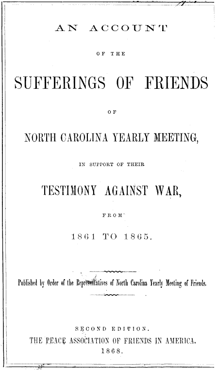

Whenever the authorities arrested, prosecuted, imprisoned, or seized property from Quaker tax or tithe resisters, whichever Meeting that Quaker belonged to was sure to make note of it in their book of “Sufferings.”
These ordeals “for conscience sake” were marks of honor and proofs of faith that sanctified the Meeting.

“Friends were always careful to put their sufferings on record,” wrote Stephen B. Weeks, in <i>Southern Quakers and Slavery</i>.
“Whatever else the Quaker might suffer, he could not bear for the shade of oblivion to come over the record of his testimonies.”

It was easier for a Quaker to exhibit fortitude in the face of government reprisal if he or she knew that this would be remembered respectfully, and would become part of the story of the endurance of the Society of Friends in a world of persecution and misunderstanding.

It was a common practice for Monthly Meetings to pass their records of sufferings up in the Society of Friends hierarchy to be recorded also at the Quarterly Meeting level, and then finally at the Yearly Meeting.

After the American Revolution, some American Monthly Meetings used this practice to press for more respect for war tax resistance in the Yearly Meeting.
Officially, the only Quakers whose sufferings were to be recorded were those who had resisted militia exemption taxes and other taxes that were explicitly and exclusively destined for war spending.
But some Monthly Meetings had a more inclusive policy and recorded sufferings of those Quakers who were resisting general-purpose taxes since the bulk of the money raised by them was going to pay off war debt.

<figcaption>the title page from a Quaker book of sufferings</figcaption>

In 1782, David Cooper wrote of the Rhode Island Yearly Meeting:

> By a previous rule, such who paid any tax wholly for the support of war should be dealt with as offenders, but Friends were allowed to pay mixed taxes a part whereof was for civil purposes and part for war, nor were sufferings of those who declined to pay these taxes received or recorded. This subject now occasioned much debate, which resulted in a minute directing such sufferings to be recorded as their testimony against war.

In another case around the same time, the monthly meeting in Evesham, New Jersey tried to forward the record of the sufferings of its members who had refused to pay war taxes, but their Quarterly Meeting in Salem balked at recording them and forwarding them further.
This led to a great deal of debate in the Quarterly Meeting and kept war tax resistance on the front burner there—and also in the Yearly Meeting, which appointed a committee of 36 Friends who unanimously recommended that these sufferings be accepted and recorded.

In these ways, the practice of recording sufferings became not just a way of commemorating and sanctifying individual resistance, but also a way of keeping this resistance in the foreground whenever Quakers met.

Modern American war tax resister Ed Hedemann has been trying to keep this practice alive.
He maintains web pages that list American war tax resisters in the modern era who have had property seized by the IRS or have been taken to court, convicted, or jailed.

Sometimes, the government does the recording for you, and all you have to do is to make sure the roll becomes an honor roll.
Local council governments in the United Kingdom tried to shame tax resisters by publishing their names in the newspapers during the poll tax rebellion of the Thatcher era:

> Many councils tried using the press to dissuade people… Local papers, such as the Docklands Recorder in Tower Hamlets, printed long lists of non-payers in an attempt to shame them in public. This plan failed miserably as hundreds of people wrote to the letters’ pages asking why they weren’t on the list, saying they were proud to be non-payers and wanted everyone to know.

Notes and Citations

* Weeks, Stephen B. <i>Southern Quakers and Slavery</i> (1896), p. 171
* Cooper, David “Some Declined to Pay Mixed Taxes” <i>American Quaker War Tax Resistance</i>, 2nd. ed. (2011), p. 200
* Cooper, David “For the Testimony of Truth” <i>American Quaker War Tax Resistance</i>, 2nd. ed. (2011), pp. 216–17
* [IRS Property Seizures Against War Tax Resisters](https://nwtrcc.org/resist/consequences/irs-property-seizures-war-tax-resisters/) and [War Tax Resisters Taken to Court](https://nwtrcc.org/resist/consequences/war-tax-resisters-taken-court/)
* Burns, Danny <i>Poll Tax Rebellion</i> AK Press (1992), p. 146

