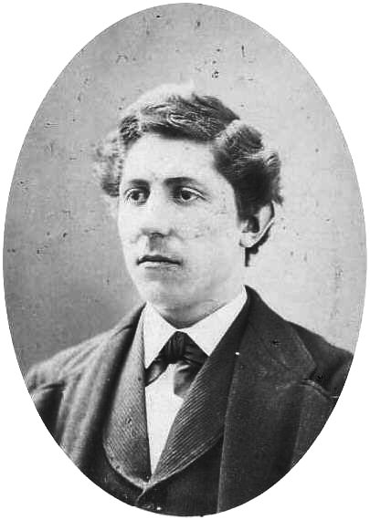

import { Aside } from '@astrojs/starlight/components';
import { Badge } from '@astrojs/starlight/components';

If your campaign has not established any formal mutual insurance plan to protect individual resisters from fines, penalties, and legal fees that might result from their resistance, people who sympathize with the movement can still show their support by contributing in a more ad hoc, spontaneous fashion.

<Aside type="tip" title="See also">
[Form Mutual Insurance Pacts](../mutualinsurance/)
</Aside>

## <Badge text="Example" size="medium" /> Nick Hogan

Nick Hogan, a Bolton pub-owner, defied a new anti-smoking ordinance and openly permitted his patrons to light up.
For this he was fined £3,000, and another £7,000 in court costs.
He refused to pay and was thrown in jail.
Hogan was set free the following month when an anonymous man, dressed in a Guy Fawkes mask and cape, delivered a suitcase full of cash to the prison to pay Hogan’s fine.
The funds had been donated by thousands of people around the world who were sympathetic to Hogan’s fight.

## <Badge text="Example" size="medium" /> American War Tax Resisters

<figcaption>Zerah C. Whipple</figcaption>

When pacifist conscientious objector Zerah C. Whipple was imprisoned for refusing to pay a militia tax, an anonymous donor eventually paid the tax (and added costs) to have him released:

> At an unexpected moment an entire stranger called at the prison and desired to know the amount of the tax and costs, which he paid, saying he knew the worth of Z.C. Whipple, and that his family for generations back had never paid the military tax, and he wished to save the State from the disgrace of imprisoning a person guilty of no crime.
> The money was paid and the door opened, and his friend took the receipt to his children and said, “Keep this as a reminiscence that in 1874 your father paid this bill to release a young man from prison, that he might enjoy the rights of conscience.”

## When Paying a Resister’s Fines is No Help

If a resister refuses to pay a tax or fine as an act of principled civil disobedience, if you were to pay the money on their behalf they might see this as <em>interference</em> rather than support.

### <Badge text="Example" /> Henry David Thoreau

The trick to supporting imprisoned tax resisters is to respect their real needs and desires.
When “someone interfered,” as Henry David Thoreau put it, and paid his taxes for him in order to spring him from his night in jail, they thought wrongly that they were doing Thoreau a favor, “for they thought that my chief desire was to stand the other side of that stone wall” whereas for Thoreau, the inside <em>was</em> the right side:

> Under a government which imprisons any unjustly, the true place for a just man is also a prison.…
>
> I saw that, if there was a wall of stone between me and my townsmen, there was a still more difficult one to climb or break through, before they could get to be as free as I was.
> I did not for a moment feel confined, and the walls seemed a great waste of stone and mortar.

### <Badge text="Example" /> Sylvia Hardy

Sylvia Hardy was upset that the annual cost of living increase in her pension was less than 3%, while her council tax was rising by a double-digit percentage each year.
So she decided to stop paying.
A misguided sympathizer paid her bill for her one year, and in response Hardy wrote to the council to ask them not to accept any further donations in her name.
Continued refusal, she felt, was “the only way to get our voices heard.”

### <Badge text="Example" /> Mary McLeod Cleeves

When women’s suffrage activist Mary McLeod Cleeves was threatened with imprisonment for refusing to pay a carriage license tax, the suffragist newspaper <i>The Vote</i> noted that “Mrs. Cleeves has been besieged by friends asking to be allowed to pay her fine; but like a true Suffragette, she refused.”

### <Badge text="Example" /> Annuity Tax Resisters

Paying fines or taxes on behalf of a conscientious resister can send the wrong message.
Quakers were largely in sympathy with the Annuity Tax resisters of Edinburgh, Scotland, in the mid-nineteenth century, but an editorial in one Quaker periodical chided those resisters for having taken up a collection to pay to get their colleagues out of jail, rather than embracing martyrdom like a good Quaker would:

> Did it not occur to the Dissenters of Edinburgh, that it was not from want of <em>pecuniary ability</em> that either of the prisoners allowed himself to be immured in jail?
> Or again, what was the difference between these individuals paying the tax themselves, and its being paid <em>for them</em> by public subscription?
> If it was wrong in the one case, it must be equally wrong, and a violation of principle, in the other.
> It has surprised us that not one of the Dissenting Journals that we have met with has taken this view of the subject.
> In their joyfulness at the liberation of the prisoners, they seem to have lost sight entirely of the <em>sacrifice of principle</em> at which it was obtained.

### <Badge text="Example" /> Juanita Nelson

American war tax resister Juanita Nelson was arrested one morning for contempt of court (she refused to provide records to the IRS) and was hauled off to jail in her bathrobe.
She explains how she accommodated her friends’ desires to help, while remaining faithful to her principles:

> [W]hen the deputy interrupted my reverie to announce visitors, whom I could see in the waiting room, I told him I would leave only to be released.…
> 
> Two fellow pacifists, one of them also a tax refuser, had been permitted to come to me, since I would not go to them.
> I asked them what was uppermost in my mind, what they’d do about getting properly dressed?
> They said that this was something I would have to settle for myself.
> I sensed that they thought it the better part of wisdom and modesty for me to be dressed for my appearance in court.
> They were more concerned about the public relations aspect of getting across the witness than I was.
> They were also genuinely concerned, I knew, about making their actions truly nonviolent, cognizant of the other person’s feelings, attitudes, and readiness.
> I was shaken enough to concede that I would like to have my clothes at hand, in case I decided I would feel more at ease in them.
> The older visitor, a dignified man with white hair, agreed to go for the clothes in a taxicab.
>
> They left, and on their heels came another visitor.
> She had been told that in permitting her to come up, the officials were treating me with more courtesy than I was according them.
> It was her assessment that the chief deputy was hopeful that someone would be able to hammer some sense into me and was willing to make concessions in that hope.
> But he had misjudged the reliance he might place in her—she was not as critical as the men.
> She did not know what she would do, but she thought she might wish to have the strength and the audacity to carry through in the vein in which I had started.
>
> And she said. “You know, you look like a female Gandhi in that robe. You look, well, dignified.”
>
> That was my first encouragement.
> Everyone else had tended to make me feel like a fool of the first water, had confirmed fears I already had on that score.
> My respect and admiration for Gandhi, though not uncritical, was deep.
> And if I in any way resembled him in appearance I was prepared to try to emulate a more becoming state of mind.
> I reminded myself, too, that I had on considerably more than the loincloth in which Gandhi was able to greet kings and statesmen with ease.
> I need not be unduly perturbed about wearing a robe into the presence of his honor.

<figcaption>Juanita Nelson in front of her Deerfield, Massachusetts home</figcaption>

Nelson decided not to contribute to the pretense of courtroom dignity by changing clothes.
She appeared before the judge in the same bathrobe she’d been arrested in.
(The government later dropped the contempt charge against her, without explanation.)

Notes and Citations

* “A Recent Imprisonment in Connecticut” <i>The British Friend</i> 1 February 1875, p. 33
* Thoreau, Henry David [“Resistance to Civil Government”](https://sniggle.net/TPL/index5.php?entry=rtcg) (1849)
* “Pensioner prepared to go to jail” <i>BBC News</i> 20 June 2005
* “‘Terrified’ pensioner jailed over £53 tax bill” <i>Daily Mail</i> 26 September 2005
* Sidley, Marguerite A. “Welsh Campaign” <i>The Vote</i> 29 October 1910, p. 5
* “Baillie Stott, and the Edinburgh Annuity Tax” <i>The British Friend</i> 31 August 1848, p. 210
* Nelson, Juanita “A Matter of Freedom” in <i>We Won’t Pay: A Tax Resistance Reader</i> (2008) pp. 451–461.

