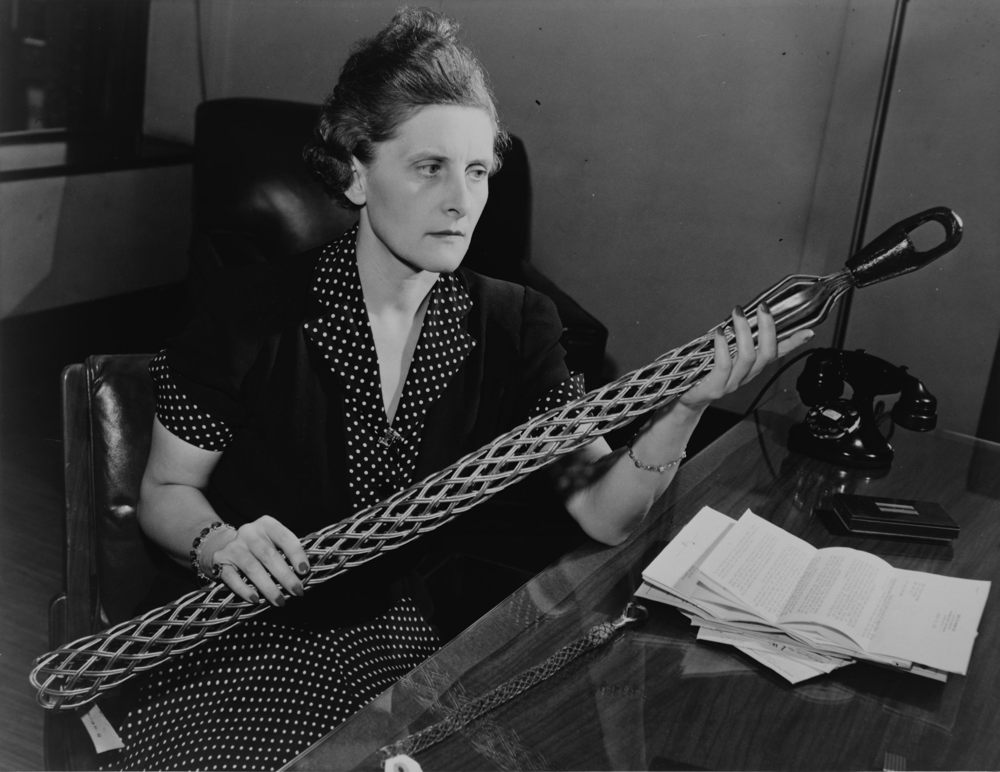

import { Aside } from '@astrojs/starlight/components';
import { Badge } from '@astrojs/starlight/components';
import WikipediaBadge from '../../../components/WikipediaBadge.astro';

Employers can also support tax resisting employees by refusing to withhold income taxes from their paychecks.

## <Badge text="Example" size="medium" /> Vivien Kellems

<figcaption>Vivien Kellems posing with one of the cable grips her company manufactured</figcaption>

American industrialist Vivien Kellems so enjoyed tax resistance that it was sometimes hard to tell whether she was resisting from principle or for sport.
In 1948 she decided she would not withhold taxes from employees’ paychecks on their behalf.
She explained why:

> Paying taxes is a duty, a responsibility, and a privilege of citizenship.
> Without taxes we can have no government.
> However I do not exercise other duties, responsibilities, and privileges of citizenship for my employees.
> I do not vote for them, I do not form political opinions for them, I do not select a church for them, I do not pay real estate taxes for them.
> They are all free American citizens, thoroughly capable of performing all of the duties and responsibilities of citizenship for themselves.
> And so, from this day, I am not collecting nor paying their income taxes for them.

To demonstrate that she wasn’t against her employees paying their taxes, but only opposed to doing it for them, she organized her employees once per quarter and allowed them, on company time, to fill out their own tax returns and to go down to the post office as a group to purchase money orders and file their own taxes.

The U.S. government was not impressed with this gesture.
It subjected Kellems to a public smear campaign (they even intercepted her love letters and released them to the press), and to legal action.
The government won in court and fined Kellems $7,600, whereupon she resumed withholding taxes from her employees’ paychecks.

## <Badge text="Example" size="medium" /> British Women’s Suffrage Movement

The National Insurance Act of 1911 required all workers in the U.K. to pay a portion of their paychecks into a fund for government-run health and unemployment benefits.
Members of the women’s suffrage movement saw this as yet another tax enacted without their consent—another example of “taxation without representation” and another opportunity to resist.

Some suffrage activists could resist as employers, and some suffrage groups could help their own employees to resist.
Kate Harvey, for example, refused to pay the tax on her gardener’s wages, and was sentenced to two months in prison for her refusal.
The Women’s Freedom League refused to pay the tax for its employees, saying “we refuse to acquiesce in any legislation which controls the resources of women without the consent of women.”

## <Badge text="Example" size="medium" /> Quakers

The Philadelphia Yearly Meeting (of Quakers) believes it has “a religious duty to refrain from taking action that violates an employee’s expression of conscience.”
So if an employee requests it, the Meeting reserves “the military portion” of the income tax withheld from his or her paycheck in an escrow account.
It then informs the government that it will only relinquish the money “at such time as there is assurance that the taxes will not be used for military purposes.”

<Aside type="note" title="See also">
[Put Your Taxes in an Escrow Account in lieu of Payment](../../tacticsofeducationandpublicrelations/puttaxesinescrow/)
</Aside>

## <Badge text="Example" size="medium" /> Pacifist Groups

In 1956, Ralph DiGia, who was working for the War Resisters League, asked them to stop withholding federal taxes from his paycheck.
The League agreed, and some of its other employees followed DiGia’s lead.

It took a lot of work to get the League to adopt a policy of tax refusal.
At first, they refused.
A member of the League’s executive committee, afraid of government retribution, said “the life of the organization is at stake.”
War tax resisters responded:
“If pacifist organizations, whose business is to create a warless world, are not ready to risk something for war resistance now, when will they be ready?”

Another group, the Fellowship of Reconciliation, decided it was not willing to challenge the Internal Revenue Service (IRS) in this way, and some of its employees resigned as a result.

For five years, War Resisters International refused to turn over to the government a portion of the taxes withheld from its resisting employees’ wages.
But in 2013, when the group heard that the government was preparing to seize its office equipment over the tax debt, it gave up the fight—though not without trying to turn its surrender into an opportunity to stage a protest.

<Aside type="note" title="See also">
[Use Property Seizures as Rally or Protest Opportunities](../../tacticsofeducationandpublicrelations/useseizuresasprotestopportunities/)
</Aside>

## <Badge text="Example" size="medium" /> Indianapolis Baptist Temple

Employers who resist legally-mandated tax withholding are taking a risk.
The Indianapolis Baptist Temple started refusing to withhold federal taxes in 1983, when pastor Gregory Dixon “decided the church would break all ties with the government and no longer act as its agent in withholding taxes from its employees.”
He cited freedom of religion as his mandate for taking his church out from under Uncle Sam’s thumb.

For several years, nothing came of this defiance, but in the early 1990s, the IRS started seeking back taxes, and eventually filed liens against the church and against Dixon.
The church fought back in court, but lost a series of appeals, and was finally rebuffed by the U.S. Supreme Court in 2001, whereupon the government seized and auctioned off church property and Dixon himself was fined.

<Aside type="tip" title="Wikipedia">
  <WikipediaBadge title="Vivien Kellems" />
  <WikipediaBadge title="National Insurance Act 1911" />
  <WikipediaBadge title="Kate Harvey" />
  <WikipediaBadge title="Women’s Freedom League" url="https://en.wikipedia.org/wiki/Women%27s_Freedom_League" />
  <WikipediaBadge title="Philadelphia Yearly Meeting" />
  <WikipediaBadge title="Ralph DiGia" />
  <WikipediaBadge title="War Resisters League" />
  <WikipediaBadge title="Fellowship of Reconciliation (United States)" />
  <WikipediaBadge title="War Resisters’ International" url="https://en.wikipedia.org/wiki/War_Resisters%27_International" />
  <WikipediaBadge title="Indianapolis Baptist Temple" />
</Aside>

---

Notes and Citations

* Kellems, Vivien [<i>Toil, Taxes, and Trouble</i>](https://archive.org/details/toiltaxes00kell) (1952), which reproduces the transcript of a speech Kellems gave to the Los Angeles Rotary Club on 13 February, 1948, from which this excerpt is taken
* Underwood, Florence A. [“Tax Resistance”](https://news.google.com/newspapers?id=heI6AAAAIBAJ&sjid=6ikMAAAAIBAJ&pg=3279,9100831) <i>The Vote</i> 14 December 1912, p. 120
* “Policy on Military Tax Refusal by Philadelphia Yearly Meeting Employees and on IRS Levies and Other Collection Efforts,” approved by the meeting in 1988 (reaffirming a practice established in 1975), and revised in 2010
* Bennett, Scott H. <i>Radical Pacifism: The War Resisters League and Gandhian Nonviolence in America</i> (2003) p. 152.
* [“War taxes paid under protest”](http://wri-irg.org/node/21053) WRI press release, 16 January 2013
* “Baptist Temple tax dispute: Church building confiscated to pay tax debt” <i>Indianapolis</i> Star 24 July 2001

