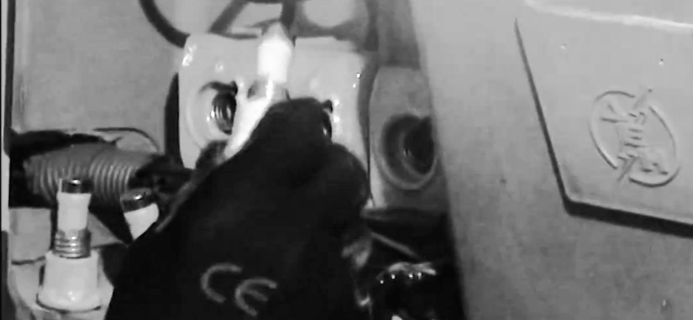

import { Badge } from '@astrojs/starlight/components';

Governments increasingly use public utility monopolies to inflict new taxes by hiding them in the utility bills.
Resisters have responded by refusing to pay the hikes, or sometimes the entire bills, and governments have sometimes retaliated by cutting off resisters’ access to the utilities.
Resistance campaigns have developed strategies for assisting resisters whose utilities are shut off in this way.

## <Badge text="Example" size="medium" /> Dublin Water Charge Strike

During the water charge strike in Dublin, for example, “local campaign groups successfully resisted attempts to disconnect water and in the couple of instances where water was cut off, campaigners re-connected it within hours.
The first round was won hands down by the campaign and it was back to the drawing board for the councils.”
Resisters also got advice on “how to block up their stopcocks to make it difficult for their water to be cut off.
Empty bean tins and a little bit of cement were the necessary ingredients.”

## <Badge text="Example" size="medium" /> Greek “Won’t Pay” Movement

The Greek “won’t pay” movement enlisted guerrilla electricians to reconnect the power to Greek households that went dark because they were unable (or unwilling) to pay the new taxes.
One report said that the campaign successfully reconnected the power to over a thousand such households.

<figcaption>a still from a video that shows one of the “won’t pay” movement’s guerrilla electricians reconnecing the power at a Greek home</figcaption>

## <Badge text="Example" size="medium" /> Phone Tax Resisters

The federal excise tax on telephone service in the United States had been a source of war funding dating back to the Spanish-American War.
It was frequently a target of war tax resisters.

According to U.S. law, the tax was owed by the customer to the federal government—not to the phone company, which is just an intermediary.
Nonetheless, phone companies often included the tax along with all of the other charges in a unified phone bill.
For this reason, some phone companies would treat phone tax resisters as though they were underpaying their phone bills instead of recognizing that they were refusing to pay only the tax—and the companies would sometimes incorrectly add late-fees or threaten to cut off service.

The [HangUpOnWar](https://nwtrcc.org/programs-events/hang-up-on-war/) website collected stories from phone tax resisters about their experiences with a variety of phone service providers.
These stories made it easier for resisters to determine which department they should call to get a bill sorted out, whether resisters would have more luck if they accompanied their phone bills with a letter or card explaining their resistance (and if so, what it should say), and so forth.
This support made it easier for people to continue to resist even when they ran up against the phone company bureaucracy.

Notes and Citations

* Kerr, Gregor [“Lessons from beating the water charges”](http://www.wsm.ie/c/lessons-beating-water-charges%E2%80%941990s)
* Karathanou, Helen “Το Κίνημα Δεν Πληρώνω επανασυνδέει κομμένες παροχές ρεύματος” <i>To Proto Thema</i> 14 November 2012

