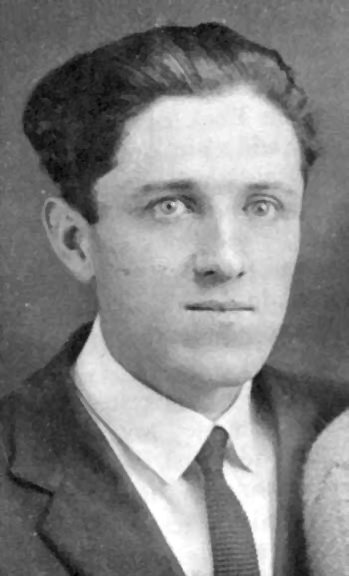

import Aside from '../../../components/ExtendedAside.astro';
import WikipediaBadge from '../../../components/WikipediaBadge.astro';
import { YouTube } from 'astro-embed';

Christian anarchist Ammon Hennacy’s theory of what he called the “one-man revolution” crystallized, appropriately enough, while he was being held in solitary confinement.
He’d been imprisoned for encouraging resistance to the military draft during World War I.
Prison authorities threw him in “the hole” as punishment after he helped lead a hunger strike of prisoners.
Because he refused to name names, he was kept there for several months.

<figcaption>Ammon Hennacy</figcaption>

It was not the most promising situation for a revolutionary:
Locked up alone in a cell 24/7, unable to communicate with his comrades in the prison or outside, given the silent treatment by the guard, and overhearing the day-in day-out torture of the prisoner in the adjoining cell.

The only book they allowed him was the Bible (and they even took this away and replaced it with a smaller-print version for no other reason but to inflict another petty torment in the dim light of his cell).
In the course of reading and reflecting on what he read—particularly the Sermon on the Mount—he decided that the revolution could be fought and won even in his cell.
“To change the world by bullets or ballots was a useless procedure,” he decided.

> [T]he only revolution worthwhile was the one-man revolution within the heart.
> Each one could make this by himself and not need to wait on a majority.

Victory is in our grasp with the one-man revolution, Hennacy believed:

> Too many of us dissipate our energy by being “for all good causes,” attending meetings and passing resolutions, organizing and presenting petitions—all this effort to change *others*, when if we really got down to it we could use this energy to change *ourselves*.
> This can be done by spiritual means and it does not wear one out but is invigorating.
> We become tired radicals because we use our weakest weapon: the ballot box, where we are always outnumbered, and refuse to use our strongest weapon: spiritual power.

The root of the government’s power and authority is the acquiescence of its subjects.
Many people who think they are boldly attacking the government stop short of striking at this root of the problem.
The real revolution needs to take place not *in* the government but in the hearts of the subjects who *enable* it.

The government is constantly trying to stage a coup in the hearts of its subjects: dethroning conscience and setting up loyalty and patriotism in its place.
That is the counterrevolution Hennacy was describing when he answered a reporter’s question—“Hennacy, do you think you can change the world?”—with “No, but I am damn sure it can’t change me.”

<YouTube id="SM3N2iDIOF0" title="A Peace of the Anarchy: Ammon Hennacy and Other Angelic Troublemakers" />

<Aside type="wikipedia" title="Wikipedia">
  <WikipediaBadge title="Christian anarchism" />
  <WikipediaBadge title="Ammon Hennacy" />
  <WikipediaBadge title="Solitary confinement" />
  <WikipediaBadge title="Sermon on the Mount" />
</Aside>
---

Notes and Citations

* Hennacy, Ammon “Love your enemy?” <i>The Book of Ammon</i> (1970) [p. 30](https://archive.org/details/bookofammon0000ammo/page/30/mode/1up)
* Hennacy, Ammon “For all good causes” <i>The Book of Ammon</i> (1970) [p. 230](https://archive.org/details/bookofammon0000ammo/page/230/mode/1up)
* Hennacy, Ammon “Tax picketing” <i>The Book of Ammon</i> (1970) [p. 122](https://archive.org/details/bookofammon0000ammo/page/122/mode/1up)

